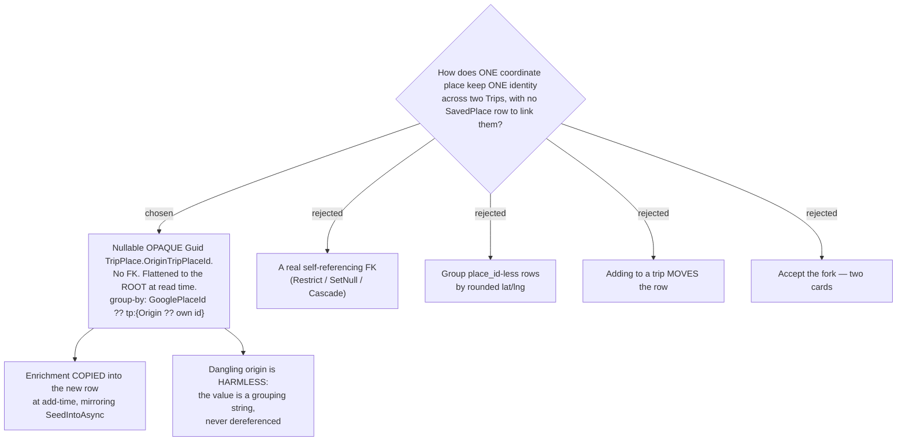

# ADR-156: A coordinate place keeps one identity across Trips via an **opaque, flattened `OriginTripPlaceId`** on `TripPlace`

**Date:** 2026-08-11
**Status:** Accepted
**Relates to:** issue #48; decision-map `discover-add-place-48` (#53), ticket `coordinate-places` (#55) — **completes the re-open ADR-155 ordered**. **Supersedes ADR-148 §3** (the dedupe-only `SavedPlaceId`, already voided by ADR-155 when `SavedPlace` was not built) and **reverses ADR-148's rejection of the no-FK origin key (D3)** on measured grounds. **Reaffirms ADR-148 §1 and §2 unchanged** — a coordinate place is still user-named, and still carries its enrichment on its own row. Extends the seed-at-add-time behaviour of `PlaceProfileSync.SeedIntoAsync`. Leaves `duplicate-policy` (#61) its genuine-matching question, unchanged. **Amends** the CONTEXT.md definition of **Place**.



## Context

ADR-155 reversed ADR-147: `SavedPlace` is not built. That voided ADR-148 §3's dedupe-only
`TripPlace.SavedPlaceId`, which had nothing left to point at, and ADR-155 explicitly re-opened this
ticket to answer what replaces it. ADR-148 §1 (user-typed name) and §2 (enrichment on the place's
own row) survived intact and are **not** re-litigated here.

**The gap is not hypothetical, and it is the system's own tap that creates it.** Measured on `main`
at `283a39d`:

- **`AddToTripDialog.tsx:16-28`** sends `googlePlaceId: place.googlePlaceId` — `null` for a
  coordinate place.
- **`AddTripPlaceHandler.cs:25-26`** creates a brand-new `TripPlace` with `GooglePlaceId = null`.
- **`PlaceProfileSync.SeedIntoAsync:18`** returns `false` immediately for a `place_id`-less place,
  so **no enrichment is seeded**, and no master can ever exist to seed from (ADR-066/148).
- **`ListMyPlacesHandler.cs:41`** groups on `GooglePlaceId ?? $"tp:{r.Place.Id}"`, so the new row's
  key is `tp:{new id}` != `tp:{old id}` — **a second card**.

So tapping **"เพิ่มเข้าทริป"** on a coordinate place already in Discover produces not merely a
duplicate but an **empty** one. The command cannot carry the enrichment even in principle:
`AddTripPlaceCommand.cs:4-7` has no `Notes`, `ReviewLinks`, `BestTimeWindows` or `SeasonPeriods`
parameter, and `api.ts:1395` `Omit`s three of those from the request type. What is lost is exactly
the user's own words — which, per ADR-148, are the only description a coordinate place will ever
have.

**A `place_id`-bearing place is already correct on this identical path**, because the group-by
merges the rows *and* `SeedIntoAsync` copies the master's enrichment into the new one. The
breakage is entirely asymmetric, and closing it is what this ADR does.

**The decisive new fact: `TripPlace` deletion is a HARD delete.**
`DeleteTripPlaceHandler.cs:32` is `_db.TripPlaces.Remove(place)` — no soft-delete flag, the row is
destroyed. This is what settles the FK question below, and it is a fact ADR-148 never had to weigh,
because its `SavedPlaceId` pointed at a *different* table whose delete path did not yet exist.

## Decision

### 1. `TripPlace` gains a nullable, **opaque** `Guid? OriginTripPlaceId` — deliberately not a foreign key

The column records which existing place this row was created **from**. It is written only when a
row is created by adding an existing Discover place to a Trip; every fresh capture, every existing
row, and every Trips-side add (search, POI tap, paste-a-link) leaves it `null`.

**It carries no FK constraint and no index.** Nothing queries by it — the grouping at
`ListMyPlacesHandler:41` runs **in memory**, after `ToListAsync` — so an index would earn nothing.

### 2. Flattening happens once, at **read** time, and the write path stores the value verbatim

The group-by is a single key lookup, **not a transitive closure**. A chain Oct <- Dec <- Mar would
key `Mar` as `tp:{Dec.Id}` and `Dec` as `tp:{Oct.Id}` — two cards again. Every row must therefore
point at the **root**, never at its immediate parent.

Rather than resolve that on write (a lookup, and recursion to guard), `ListMyPlacesHandler` emits
the already-flattened root on the DTO:

- **`DiscoverPlaceDto` gains `Guid OriginTripPlaceId`**, computed as `rep.OriginTripPlaceId ?? rep.Id`.
  Every member of a coordinate group shares one root by construction, so any representative yields
  the same value.
- **`AddTripPlaceCommand` gains `Guid? OriginTripPlaceId`**, which `AddToTripDialog` passes straight
  through from the card, and the handler **stores unchanged**.

The value the client holds is already the root, so the write path performs no lookup and cannot
build a chain. One construction site changes (`ListMyPlacesHandler:67`) and the frontend
`DiscoverPlaceDto` is a named-field interface (`api.ts:538-555`), so the DTO change is additive at
both ends.

### 3. The group key becomes `GooglePlaceId ?? $"tp:{p.OriginTripPlaceId ?? p.Id}"`

`GooglePlaceId` still wins whenever it is present, so the column is **inert** for the common case
and no existing grouping behaviour changes. It is set unconditionally on an add-from-Discover
rather than only when `place_id` is null — one unconditional rule is less code and fewer test cases
than a conditional, and it costs nothing, since the key never consults it for a `place_id` place.

### 4. Enrichment is **copied** into the new row at add-time

`AddTripPlaceCommand` gains `Notes`, `ReviewLinks`, `BestTimeWindows` and `SeasonPeriods`.

**Correction (post-implementation, #48 final review):** the sentence above originally said
`api.ts:1395` "stops `Omit`ting them". Taken literally that would make `notes`, `bestTimeWindows`
and `seasonPeriods` **required** on every `addTripPlace` call, which breaks the third caller —
`AddPlaceMode.tsx`'s own Trips add-form path — that sends neither. What actually shipped, and what
this ADR intends, keeps `api.ts:1395`'s `Omit` list unchanged and instead adds four members —
`originTripPlaceId`, `notes`, `bestTimeWindows` and `seasonPeriods` — as **optional** on the
left-hand explicit object that is intersected with it. `reviewLinks` needed no change: it was
already a required field on `TripPlaceDto` before this ADR (since #36), and `AddPlaceMode.tsx`
already always sends it. `AddTripPlaceHandler` applies the copied members **only when the master
did not**:

```
var seeded = await PlaceProfileSync.SeedIntoAsync(...);
if (!seeded) { /* apply the copied enrichment from the command */ }
```

A master, where one exists, stays canonical (ADR-103's write-through is untouched); the copy is the
fallback for exactly the case that has no master and never will.

**Correction (pre-push scrutinize, #48):** the gate above is wrong, and the bug it produces is
exactly the one this ADR exists to fix. `seeded`/`SeedIntoAsync` returning `true` means only that a
master **row** exists — it says nothing about which of that row's fields are populated. Notes and
ReviewLinks write through on every edit (ADR-103, `UpdateTripPlaceHandler`), but BestTimeWindows
and SeasonPeriods are **push-only**: they land on the master only via explicit
push-to-master (`PlaceProfileSync.UpsertFromAsync`), never via the ordinary edit path. So "a master
exists, with empty windows/seasons" is a routine state, not an edge case — reachable by (1) add a
place with a `place_id`, no master yet; (2) edit its notes, which auto-creates a master from the
place's enrichment at that moment (`EnsureCreatedAsync`), windows still empty; (3) edit again adding
best-time windows to the place itself (not pushed to the master). The master now exists and has
notes but no windows. Add that place to a second Trip and the all-or-nothing gate above skips
`ApplyCopiedEnrichment` entirely because `seeded == true`, silently dropping the windows the
Discover card had just displayed (`ListMyPlacesHandler` reads `BestTimeWindows`/`SeasonPeriods` from
the representative TripPlace `rep`, never from the master, precisely because they're push-only).

The actual rule is **per field**, not per row: `ApplyCopiedEnrichment` runs unconditionally, and
each of the four fields copies from the command only if the master left that field empty on the
freshly-seeded place (`place.Notes is null`, `place.BestTimeWindows.Count == 0`, etc.). A field the
master *did* supply still wins — that half of the original intent is unchanged. `seeded` keeps its
original, narrower meaning ("a master row exists") and keeps flowing unchanged into
`ToDto(place, seeded)` as `hasProfile`; only the enrichment-copy gating changes.

This mirrors what the codebase already does at this precise moment — `SeedIntoAsync:23-26` **copies**
a master's enrichment into a freshly-created `TripPlace` rather than reading through to it. This
decision extends that one behaviour to "source = the origin row", so both cases share one rule.

Merging the Discover card alone would **not** have been enough: `PlaceEditorDialog.tsx:27-31` reads
`bestTimeWindows`, `reviewLinks`, `seasonPeriods` and `notes` straight off the `TripPlace` row with
no master fallback, so without the copy, opening the December trip and tapping the place would show
a blank editor even though ไปไหนดี looked right.

### 5. The migration

One nullable `uniqueidentifier` column on `TripPlaces`. No table, no FK, no index, no owned
collection, no `DbSet<>` — so, unlike ADR-148's plan, **no `IApplicationDbContext` implementer
changes and no `CS0535` risk**. Every existing row takes `NULL`.

It must still be **applied to prod by hand** (CLAUDE.md); shipping the code without it yields
`Invalid column name 'OriginTripPlaceId'` across all of Discover — the #49 outage mode. This
re-introduces the one cost ADR-155 was pleased to have eliminated, and that was weighed and
accepted: it is the smallest possible migration, and it is the only option that buys a true single
card without silently merging distinct places.

## Rejected

**A real self-referencing foreign key.** ADR-148 rejected the no-FK form (D3) as "integrity by
convention", and against a `SavedPlace` table that was right. Against a self-reference on a
**hard-deleted** table it inverts — every FK behaviour is worse than none. Three trips, Oct (root),
Dec and Mar all keyed `tp:{Oct.Id}`, then the user deletes the place from October:

| | on deleting October's place | outcome |
|---|---|---|
| **opaque Guid (chosen)** | Dec + Mar keep the dangling `tp:{Oct.Id}` | **one card**, Dec + Mar chips — correct |
| FK `SetNull` | both reset to their own ids | **two cards** — identity destroyed by an unrelated delete |
| FK `Restrict` | the delete fails | breaks a working feature |
| FK `Cascade` | Dec + Mar are deleted too | destroys rows on other Trips |

`SetNull` is the trap, because with only *two* trips it looks correct — the survivor forms a group
of one either way. It fails only at three, which is precisely the case a test would omit. The
dangling pointer is harmless because the value is **only ever a grouping string and is never
dereferenced**; SQL Server's restrictions on cascading actions for self-referencing keys never even
come into play.

**Group `place_id`-less rows by rounded lat/lng.** No schema change and no migration at all, which
makes it the cheapest option on paper. Rejected because it silently merges two genuinely different
places inside the rounding box — two stalls ten metres apart become one card with no way to split
them — and because grouping by proximity **is** blocking-by-proximity, which contradicts
`duplicate-policy` (#61)'s decision that a `place_id`-less match within 100 m *only warns, never
blocks*. It also answers a different question: it guesses at identity, where the chosen mechanism
**records** a link the system itself created and already holds in hand.

**Adding to a Trip MOVES the row.** One card guaranteed, zero schema change, zero migration, and
enrichment travels because it is the same row. Genuinely newly available: ADR-148 rejected this (C3)
only to protect `SavedPlace`'s survival guarantee, which ADR-155 deleted — a coordinate place
already dies with its Trip, so there is no longer anything for a move to destroy. Rejected because
**"เพิ่มเข้าทริป" would then be lying**: the place silently vanishes from the October trip the user
was not editing. Making it honest means different copy (`ย้ายเข้าทริป`) for `place_id`-less places
only, which forks the two Discover surfaces that ADR-155 deliberately kept identical, and puts a
destructive action behind a button whose `place_id` sibling is additive.

**Accept the fork — two cards, ship as-is.** Zero cost and zero risk, and coordinate captures are
the rarest of the four inputs, since URL and POI-tap both yield `place_id`s. Rejected because the
duplicate is **empty**, not merely redundant: it discards the note and review links that are the
only description this class of place will ever carry. ADR-148 refused this as "a visible duplicate
the system itself created", and nothing ADR-155 changed makes it less self-inflicted.

**Copy the enrichment but keep two cards.** Fixes the emptiness with no migration — API and
frontend only. Rejected as the worst of both: it still ships the visible duplicate, and it now
ships **two** diverging copies of the user's note with no card-level merge to reconcile them.

**Read through to the origin row instead of copying (§4).** One source of truth *and* a populated
editor, and it mirrors `ListMyPlacesHandler:62-65`'s existing master fallback. Rejected because the
editor would display values that are not on the row it saves to, so the first Save converts the
read-through into a copy regardless — arriving at the chosen state later and less predictably —
and because it gives the rarer case a bespoke mechanism where copying reuses the one already there.

## Consequences

**One card, both chips, and the December editor is populated.** The walk-through that motivated
this ticket now ends correctly: capture ร้านลุงหนวด from a Plus Code into *เชียงใหม่ ตุลาคม* with a
note and a TikTok link, add it to *เชียงใหม่ ธันวาคม* two months later, and ไปไหนดี shows **one**
card carrying both trips, while the December trip's own editor opens with the note and the link
already in it.

**The two rows can now diverge, and nothing reconciles them.** Edit December's note and October's
goes stale; the Discover card shows whichever was touched most recently, since
`ListMyPlacesHandler:54` picks the representative by `UpdatedAt ?? CreatedAt`. This is **not a new
class of problem** — it is exactly the state a `place_id` place occupies before it has a master,
which is why the empty-aware fallback at `:62-65` exists. It is accepted here because a coordinate
place can never have a master (ADR-066/148), so the alternative is not "keep them in sync" but
"have only one row", which the rejected options above cover.

**The copy itself becomes the group's representative the instant it is created.**
`ApplyCopiedEnrichment` (§4) applies the copied fields through the entity's own `Set*` methods
(`SetNotes`, `SetReviewLinks`, `SetBestTimeWindows`, `SetSeasonPeriods`), and every one of those
stamps `UpdatedAt` on the brand-new row — even though the values it just wrote are byte-identical
to the origin row's. So the new row's `UpdatedAt` is now the newest in the group, and
`ListMyPlacesHandler:54`'s `UpdatedAt ?? CreatedAt` ordering picks it as the representative on the
very next read. Nothing is visibly wrong, since the copied values match the origin exactly — but
"most recently edited" now also means "most recently copied," which is worth knowing before relying
on representative selection to mean the former.

**`duplicate-policy` (#61) is unchanged and still owed an answer.** This ADR removes only the
**self-inflicted** fork — the one the system creates in a single tap on a link it already holds.
Two *independent* coordinate captures of the same physical spot remain two cards and remain a
genuine matching problem, exactly the boundary ADR-148 drew. #61 was re-opened by ADR-155 for its
own reasons and is not advanced here.

**A place whose Trip is soft-deleted behaves correctly, and reversibly.** `ListMyPlacesHandler:27`
gates on `t.DeletedAt == null`, so a root row on a soft-deleted Trip simply leaves the row set; the
survivors keep their `tp:{root}` key, still group together, and still render one card. Restore the
Trip and the root rejoins the same group. No special handling is required.

**Test cases `ListMyPlacesHandlerTests` must gain**, all with `place_id`-less rows: a place added to
a second Trip renders **one** card with two trip chips; a **three**-Trip chain renders one card and
the third row's origin is the root, not its parent; deleting the **root** row leaves the remaining
two still grouped as one card (the case that discriminates the chosen mechanism from `SetNull`); and
a soft-deleted root Trip leaves one card bearing only the live Trips. `AddTripPlaceHandlerTests`
must cover that a master, where one exists, still wins over the copied enrichment.

**Verify interactively before pushing.** The single-card render, the trip chips and the populated
December editor are all render-level behaviour, and the SPA has no component or visual test harness
(CLAUDE.md).
