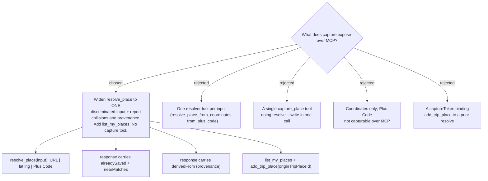

# ADR-157: Capture over MCP widens `resolve_place` and returns what it collides with — no capture tool

**Date:** 2026-08-11
**Status:** Accepted
**Relates to:** issue #48; decision-map `discover-add-place-48` (#53), ticket `mcp-surface` (#63).
**Amends ADR-149 section 2** — the 100 m near-match predicate moves from the SPA to the server and
is read by both surfaces; ADR-149's *timing* (resolve time, before a category is chosen) is
unchanged and is the reason this shape works. **Depends on ADR-155** (a capture attaches to a Trip,
so `tripId` stays mandatory) and **ADR-156** (the flattened `OriginTripPlaceId`, which this exposes
over MCP). **Amends the CONTEXT.md `Capture` entry** — it now names the MCP surface, and its claim
that every path ends at "a Google `place_id` + snapshot" is corrected, having contradicted the
`Place` entry's own statement that a `place_id` is optional. Constrains `shared-capture` (#60).

## Context

Measured on `main` at `ce28a1b`: `McpServerRegistration` registers **7** tool types totalling **82**
tools, of which `TripTools` holds **27** — every one trip-scoped. There is no Places or Discover
tool type at all, so **an agent cannot read ไปไหนดี**.

Capture over MCP already exists, and it is already two steps: `resolve_place(url)`
(`TripTools.cs:81-85`) returns a `ResolvedPlaceDto` (`TripDtos.cs:39-41`), the agent reads it, and
`add_trip_place(tripId, name, lat, lng, category, …)` (`TripTools.cs:93-107`) commits. The ticket
was framed around "an agent cannot look at a preview card and confirm", but **the confirmation
point already exists** — it is split across two tools with the snapshot held by the agent in
between, and the human reading the agent's message is the surface that would have read the card.

### The four inputs are not four equal problems on this surface

| input | over MCP at `ce28a1b` | what is missing |
|---|---|---|
| Google Maps URL | `resolve_place` → `add_trip_place` — works, badly (#56) | nothing new; #56's resolver weakness is its own issue |
| latitude/longitude | **already works** — `add_trip_place` takes `lat`/`lng`, `googlePlaceId` is optional, and `AddTripPlaceValidator` constrains neither (it checks only `TripId` non-empty, `Name` ≤ 300, `PriceLevel` 0-4) | nothing structural; the tool doc actively discourages it |
| Plus Code | rejected — `ResolvePlaceValidator` requires `GoogleMapsHosts.IsAllowedUrl`, and no offline decode exists server-side | a decode step |
| tap a place on the map | **no agent equivalent** — a tap is a UI gesture | nothing; it reduces to coordinates or a `place_id` |

So exactly **one** of the four inputs needs a new resolution path. The ticket's framing — "one
resolve-and-add tool per input type, or a single tool taking a discriminated input" — assumed four
new paths, and the code contradicts that.

The ticket's other clause, "do they take a `tripId` at all, once place-home has decided where a
trip-less place lives", was written while ADR-147 stood. **ADR-155 reversed it**: there is no
trip-less place. `tripId` stays mandatory and the question dissolves.

### Three gaps the agent path has and the SPA does not

1. **ADR-149 section 1's idempotent handler is not implemented.** `AddTripPlaceHandler` calls
   `TripPlace.Create` and `_db.TripPlaces.Add` with no pre-check, so a duplicate `place_id` on one
   trip hits the unique filtered index at `TripPlaceConfiguration.cs:77-79` and raises
   `DbUpdateException` — which `McpToolErrorMapper` does **not** catch (it catches `DomainException`
   and `ValidationException` only). Today an agent receives a raw unexpected error.
2. **ADR-149 section 2's 100 m near-match is frontend-only** (`frontend/src/shared/utils/distance.ts`).
   It is the only mechanism that catches one physical place saved once from a URL and once from
   coordinates — the pair #57 measured can never share an identifier — and **two of the three
   agent-reachable inputs carry no `place_id` at all**, so it is the only check that can fire for them.
3. **A silently-wrong resolve reads as a success.** #56 measured 7 URL shapes resolving to the
   wrong place (the resolver discards the `place_id` in a long URL and re-searches by name, which
   can land on a different branch of a chain); #57 measured a short Plus Code resolving
   *confidently* 500 km off. The SPA survives this because the preview sheet draws a pin on a map.
   An agent has no map — it has a sentence.

`ListMyPlacesQuery()` is parameterless: the library comes back whole and the viewport scoping is
entirely client-side, so exposing it needs no scoping story invented for it.

## Decision

### 1. `resolve_place` widens to one discriminated input. No capture tool is added.

Its parameter is renamed `url` → `input` and it accepts three shapes, sniffed server-side:

| input shape | how it resolves | cost |
|---|---|---|
| a Google Maps URL | as today, via `IPlaceResolver` | per ADR/#58 masks |
| `"13.7563, 100.5018"` | verbatim passthrough — **no Google call** | $0 |
| a Plus Code | offline `open-location-code` decode (#57) | $0 |

`add_trip_place` remains the commit, and the two-step survives. Nothing named `capture_place` is
added: the two-step **is** the preview-and-confirm, and collapsing it would force the agent to
commit a category before learning the place is already saved — the precise cost ADR-149's
resolve-time timing exists to avoid.

`ResolvePlaceValidator` must accept the two new shapes; it currently rejects everything that is not
an allowed Google Maps host.

### 2. The resolve response reports what it collides with

`ResolvedPlaceDto` gains two fields, populated by a **server-side** scan of the caller's own library:

- **`alreadySaved`** — the existing place this input already resolves to, with the Trips it sits on.
  Library-level, not per-trip: at resolve time **neither surface knows the target Trip yet**, because
  ADR-155 puts the Trip picker *after* the preview. Per-trip idempotency stays in the handler.
- **`nearMatches`** — up to **3** of the caller's places within **100 m**, nearest first, non-blocking.

This fires for **all three** inputs, which is the point: for a coordinate or a Plus Code there is no
`place_id`, so `nearMatches` is the only duplicate signal that can exist.

`ResolvePlaceHandler` gains `IApplicationDbContext` — it currently injects only `IPlaceResolver`,
`IUserProvisioner` and its validator.

### 3. The resolve response names its own provenance

`ResolvedPlaceDto` gains **`derivedFrom`**, naming how the place was obtained:

| value | trustworthy? |
|---|---|
| `ExactPlaceId` | yes — the `place_id` was read directly |
| `NameSearch` | **no** — may be a different branch of a chain (#56) |
| `CoordinateVerbatim` | exactly what the caller supplied, nothing inferred |
| `PlusCodeFull` | yes — a deterministic offline decode |
| `PlusCodeShort` | **no** — may be far off (#57 measured 500 km) |

`resolve_place`'s tool description instructs the agent to **read the resolved name and address back
to the user and get a reply before calling `add_trip_place`** whenever `derivedFrom` is not
`ExactPlaceId`. Nothing is refused and no server state is added: the user reading the agent's
message becomes the preview card. This converts an invisible risk into a field the agent must
reason about.

### 4. One new read tool, and the origin parameter beside it

- **`list_my_places`** is added — a new `PlaceTools` type registered alongside the existing seven —
  returning the same `DiscoverPlaceDto` the SPA reads, grouped, with ADR-156's **already-flattened**
  `OriginTripPlaceId`.
- **`add_trip_place` exposes `originTripPlaceId`**, which the agent passes straight through from the
  card exactly as `AddToTripDialog` does.

These two travel together and neither ships alone. The parameter is useless without the read tool,
because the value it requires is the **root**, and only the Discover projection computes it —
`TripPlaceDto` does not carry it, so an agent brute-forcing `list_trips` + `list_trip_places` would
hold a non-root id and building a chain is exactly what ADR-156 section 2 forbids. Conversely the
read tool without the parameter lets an agent *observe* the split card it just caused without being
able to prevent it.

The exposure is scoped by ADR-156's own key, `GooglePlaceId ?? "tp:{OriginTripPlaceId ?? Id}"`: a
place with a `place_id` is immune, so this matters for precisely the `place_id`-less places the new
inputs create.

### 5. The 100 m predicate lives once, on the server

The SPA's client-side scan is **deleted**; both surfaces read `nearMatches` off the resolve
response. For a pasted link this costs nothing, because the coordinates only arrive *in* that
response — the client-side scan could never have run earlier. For ADR-150's empty-ground tap and a
typed coordinate pair, where the browser already holds the coordinates, the SPA calls the widened
`resolve_place` with a `"lat,lng"` input: a passthrough with **no Google call**, so $0 and one round
trip. The threshold then lives in exactly one place.

### 6. Two defects this closes on the way

Both are pre-existing and both become reachable by an agent under section 1:

- **`AddTripPlaceValidator` range-checks nothing.** It constrains `TripId`, `Name` and `PriceLevel`
  and never validates `Lat`/`Lng`, so `lat: 999` is writable today. Latitude ∈ [-90, 90] and
  longitude ∈ [-180, 180] are added, and the widened `resolve_place` rejects an out-of-range pair.
- **`resolve_place`'s doc contradicts its own error messages.** The description says *"never
  fabricate coordinates yourself"* while `GooglePlaceResolver` fails with *"Enter the place
  manually."* — advice an agent cannot follow without violating the description. The doc gains the
  distinction that matters: a **user-supplied** coordinate is a first-class input; an
  **agent-invented** one is still forbidden.

## Rejected

**One resolver tool per input** — `resolve_place_from_coordinates` and `resolve_place_from_plus_code`
beside an untouched `resolve_place`. Honest, narrow signatures and no sniffing. Rejected because it
grows `TripTools` from 27 to 29 for two inputs that need no Google call at all, and it makes the
agent classify the input before it can choose a tool — a job the server does more reliably, since it
must validate the shape regardless.

**A single `capture_place` tool** doing resolve and write in one call. One round trip, and ADR-149's
idempotent handler would keep it safe from writing a duplicate. Rejected because it destroys the only
confirmation point the agent path has, and it re-creates the discarded-work problem ADR-149
deliberately designed away: the agent must supply a category *before* it can learn the place is
already saved. The two-step is load-bearing, not incidental.

**Coordinates only, cutting Plus Code from MCP.** The smallest change of all — document that an agent
passes a user-supplied `lat`/`lng` to `add_trip_place` and support nothing else. Rejected because a
Plus Code decode is offline and free (#57), so the cut saves almost nothing while leaving one of the
four inputs #48 names missing from a surface the destination puts in scope.

**A `captureToken` binding `add_trip_place` to a prior `resolve_place`.** It would make the two-step
structurally enforced rather than conventional. Rejected because it adds server-side state to a
stateless tool surface, breaks the direct user-supplied-coordinate path that already works, and still
cannot tell whether the agent actually showed the user anything — it enforces the *call order*, not
the confirmation, which is the thing that matters.

**Refusing low-confidence inputs over MCP** — rejecting a short Plus Code and a name-only URL
outright. Nothing wrong is ever written. Rejected because it makes MCP strictly weaker than the SPA,
which permits the same inputs, and the asymmetry is not justified: the agent path has a human reading
its message, so it has a confirmation surface — it just needed to be *told* when to use it, which is
section 3.

**Exact hit only at resolve, near-match left frontend-only.** A smaller change than section 2.
Rejected because it goes silent for exactly the two inputs this ADR exists to add.

**Keeping both 100 m implementations, split by input.** No new round trip on a ground tap. Rejected
because a threshold that lives in two places can drift, and the round trip it saves is a $0
passthrough.

**Server-side scan as an MCP-only mechanism**, leaving the SPA and ADR-149 section 2 untouched.
Smallest frontend blast radius. Rejected because it makes the duplication permanent and deliberate
for no gain beyond avoiding a frontend edit.

## Consequences

- **The MCP surface grows by one tool and three response fields**, not by a capture tool. `TripTools`
  stays at 27; a new `PlaceTools` adds `list_my_places`, taking the registered types from 7 to 8.
- **`resolve_place`'s parameter is renamed `url` → `input`.** MCP tools are discovered per session
  rather than compiled against, so no stored client breaks; a saved user *prompt* naming `url` could
  read oddly, which the description absorbs.
- **`ResolvedPlaceDto` is shared with the SPA**, so sections 2 and 3 are additive at both ends — but
  the SPA must now read `nearMatches` from it, which is a real frontend change, not a no-op.
- **`ResolvePlaceHandler` stops being a pure pass-through** to `IPlaceResolver`: it gains a database
  query per resolve. No Google call is added, so the #58 cost envelope is untouched.
- **This constrains `shared-capture` (#60).** The widened `resolve_place` becomes the single
  resolution entry point for *every* input including ADR-150's ground tap, and the SPA's client-side
  scan is deleted — both land inside the component seam #60 is deciding. Recorded on that ticket.
- **`list_my_places` returns the whole library**, since `ListMyPlacesQuery` is parameterless. For a
  large library that is a large tool payload; a `search`/`near` parameter is the obvious later
  optimisation and is deliberately not invented here.
- **ADR-149 section 1's idempotent handler is now on the critical path.** Without it a duplicate
  `place_id` still reaches the unique index as an uncaught `DbUpdateException`, and section 2's
  `alreadySaved` would advertise a check the commit does not honour.
- **ADR-149 section 3 is already void** — it gave the filtered unique index to `SavedPlace`, which
  ADR-155 deleted. Noted here because section 2 reads as if that index existed.
- **Not decided here:** whether Trips gains the coordinate and Plus Code inputs in its own UI
  (that is `shared-capture` #60), and what Discover renders for these places (`trip-less-place-rendering`
  #64, re-scoped by ADR-155).
