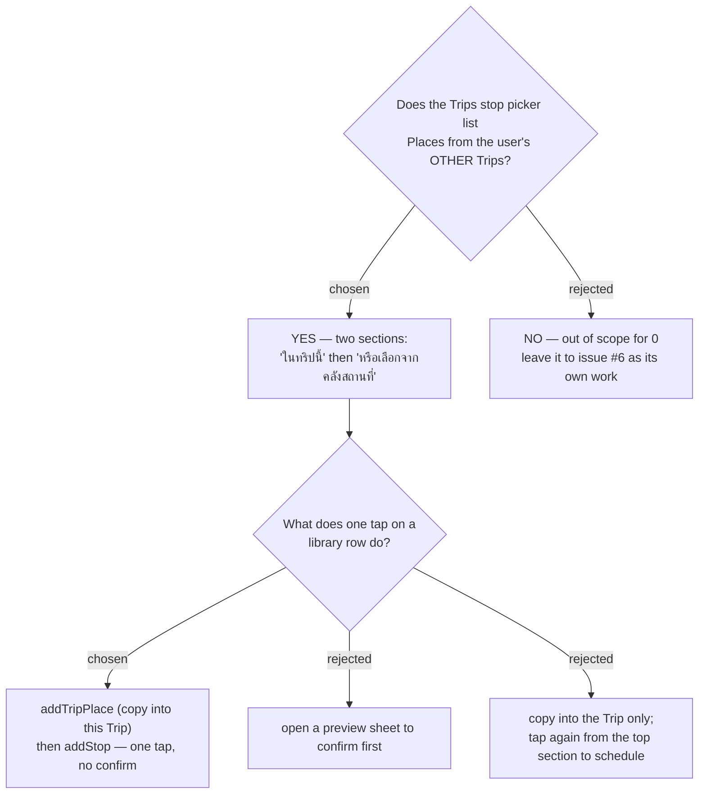

# ADR-158: The add-stop picker lists the whole **Place library**; a pick from another Trip **copies the row in**

**Date:** 2026-08-12
**Status:** Accepted
**Relates to:** issue #48 and issue #6; decision-map `discover-add-place-48` (#53), ticket
`stop-picker-saved-places` (#66) — **re-scoped** by ADR-155 and answered here. Builds on ADR-067 /
ADR-068 / ADR-070 (the add-stop picker as a Capture launch surface) and is the **second writer** of
ADR-156's `OriginTripPlaceId` and copy-at-add-time enrichment. **Deliberately declines** to extend
the `place_id`-less chip of `trip-less-place-rendering` (#64) to this surface. **Adds** the
CONTEXT.md term **Place library** and amends **Capture** and **Discover**.

## Context

**The picker already promises the library, and the promise is false.** Measured on `main` at
`cae3efc`:

| where | what it does |
|---|---|
| `ItineraryTab.tsx:92` | renders the divider **"หรือเลือกจากคลังสถานที่"** |
| `ItineraryTab.tsx:89` | renders the empty state **"คุณยังไม่มีสถานที่ในคลัง"** |
| `ItineraryTab.tsx:145` | but `places` comes from `useListTripPlacesQuery(tripId)` |
| `ListTripPlacesHandler.cs:21-22` | which filters `p.TripId == c.TripId` — **this Trip only** |

So a user with 200 Places across 12 Trips opens a fresh Trip's เลือกจุดแวะ and is told
*"คุณยังไม่มีสถานที่ในคลัง"*. That is exactly what **issue #6**
(แสดงสถานที่จากในคลังที่ยังไม่เลือกในหน้าเดินทางด้วย) asks for, and #66 was charted to settle it.

**#66's question as charted no longer has a subject.** It asked whether the picker lists *trip-less
**Saved place**s* — a category ADR-155 deleted outright, along with the glossary term
(CONTEXT.md:93). What survives is the question above, and it is answered here rather than narrowed
away.

**Two mechanical facts shape the answer.**

- **`addStop` cannot reach another Trip's row.** `AddStopHandler.cs:27-28` guards
  `p.Id == c.TripPlaceId && p.TripId == c.TripId` and otherwise throws
  `"Place not found in this trip."` A library Place must therefore be **copied into this Trip
  first**, which is precisely the `addTripPlace` path ADR-156 designed for Discover's
  "เพิ่มเข้าทริป".
- **`list_my_places` alone is not enough, and neither is `listTripPlaces`.**
  `ListMyPlacesHandler.cs:41` already dedupes to one entry per physical place and `:55` attaches
  every Trip it sits on — but `PlaceTripRefDto` carries only `(Guid TripId, string TripName)`
  (`PlaceDtos.cs:7`), **never the `TripPlace.Id`** that `addStop` needs. The panel needs both
  queries.

## Decision

### 1. The picker reads both queries and renders **two sections**

- **"ในทริปนี้"** — `useListTripPlacesQuery(tripId)`, exactly today's content and today's one-call
  `addStop` behaviour. Unchanged.
- **"หรือเลือกจากคลังสถานที่"** — `useListMyPlacesQuery()` (`api.ts:1391`, parameterless), **minus
  every card whose `trips[]` already contains this `tripId`**. The existing divider copy becomes
  true rather than being reworded.

A section heading, **not** a per-row Trip chip. The two kinds of row commit differently, so that
boundary is the information the user needs; a chip on every library row would repeat the same fact N
times and reproduce the Trip-name noise ADR-155 rejected its option C for.

### 2. One tap on a library row = `addTripPlace` **then** `addStop`

No confirm step. A library Place is one the user already saved and already named; the picker's job
is to identify it, not to re-approve it. The copy carries `originTripPlaceId` and the enrichment per
ADR-156, so ไปไหนดี keeps showing **one** card.

### 3. A half-done tap degrades into a **valid state**, not corruption

If `addStop` fails after `addTripPlace` succeeded, the Place *is* now in this Trip's pool, just
unscheduled — a state the product already supports (`TripPlace.Create` requires no `ItineraryDay`,
ADR-155). And it self-corrects on screen: `addTripPlace` invalidates both `{type:'TripPlaces', id}`
and `'MyPlaces'` (`api.ts:1397`), so the row **moves from the bottom section to the top one by
itself** and the user's next tap takes the plain `addStop` path. The error surfaces through the
picker's existing `addError` slot; no rollback, no compensating delete.

### 4. A row shows **name + category**, and a `place_id`-less Place is **not marked**

`ItineraryTab.tsx:113` renders `p.name` alone today, which cannot separate three saved
"คาเฟ่ริมทาง". `category` is non-nullable `PlaceCategory` and already on both DTOs, so the second
line is free.

**The `ไม่มีเวลาเปิด-ปิด` chip of #64 stays in Discover.** A picker row is where you say *which
place I mean*, not where you judge whether to go — hours belong on the Discover row and the detail
sheet, where #64 put them. A coordinate Place therefore looks like every other Place here, which is
the honest rendering: it *is* a Place like any other.

### 5. A client-side search box, on the library section only

Not a fork: 200 rows without search is unusable, and ADR-155 already made search mandatory on the
*Trip* picker for the same reason. `ListMyPlacesQuery` is parameterless by design and Discover
already scopes client-side, so this stays consistent with the map's standing out-of-scope line on
bounding the `list_my_places` payload. The "ในทริปนี้" section is a Trip's own pool and stays
unfiltered.

### 6. This ships **after** ADR-156's column

Without `OriginTripPlaceId`, a copied coordinate Place splits into a second Discover card — the
exact defect ADR-156 exists to prevent. Frontend-only otherwise: **no backend change, no new
endpoint, no migration of its own.**

## Rejected

- **Out of scope; leave it to issue #6.** The map's destination names *capture*, and browsing your
  own library is a different verb — the same reasoning that put "editing and deleting a place from
  Discover" out of scope. Rejected because the surface is already lying: the divider and the empty
  state promise คลังสถานที่ today, so this is an unkept promise on a panel this map is already
  changing, not a new feature. #6 also asks to *add* a place, which is what #48 is about.
- **One flat list with a Trip-name chip per library row.** Fewer headings, and the chip names the
  provenance precisely. Rejected because it does not tell the user the thing that actually differs —
  that tapping one row copies a place into this Trip — and it puts Trip names on every row.
- **Tap opens a preview sheet to confirm.** Honest about the write, and it would show the photo and
  hours. Rejected because it adds a step to the common path for a place the user saved themselves;
  the preview sheet exists for a *newly resolved* place, where the risk is having resolved the wrong
  one.
- **Copy into the Trip only; tap again from "ในทริปนี้" to schedule.** No partial failure at all,
  and one call per tap. Rejected because it charges every user two taps to avoid an edge case that
  decision 3 already renders harmless.

## Consequences

**Issue #6 is closed by this decision** and should be resolved against it rather than planned
separately.

**The picker becomes the second reader of the Place library**, which is why the set now has a
glossary name. It is also the first surface where a Place appears *outside* the Trip that owns it,
so `AddStopPicker` gains a dependency on `DiscoverPlaceDto` — a Trips component reading a Places
DTO. Accepted: the alternative is a third endpoint returning the same rows.

**A Trip's pool can now grow without the itinerary changing.** A failed `addStop` leaves a copied
`TripPlace` behind, and nothing prunes it. This is already true of every Place added from Discover's
"เพิ่มเข้าทริป" (ADR-155), so it introduces no new class of orphan.

**The empty states split.** "คุณยังไม่มีสถานที่ในคลัง" becomes correct only when the *library* is
empty; a Trip with no Places of its own needs different copy, or none, since the library section
below it is the useful thing.

**Verification is interactive.** The SPA has no component or visual test harness and the review
gates are blind to visual fidelity (CLAUDE.md), and this change is entirely rendering plus a
two-call sequence. It must be exercised by hand — a Trip with no Places of its own, a library Place
from another Trip, and a `place_id`-less one — before it is pushed.
