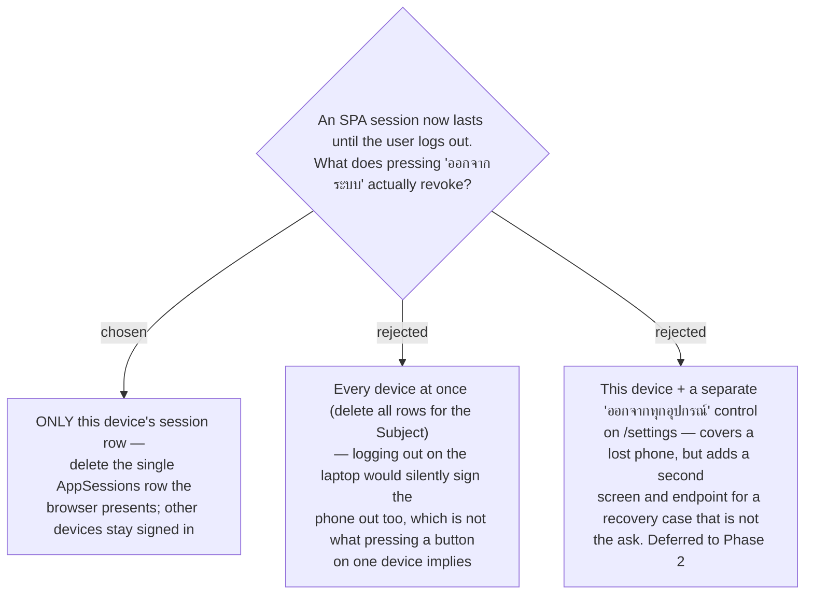

# ADR-159: Logout revokes only the device that pressed it

**Date:** 2026-08-12
**Status:** Accepted
**Relates to:** issue #5. Sibling of the durable-SPA-session work that supersedes ADR-036.
Builds on ADR-037's SQL persistence pattern. **Amended by ADR-162**, which gave the SPA
session its own `AppSessions` table: the row this deletes is an `AppSessions` row, not the
`OAuthRefreshToken` row named when this ADR was written. The decision itself is unchanged.

## Context

Until now the SPA had no durable session to revoke: closing the browser destroyed it by
itself (MSAL v5 binds its `localStorage` cache to a session cookie — the root cause behind
issue #5). Making the session survive until an explicit logout creates, for the first time, a
credential that outlives the browser — so "log out" has to mean something on the server, not
just in the tab.

The proxy has **no revoke endpoint at all** today (`/oauth/register`, `/oauth/authorize`,
`/oauth/callback`, `/oauth/token` only). Without one, pressing logout would clear the browser's
copy while the stored refresh row lived on in SQL for its full 365 days.

## Decision

Logout revokes **the pressing device only**. The SPA sends its refresh token to a new revoke
endpoint, which deletes that one row; every other device keeps its own row and stays signed in.

As implemented (after ADR-162 split the SPA session off into its own table), that endpoint is
`POST /api/session/logout` and the deletion is `AppSessionStore.RevokeAsync`, which removes the
one matching `AppSessions` row. The MCP proxy's `OAuthRefreshToken` rows are a separate store and
are not touched by SPA logout.

The user chose this over all-devices because a button pressed on one machine should not reach
across to another. "ออกจากทุกอุปกรณ์" is a **Phase 2** addition — it is a device-loss recovery
feature, not part of the "stay signed in until I log out" requirement.

## Consequences

**Positive:** matches the mental model of the control being pressed; one row deleted, no
cross-device surprises; the endpoint stays small.

**Negative (accepted):** a lost or stolen device cannot be signed out remotely in Phase 1 —
the only recourse is deleting the row by hand in SQL. Acceptable for a personal app, and the
Phase-2 control closes it without changing this decision.
