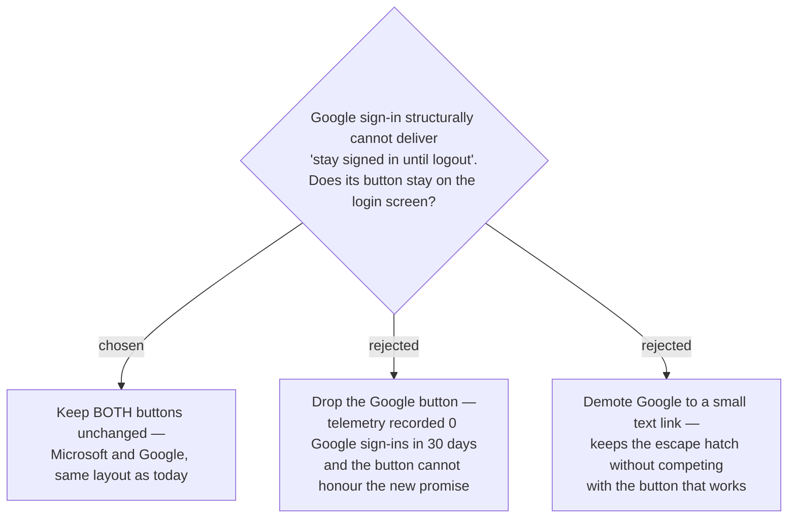

# ADR-160: The login screen keeps both sign-in providers

**Date:** 2026-08-12
**Status:** Accepted
**Relates to:** issue #5, ADR-159. Constrains the durable-session mechanism (see ADR-161).

## Context

`GoogleLogin` (`@react-oauth/google`) returns only an ID token, valid ~1 hour, with **no
refresh token of any kind** — `getGoogleToken()` self-deletes it once expired
(`googleAuth.ts`). This is ADR-036's deferred branch B. No amount of work on the Microsoft
path changes it, so a login screen carrying both buttons offers one that honours "stay signed
in until logout" and one that cannot.

Supporting evidence: 30 days of App Insights recorded **no Google sign-in at all** (402
pageviews / 60 sessions all carried a Microsoft-shaped `oid`).

## Decision

**Both buttons stay, unchanged.** The user was shown the asymmetry and the zero-usage
telemetry and chose to keep the screen as it is.

The backend Google authentication scheme (`AddJwtBearer("Google")` and the
`ForwardDefaultSelector` branch in `Program.cs`) was never in question — it stays regardless.

## Consequences

**Positive:** no user-visible change to a working screen; the Google escape hatch survives for
an account that cannot reach Microsoft.

**Negative:** the two buttons have **different session longevity** unless the durable-session
mechanism is provider-agnostic. That is precisely the fork this ADR hands to ADR-161 — keeping
Google on screen is what makes a provider-agnostic mechanism worth its cost.
