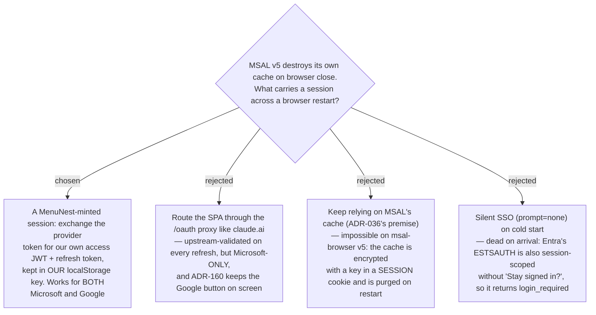

# ADR-161: The durable SPA session is app-minted and provider-agnostic

**Date:** 2026-08-12
**Status:** Accepted — **supersedes ADR-036**
**Relates to:** issue #5. Consumes ADR-037's SQL persistence. Constrained by ADR-160
(both providers stay on the login screen). Revocation shape set by ADR-159.

## Context

`@azure/msal-browser` v5 encrypts everything it writes to `localStorage` with a key held in the
**session cookie** `msal.cache.encryption` (`LocalStorage.mjs`, written with `cookieLifeDays = 0`
→ no `expires` attribute). On the next browser start MSAL mints a new key, finds every entry
carries a different `id`, and discards it as *"from a previous session"*. `getAllAccounts()`
returns empty, so `ProtectedRoute` shows the login card. v5's whole `CacheOptions` is
`cacheLocation` + `cacheRetentionDays` — **no setting escapes this**, and `storeAuthStateInCookie`
no longer exists.

**This falsifies ADR-036**, which moved the cache `sessionStorage` → `localStorage` expecting
cross-restart persistence. Production telemetry: login-first sessions went 65% → 69% after that
fix shipped, and gaps over 24 h land on `/login` 15 times out of 16.

The provider token cannot be the durable credential either: Entra caps SPA refresh tokens at
24 h, and Google's `GoogleLogin` issues **no refresh token at all**.

## Decision

The SPA keeps using **MSAL / Google for the interactive sign-in only**, then immediately
exchanges that provider token for a **MenuNest app session** — a short (1 h) access JWT plus a
durable refresh token stored under **our own** `localStorage` key, which MSAL's encryption does
not govern and nothing purges on browser close.

Refreshing the app session is **self-contained**: it re-mints from the stored subject and does
**not** call Entra or Google. That is what makes it provider-agnostic and therefore able to serve
both buttons ADR-160 keeps on screen.

## Consequences

**Positive:** one mechanism satisfies "stay signed in until logout" for **both** providers;
the interactive login path (MSAL/Google) is untouched, so the blast radius stays small — which
matters because CLAUDE.md records that the SPA has **no component/visual test harness**;
sessions are revocable server-side (ADR-159).

**Widened token acceptance on `/api/*` (accepted side effect, recorded here so it is a chosen
trade-off rather than an undocumented one):** the SPA's access token and the MCP proxy's own
access tokens are minted by the **same** `OAuthJwt` with the **same** issuer and audience
(`MCP:ServerUrl`), so nothing distinguishes them. Routing app-issued tokens to a scheme that
validates them therefore also makes **MCP-proxy access tokens valid on every `/api/*` endpoint**
— previously they reached the Entra handler and were rejected, so `/api/*` was reachable by
provider tokens only.

The blast radius is bounded: `RedirectAllowlist` restricts dynamic client registration to
`https://claude.ai/…` and `https://claude.com/…`, so the only holder of such a token is an MCP
client the user themselves authorised, acting as that same user, with no more reach than the
tools already expose. The one place the distinction is enforced is `POST /api/session/exchange`,
which carries an explicit Microsoft/Google-only policy — an app-issued token there would upgrade
a 1-hour credential into a fresh 365-day one. Narrowing acceptance elsewhere (a `client_id` or
`aud` split between the SPA session and the proxy) is a separate decision, deliberately not taken
here.

**Negative (accepted, chosen with eyes open):** the refresh never re-validates upstream, so
disabling or password-changing the Microsoft/Google account does **not** end an existing app
session — only logout or deleting the SQL row does. Combined with ADR-159's Phase-1 lack of a
remote "sign out everywhere", a lost device stays signed in until its row is removed by hand.
The refresh token is XSS-readable in `localStorage`, the same trade-off ADR-036 already accepted
explicitly.
