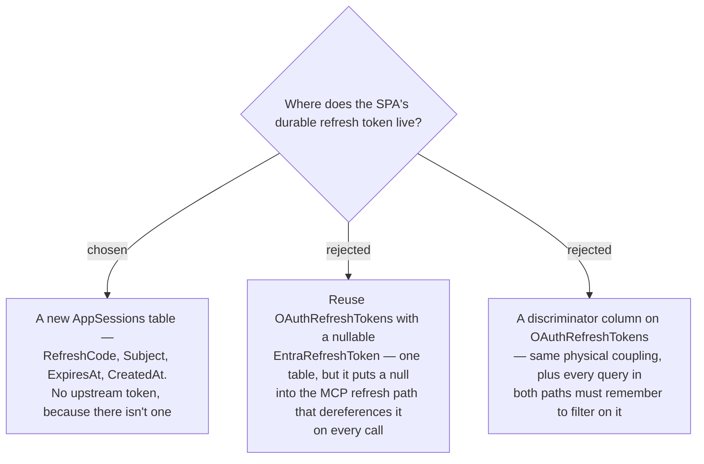

# ADR-162: App sessions get their own table, not a nullable column on OAuthRefreshTokens

**Date:** 2026-08-12
**Status:** Accepted
**Relates to:** ADR-161 (the app-minted session this stores), ADR-037 (the table it declines to reuse).

## Context

ADR-161's app session refreshes **without** an upstream identity-provider call, so it has no
Entra refresh token to store. The obvious move is to reuse the existing `OAuthRefreshTokens`
table, which already holds `RefreshCode` / `Subject` / `ExpiresAt` / `CreatedAt` — everything
needed except the upstream token.

But `OAuthRefreshTokenConfiguration.cs:14` declares `EntraRefreshToken` as `IsRequired()`, and
`/oauth/token`'s refresh branch dereferences it immediately: `entra.RefreshAsync(entraRt)`.
Relaxing that column to nullable would let an app-session row be handed to the MCP refresh path,
where the only possible outcome is a null-reference or a confusing `invalid_grant`.

## Decision

A **separate `AppSessions` table**. The two credentials have genuinely different semantics — one
brokers a server-held Entra refresh token for MCP clients, the other is a self-contained app
session for the SPA — and keeping them apart preserves `EntraRefreshToken`'s non-null invariant
rather than weakening a shipped, working path (ADR-037) to accommodate a new one.

## Consequences

**Positive:** the MCP refresh path is untouched and its invariant still holds; each table's rows
mean exactly one thing; revoking a session (ADR-159) is a delete against one clearly-scoped table.

**Negative:** two tables with a similar shape, and a reader may wonder why. That is what this ADR
is for. Rotation logic is deliberately mirrored from `TokenStore.TakeRefreshAsync` rather than
shared, since the two differ in exactly the step that matters — whether an upstream call happens.
