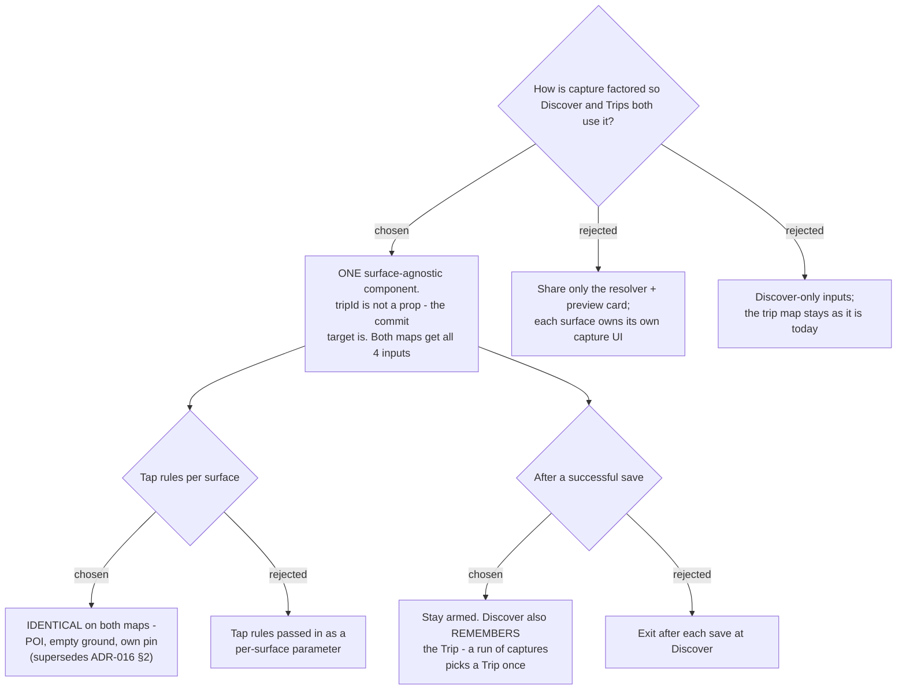

# ADR-163: Capture is **one** surface-agnostic component, and both maps accept every input

**Date:** 2026-08-13
**Status:** Accepted
**Relates to:** issue #48; decision-map `discover-add-place-48` (#53), ticket `shared-capture` (#60).
**Supersedes ADR-016 §2** (empty-ground taps ignored on the trip map). Builds on ADR-150 (#59, Capture
mode tap rules), ADR-155 (#54, a capture attaches to a Trip), ADR-157 (#63, server-side resolution and
`nearMatches`), ADR-158 (#66, the add-stop picker). **Amends** the CONTEXT.md definition of **Capture
mode**. Unblocks `capture-mock` (#62).

## Context

The ticket stated that `AddPlaceMode` is "tripId-bound end to end: the prop, the `addTripPlace` call,
the `addStop` chain, the `createdRef` idempotency guard and the stay-armed behaviour all assume a
trip." **Measured on `main` (f7c4b97), that is not what the code does.**

- `tripId` is read in exactly **one** function, `doAdd` — `AddPlaceMode.tsx:122` (`addTripPlace`) and
  `:141` (`addStop`). Search, the preview card, the category guess, the review-link drafts, the link
  fallback, the POI-tap resolve effect and the Esc handler never see it.
- `createdRef` (`:46`, `:119-136`) guards the **`addTripPlace` → `addStop`** pair, not the trip
  binding. Where there is no `addStop` — which is every Discover capture, since ADR-155 writes a
  `TripPlace` and `TripPlace.Create` needs no `ItineraryDay` — the second half of the guard is inert.
- Resolution is already **two** mechanisms, and neither is trip-bound: pasting a link is a server
  call to `POST /api/trips/resolve-place` whose body is `{url}` with **no** `tripId`
  (`api.ts:1410-1412`), while search and POI-tap run in the browser on the Maps JS SDK
  (`usePlaceSearch.ts:108-126`), bound to the `<Map>` subtree rather than to a trip.
- Discover already commits places to trips: `AddToTripDialog.tsx:15-30` calls the same
  `addTripPlace`. What it lacks is the **resolution** and the **capture form**, not the write path.

So the seam the ticket set out to find largely already exists. What genuinely differed between the two
surfaces were the **tap rules** and the **after-save behaviour**, and those are owner decisions rather
than factoring ones. Both were put to the owner as rendered screens.

On the tap rules the owner chose full parity — *"ได้ทุกอย่าง เหมือน ไปไหนดี เป๊ะ"* — which reverses
ADR-016 §2. That reversal is narrower than it looks: ADR-016 rejected **reverse-geocoding an arbitrary
tapped point** ("adds a Geocoding call and 'what place is this?' ambiguity"). What ADR-150 actually
ships is the raw coordinates dropped into a form the User names themselves — no Geocoding call, no
claim about what is there. ADR-016's *conclusion* is superseded; its *concern* is untouched.

## Decision

1. **One capture component, surface-agnostic.** It does not take `tripId`. It takes a commit target —
   the callback that turns a resolved place plus the form's category and review links into a saved
   row — and both surfaces supply their own. Nothing about the component is duplicated per surface.
2. **Both maps accept all four inputs**: live search, POI tap, a Google Maps URL, a coordinate pair
   and a Plus Code. The trip map gains the coordinate and Plus Code inputs **in the same change**, not
   a later one.
3. **The tap rules are identical on both maps** (ADR-150's rules, now unqualified): a POI tap previews,
   an empty-ground tap becomes the coordinate input, a tap on one of the User's own pins only warns.
   This **supersedes ADR-016 §2**. They are not a per-surface parameter — one rule set, no branch.
4. **Capture stays armed after a save on both surfaces** (ADR-016's stay-armed, unchanged), and at
   **Discover the arming remembers the Trip chosen at the previous save**. A run of captures picks a
   Trip once. Without this, ADR-155's per-save trip choice would make staying armed worse than exiting.
5. **The preview card keeps ADR-155's two same-level buttons.** Once a Trip is remembered the first
   button carries its name — "เพิ่มเข้า เชียงใหม่ ก.ย. ▾" — and commits in one tap; the ▾ opens the
   trip picker. "สร้างทริปใหม่" stays a sibling button and never becomes a row inside the picker,
   which is the shape ADR-155 rejected as option D.
6. **Add-as-stop stays Trips-only.** A Discover capture writes a `TripPlace` and stops there; the route
   from library to itinerary is ADR-158's add-stop picker, not a day selector bolted onto Discover.
7. **POI-tap resolution stays client-side** on the Maps JS SDK. ADR-157 routes the URL, coordinate and
   Plus Code inputs through `resolve_place`; a POI tap already carries a `place_id` and both surfaces
   render a `<Map>`, so moving it server-side would add a hop and bill the same Place Details call.

## Consequences

- The trip map's behaviour changes for existing users: a tap on empty ground, previously ignored, now
  drops a draft pin. It only does so while **Capture mode** is armed, so browsing a trip map is
  unaffected — but this is the one user-visible regression risk in the change and the mock must show it.
- `AddPlaceMode` moves out of `pages/trips/components/` — a component both pages render cannot live
  inside one of them. `usePlaceSearch` moves with it for the same reason.
- The remembered Trip is **session state, not persisted**: it lives as long as the arming does and is
  forgotten when Capture mode exits. Nothing is written to the backend to support point 4.
- `AddToTripDialog` is the trip picker point 5's ▾ opens, and it needs the 100-newest cap and the
  search box #54 called for. It also still renders a bare `✕` character
  (`AddToTripDialog.tsx:37`) where the project requires an inline-SVG icon; that is a pre-existing
  defect this ADR does not fix, and it is noted here because the picker is being touched anyway.
- ADR-016 stays authoritative for everything except its §2 tap-target restriction — its surface
  choice, category guess, viewport bias and stay-armed decisions are all reaffirmed here.
