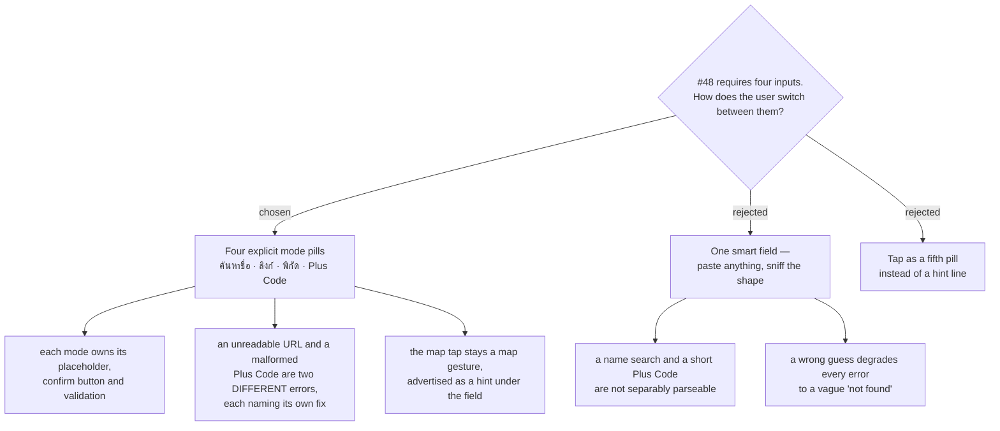

# ADR-164: The four capture inputs are four explicit mode pills, not one smart field — and the Discover capture surface is approved as drawn

**Date:** 2026-08-13
**Status:** Accepted
**Relates to:** issue #48; decision-map `discover-add-place-48` (#53), ticket `capture-mock` (#62). Renders and is constrained by ADR-150 (armed Capture mode and the tap rules), ADR-155 (a capture must attach to a Trip; two same-level buttons; the trip picker must be fixed first), ADR-149 (exact `place_id` idempotent, a `place_id`-less match within 100 m only warns), ADR-148 §1 (the name is typed by the user, the address is best-effort), ADR-163 (one surface-agnostic component; both maps accept every input), ADR-158 / ticket #66 (a `place_id`-less row is unmarked in the picker) and ticket #64 (the `ไม่มีเวลาเปิด-ปิด` chip). Decides the one thing none of them decided: **how the user moves between the four inputs.**

## Context

`capture-mock` (#62) was the last open ticket on map #53: eleven decisions had accumulated across
ADR-148 through ADR-163, and #48's body requires four capture inputs, but nothing had ever been
drawn. The ticket's own scope was explicit — the entry affordance, all four inputs **and how the
user switches between them**, the preview card, the duplicate state, the error states for an
unreadable URL and an invalid Plus Code, a coordinate place with no name, mobile and desktop,
built from the real CSS rather than approximated.

Three facts from the repo shaped the switcher answer:

**The four inputs are not four variants of one field.** `AddPlaceSearchBar` drives an Autocomplete
suggestion list; the URL path is a separate Syncfusion dialog (`PlaceLinkFallbackDialog`) with its
own `ดึงข้อมูล` button and its own `resolvePlace` mutation; a coordinate pair is two numeric fields;
a Plus Code is one token converted offline. They already differ in placeholder, in confirm
affordance and in what a failure means.

**The two required error states are only distinguishable if intent is known.** #62 demands the
mock show "an unreadable URL" and "an invalid Plus Code" as distinct states. `7P52PJ2R59` (missing
`+`) and `PJ2R+59` (short code with no locality) each have a specific, actionable message — and
#57 measured that guessing the locality from the map camera can be confidently wrong by hundreds
of kilometres, so the short-code error must *ask*, not guess.

**A name search and a short Plus Code overlap.** `7P52PJ2R+59` is sniffable, but `2R+59 เชียงใหม่`
is simultaneously a plausible free-text search and a valid short Plus Code. A sniffing field must
pick one, and when it picks wrong the user gets "not found" instead of the message that would have
told them what to fix.

**The pill treatment already exists.** `.seg-tab` in `trips-tokens.css:100-119` is a shipped flat
teal pill group (`SegmentedTabs.tsx`), so the switcher costs no new visual vocabulary.

## Decision

1. **Four explicit mode pills** — `ค้นหาชื่อ` · `ลิงก์ Google Maps` · `พิกัด` · `Plus Code` — rendered
   in the existing `.seg-tab` treatment, `ค้นหาชื่อ` active by default (it is the path Trips ships
   today). Each mode owns its field, placeholder, confirm button, validation rule and error copy.
2. **The map tap is not a pill.** It is a gesture on the surface behind the sheet, advertised as a
   hint line under the active field: `แตะ POI ของ Google = ดึงข้อมูลเลย · แตะพื้นที่ว่าง = ใช้พิกัดจุดนั้น`.
   An empty-ground tap switches the sheet to the **พิกัด** mode with the tapped lat/lng prefilled,
   which is how ADR-150 §2's "opens the coordinate form prefilled" is expressed in this layout.
3. **Every resolve failure keeps the user in the mode they chose**, with the other modes still one
   tap away and named as the escape route. Nothing is written on a failed resolve.
4. **The mock at `screens/issue-48-discover-capture.html` (Claude Design project `8d8d4c81`, group
   Screens) is the approved surface** and the reference the implementation is measured against —
   ten frames covering the unarmed FAB, the armed mode, the preview card, all four inputs, the
   no-name coordinate place, both duplicate states, three error states, the trip picker, desktop,
   and the same component on the trip map. Its colours, radii, spacing and class names are copied
   from `DiscoverPage.css` (`.disc-*`) and `trips-tokens.css` (`.add-capture-*`, `.add-preview-*`,
   `.seg-tab`, `.se-sec` / `.rv-*`) rather than approximated, so the build inherits them directly.

### Rejected

**One smart field that sniffs what was pasted.** Cleaner, and one tap fewer on every capture. Rejected
because `2R+59 เชียงใหม่` is both a search string and a short Plus Code, so the field must guess; and
because a wrong guess collapses the two error states #62 requires into one vague "not found", which
is precisely the message that cannot tell the user what to fix. Worth revisiting only as an *addition*
— sniffing a pasted URL while in `ค้นหาชื่อ` and offering to switch — never as the only route.

**Tap as a fifth pill.** More discoverable, and it makes the sheet shrink to show more map. Rejected
because arming *is* the tap mode: ADR-150 §2 already says every tap belongs to capture while armed, so
a pill that "turns on tapping" would advertise a mode that is already on, and its inactive state would
imply taps are off when they are not.

## Consequences

- The capture component gains one piece of state — the active input mode — and four field renderers.
  ADR-163's commit-target prop is unaffected: the mode is internal to the component, identical on both
  surfaces.
- `PlaceLinkFallbackDialog` stops being a dialog. Its `resolvePlace` call and its Thai copy move into
  the `ลิงก์` mode of the sheet; the URL path stops being "hidden behind a small button" (ADR-014's
  framing) and becomes one of four peers.
- The Plus Code mode needs two distinct validation messages, not one: malformed (`+` missing) and
  short-code-without-locality. Both are client-side and free.
- The mock is the fidelity gate. CLAUDE.md records that every automated gate and every review agent is
  blind to visual fidelity — #46 shipped a flat HourlyPlanner straight through all of them — so the
  produced CSS must be diffed against this card, and the armed state, the dimmed pins, the draft pin
  and the banner footprint verified interactively before #48 ships.
- The trip picker fix ADR-155 made mandatory (100 newest, `startDate` descending, plus a search box) is
  drawn in frame 8 and is now specified visually as well as behaviourally.
