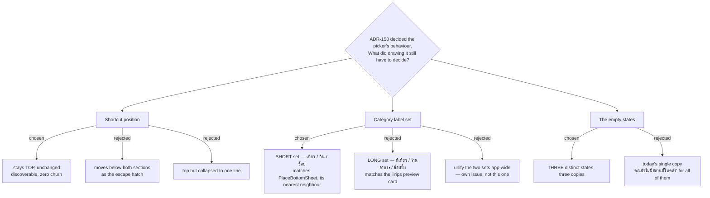

# ADR-165: The add-stop picker's approved mock — the new-place shortcut stays on top, rows carry Discover's short category labels, and "nothing to choose" is three different states

**Date:** 2026-08-13
**Status:** Accepted
**Relates to:** issue #6 (which ADR-158 closes) and issue #48; decision-map `discover-add-place-48` (#53), ticket `add-stop-picker-mock` (#95). Renders ADR-158 (the picker lists the Place library and a pick copies the row in) and is bounded by it — this ADR decides only what ADR-158 left to the drawing. Sits alongside ADR-164, which did the same job for the Discover capture surface. Keeps #64's `ไม่มีเวลาเปิด-ปิด` chip out of the picker, per ADR-158 §4.

## Context

ADR-158 settled every behavioural question the picker raises — two sections, one tap copies,
a half-done tap degrades into a valid state, `name + category` rows, a `place_id`-less place
left unmarked, client-side search on the library section only, and no backend change. Ticket
#95 existed because none of it had been *drawn*, and CLAUDE.md records that every automated
gate and every review agent is blind to visual fidelity: #46 shipped a flat, placeholder-styled
HourlyPlanner straight through SDD review, the whole-branch review and `/scrutinize` to prod.

Drawing it against the real `.add-stop-*` CSS surfaced three things ADR-158 does not decide,
and one pre-existing defect worth naming:

**The panel's own copy is already wrong on `main` (91abdb5).** `ItineraryTab.tsx:92` renders the
divider `หรือเลือกจากคลังสถานที่` and `:89` renders the empty state `คุณยังไม่มีสถานที่ในคลัง`,
but the list beneath them comes from `useListTripPlacesQuery` — this Trip's own places, not the
library. Both strings promise a คลัง that the code never reads. ADR-158 already noted the divider;
the empty state is the same lie and had not been named.

**Rows are name-only.** `:113` renders `p.name` alone, which cannot separate three saved
`คาเฟ่ริมทาง`.

**The app carries two Thai label sets for the same six categories.** `PlaceBottomSheet.tsx:3`
uses `เที่ยว / กิน / คาเฟ่ / ที่พัก / ช้อป / อื่น ๆ`; `AddPlacePreviewCard.tsx:14` uses
`ที่เที่ยว / ร้านอาหาร / คาเฟ่ / ที่พัก / ช้อปปิ้ง / อื่นๆ`. A picker row needs one of them and
nothing in the repo says which.

## Decision

1. **The mock at `screens/issue-6-add-stop-picker.html`** (Claude Design project `8d8d4c81`,
   group Screens) **is the approved surface** and the reference the implementation is diffed
   against. Seven frames: today's picker with its lie labelled, the two-section version, the
   search box typed and with no result, the three empty states, the half-done tap, row anatomy,
   and desktop in its 464px column.
2. **Exactly three things in it are new CSS**, and they are named so the build inherits them
   rather than reinventing them: `.add-stop-divider.first` (the `ในทริปนี้` heading, the existing
   divider treatment with its top margin dropped), `.add-stop-cat` (the second row line — colour
   dot plus label), and `.as-search` plus a result count (the library search box). Everything
   else is `trips-tokens.css` and `TripsPage.css` as they stand.
3. **`+ เพิ่มสถานที่ใหม่` stays at the top of the panel**, unchanged from what ships today. It is
   the most expensive path and the least-used one, so there is a real case for moving it below
   both sections — but it is also the *only* correct path when the library is empty, and leaving
   it where users already find it costs nothing.
4. **Rows use the SHORT label set** — `เที่ยว / กิน / คาเฟ่ / ที่พัก / ช้อป / อื่น ๆ`. A picker row
   is a compact list row, so it matches `PlaceBottomSheet`, its nearest neighbour in form, rather
   than the preview card it happens to share a feature area with. **The two sets are not unified
   here**: that is an app-wide copy change touching Discover and Trips both, and it needs its own
   issue.
5. **"Nothing to choose" is three states with three different copies**, because they have three
   different causes and three different exits:

   | state | copy | why it differs |
   |---|---|---|
   | library holds nothing this Trip lacks | `ที่ในคลังของคุณอยู่ในทริปนี้ครบแล้ว` | success, not emptiness — the section is filtered out, the Trip is complete |
   | library genuinely empty | `คุณยังไม่มีสถานที่ในคลัง` | today's copy, correct **only** here; both sections vanish and the top shortcut is the only route |
   | search matched nothing | `ไม่มีที่ในคลังตรงกับ "<query>"` + clear-the-search hint | the library is not empty; the query is wrong |

   The `ในทริปนี้` heading **stays rendered even when that section is empty** (`ยังไม่มีที่ในทริปนี้`),
   otherwise the library list below it reads as the Trip's own.
6. **The half-done tap's copy is Thai and states the recovery**:
   `เพิ่มเป็นจุดแวะไม่สำเร็จ — ที่นี้อยู่ในทริปแล้ว แตะอีกครั้งเพื่อจัดลงวัน`. It renders in the
   `addError` slot the picker already has (`:120`), and the row will already have moved itself into
   `ในทริปนี้` by the time it is read, because `addTripPlace` invalidates both `TripPlaces` and
   `MyPlaces`.
7. **The library row's only visual marker is a hairline left accent** (`.add-stop-item.lib`). One
   tap on it writes twice rather than once, which the section heading already says; the accent
   carries that distinction down to the row without repeating the sentence.

### Rejected

- **Move the shortcut below both sections.** Reads as the escape hatch it is, and gets its own
  divider. Rejected as churn on a control users already locate, for a path taken least often.
- **The long label set.** It is what the Trips capture card shows, and the picker is a Trips
  surface. Rejected because form beats feature-area adjacency here: a two-line list row is the
  same object as a Discover row, and `ช้อปปิ้ง` on a 464px row buys nothing over `ช้อป`.
- **Unify the label sets in this change.** The honest fix. Rejected as scope: it edits Discover
  and Trips copy for a reason unrelated to #48, and it should be visible as its own issue rather
  than buried in a picker mock.
- **Keep one empty-state string.** One less branch. Rejected because two of the three cases it
  covers are then described wrongly, and the wrong description sends the user to the wrong exit.

## Consequences

- `AddStopPicker` gains a second query (`useListMyPlacesQuery`), the `tripId` filter over its
  `trips[]`, one piece of search state, and three empty-state branches. Still frontend-only:
  no endpoint, no migration, per ADR-158 §6.
- Two existing strings change meaning rather than wording: the divider becomes true, and
  `คุณยังไม่มีสถานที่ในคลัง`'s scope narrows to the one case where it is accurate.
- The label-set split is now recorded rather than merely present. Anyone adding a seventh
  category has to touch two maps in two files; that is the follow-up issue this ADR declines to
  open on its own authority.
- The mock is the fidelity gate. Diff the produced CSS against the card — the two dividers, the
  second row line, the search box and the left accent — and verify interactively before this
  ships, for the same reason ADR-164 says so.
