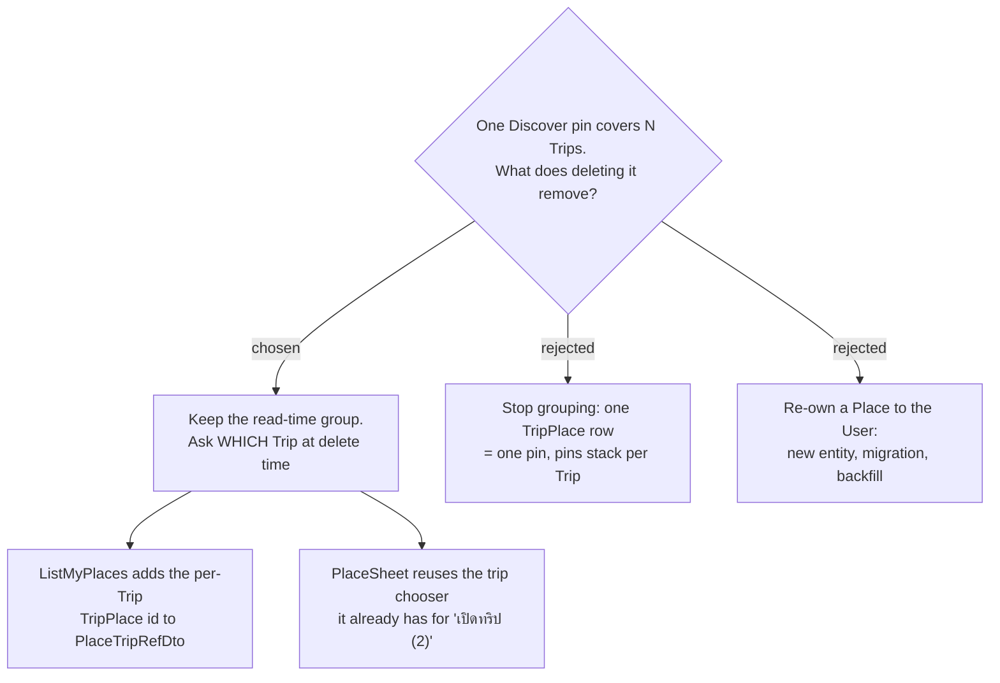

# ADR-166: The Discover pin stays grouped — a delete asks which **Trip**

**Date:** 2026-08-14
**Status:** Accepted
**Relates to:** the delete-button request on **Discover** (ไปไหนดี). Builds on ADR-100 (the
user-scoped Places read model), ADR-155 (a capture must attach to a **Trip**) and ADR-156 (the
flattened origin key). **Does not re-open ADR-155.** Evidence:
`docs/decision-map/discover-place-delete/evidence/current-model-er.md`.

## Context

The owner's objection was aimed at the model, not at the button:

> "คิดว่า group places to show in discover is not right way, we will need delete functionality for
> this discover too"

It is factually correct about the mechanism. **A Discover pin is not a row.**
`ListMyPlacesHandler:43` groups every `TripPlace` the user owns by
`GooglePlaceId ?? "tp:{OriginTripPlaceId ?? Id}"` in memory at read time, and `DiscoverPlaceDto`
(`PlaceDtos.cs:19-36`) returns `Key`, `Trips[{TripId, TripName}]` and one `OriginTripPlaceId` —
and **no per-Trip `TripPlace` id**. That absence, not a missing endpoint, is why the delete button
cannot be written today: `DELETE /api/trips/{tripId}/places/{placeId}` already exists
(`DeleteTripPlaceHandler`) and its frontend mutation is already wired (`api.ts:1431-1434`).

Three options were drawn as screens and priced against each other in the evidence file. Option C —
re-owning a Place to the **User** — reverses ADR-155 three days after it was decided; the owner was
shown that and did not choose it.

## Decision

**The read-time group stays. A delete names the Trip.**

- **`PlaceTripRefDto` gains the per-Trip `TripPlace` id**, so `Trips[]` carries
  `{TripId, TripName, TripPlaceId}`. No new entity, no `DbSet<>` on the three
  `IApplicationDbContext` implementers, no EF configuration, **no migration**.
- **The delete is the endpoint that already exists**, once per Trip. Its mutation already
  invalidates `'MyPlaces'` (`api.ts:1433`), so Discover refreshes itself with no new cache wiring.
- **One Trip deletes without asking; more than one opens a chooser** — and the chooser is the one
  `PlaceSheet` **already has**: the `choosing` state and the `.disc-trip-choose` block that serve
  "เปิดทริป (2)" (`PlaceSheet.tsx:22-31, 95-103`). No new surface is invented.

## Rejected

- **A — stop grouping, one row = one pin.** The most honest rendering of the model, and a delete
  then needs no question at all. Rejected because grouping is what stops the map growing a stack of
  identical pins for a place saved to three Trips — the map-forward view Discover exists to give
  (ADR-100).
- **C — a Place belongs to the User, not the Trip.** The only option where the pin genuinely *is*
  one row. Rejected on cost, after the owner was shown it: a new entity, a `DbSet<>` on all three
  `IApplicationDbContext` implementers, an EF migration this repo applies **by hand** (issue #49
  took Trips down by skipping exactly that step), and a backfill of every existing `TripPlace` —
  omit the backfill and the whole **Place library** vanishes from Discover. It also hands back the
  migration ADR-155 was chosen to avoid.

## Consequences

- **The cost is one extra question per delete on a multi-Trip pin.** Accepted deliberately: of the
  three options it is the only cost paid in taps rather than in schema.
- **`ListMyPlacesHandler:57-60` dedupes `Trips[]` by `TripId` and keeps `First()`.** If one Trip
  ever holds two rows inside the same group, only one `TripPlaceId` surfaces, and a delete on that
  Trip leaves the other row behind. ADR-149 makes an exact `place_id` duplicate idempotent, so this
  can only arise for `place_id`-less rows sharing an origin key inside one Trip.
- **The Place profile survives every delete.** It is joined on the `GooglePlaceId` string with no FK
  (ADR-065), so the pin disappears while the **Place note**, **Review link**s, **Best-time window**s
  and **Season period**s stay. Recorded here; whether the UI says so is a separate decision.
