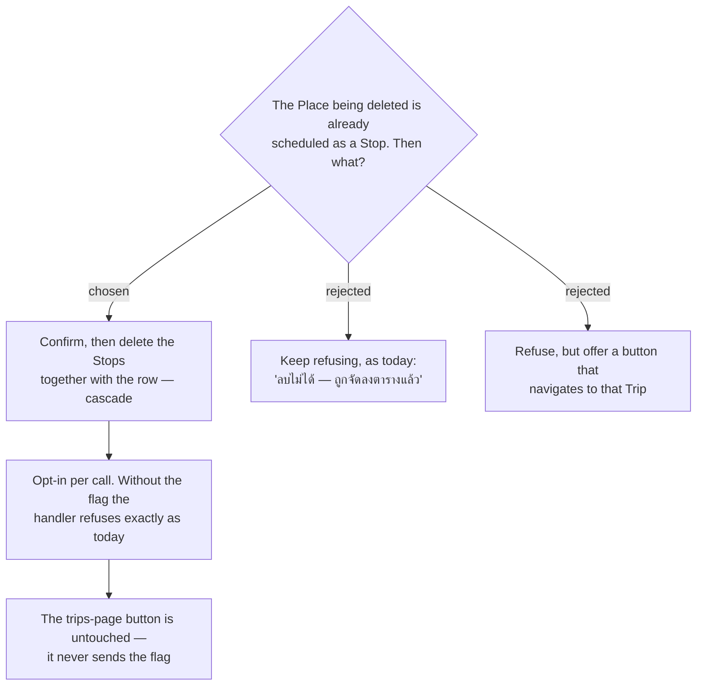

# ADR-167: A scheduled **Stop** no longer blocks a delete — it cascades, opt-in per call

**Date:** 2026-08-14
**Status:** Accepted
**Relates to:** ADR-166 (the delete names the Trip). **Changes the contract** of
`DeleteTripPlaceCommand` / `DELETE /api/trips/{tripId}/places/{placeId}`, whose other caller is the
trips-page **"เอาออกจากทริปนี้"** button.

## Context

`DeleteTripPlaceHandler:23-27` refuses whenever any **Stop** in that Trip references the row, with
*"ลบไม่ได้ — สถานที่นี้ถูกจัดลงตารางแล้ว ลบจุดในแผนก่อน"*. The places worth deleting from Discover
are largely ones the user has already scheduled, so reusing the handler unchanged would ship a
button that answers *"ลบไม่ได้"* nearly every time it is pressed.

**Blast radius, checked before deciding.** The same command is the only delete path for the
trips-page **"เอาออกจากทริปนี้"** button (`PlaceEditorDialog.tsx:68-76` → `api.ts:1431-1434`), and
that button has **no confirmation dialog at all**. Making the handler cascade unconditionally would
turn an existing, unconfirmed button into one that silently destroys itinerary Stops.

## Decision

- **Cascade — and only when the caller asks for it.** `DeleteTripPlaceCommand` gains an opt-in
  switch, default off. With it absent the handler keeps `DeleteTripPlaceHandler:23-27` exactly as it
  is, so the trips-page caller is not touched. Enforcement is scoped to where the new input is
  consumed rather than made global.
- **Discover confirms before it sends.** **Amended by ADR-168:** the confirmation names how many
  scheduled Stops the delete will take, and is hidden when there are none. The count costs no extra
  read — `ListMyPlacesHandler:35-39` already queries `Stops` over exactly those rows. The **day** is
  still not named.
- **What the cascade removes, in one `SaveChanges`:**
  - every **Stop** in that Trip referencing the row. A Place may be scheduled on **more than one
    day** (a hotel across two nights), so this is a set, not a single row;
  - each affected `ItineraryDay` is **resequenced with no gaps** — the same invariant
    `RemoveStopHandler:27-33` maintains, applied per affected day rather than to one day;
  - `StopChecklistEntry` rows follow at the database level (`StopChecklistEntryConfiguration.cs:20`
    is `DeleteBehavior.Cascade`), so their **Checked** flags are destroyed with the Stop and nothing
    extra is written.
- **The delete order is forced by the schema.** `StopConfiguration.cs:23` maps `Stop → TripPlace` as
  `DeleteBehavior.NoAction`, so the Stops must go before the `TripPlace` inside the same
  transaction; there is no database cascade to lean on.

## Rejected

- **A — keep refusing.** Zero backend change and the safest behaviour available. Rejected because it
  ships a button that mostly fails: the places most worth deleting are the ones already in a plan.
- **B — refuse, but offer a jump to that Trip.** Frontend-only, and it never destroys anything the
  user cannot see. Rejected as too many steps for the common case — leave Discover, delete the Stop,
  come back — though it stays the natural fallback if the cascade proves too blunt in use.

## Consequences

- **A delete can now change a Trip the user is not looking at.** That is the point of the cascade,
  and the reason the confirmation is mandatory rather than optional.
- **The refusal string stays reachable.** It is what a caller that omits the flag gets, and the trips
  page still gets it — so the existing `DeleteTripPlaceHandlerTests` must keep passing unchanged.
- **`RemoveStopHandler` is not the code path.** Its resequencing rule is being reproduced for a set
  of days, not called; if the two ever diverge, the invariant is what matters, not the duplication.
