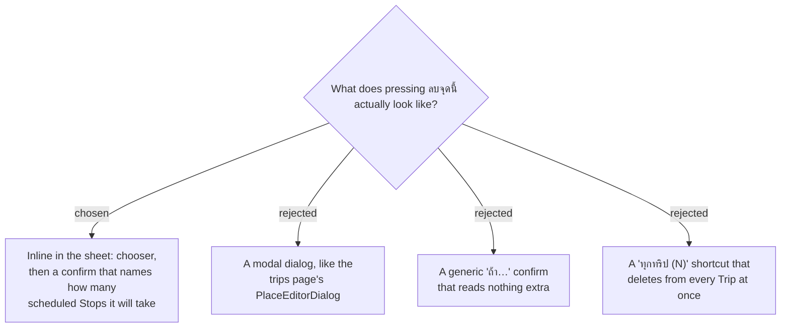

# ADR-168: The Discover delete confirms inside the sheet, names the scheduled count, and has no all-Trips shortcut

**Date:** 2026-08-15
**Status:** Accepted
**Relates to:** ADR-166 (the delete names the Trip) and ADR-167 (the cascade) — **amends ADR-167's
generic-confirmation clause**. Mockup: *MenuNest design system* → **Screens** →
`discover-place-delete`.

## Context

ADR-166 settled *what* a delete removes and ADR-167 *what happens to a scheduled Stop*. What was
left was the screen. It was grilled against a rendered mockup rather than prose, because the open
points — where the control sits, what is on screen at once, the flow between chooser, confirm and
the state after — are the kind that text agrees on falsely.

One fact found while rendering changed an answer. ADR-167 assumed a **generic** confirmation on the
grounds that naming the scheduled Stops would cost an extra read. It does not:
`ListMyPlacesHandler:35-39` **already queries `Stops`** for the "มาแล้ว" badge, over exactly the
rows in question. Turning that `Distinct()` into a count per `TripPlace` yields the number inside
the request that is already being made.

## Decision

- **The control is the last row of the sheet** — full width, outline-danger, below "สร้างทริปใหม่".
  A destructive action sits at the end, away from the controls used often; the same placement
  reasoning as ADR-143, which put trip delete in the edit dialog's footer.
- **One Trip goes straight to the confirm. More than one opens the chooser first** — the
  `.disc-trip-choose` block `PlaceSheet` already uses for "เปิดทริป (2)", one row per Trip.
- **No "ทุกทริป (N)" shortcut.** The chooser lists Trips and nothing else.
- **The confirm renders inside the sheet, not in a portal.** `PlaceSheet`'s tokens are page-scoped,
  and a portaled node breaks DOM ancestry so `var(--…)` silently resolves to nothing — the trap
  already recorded for this codebase's dialogs. Staying inline also keeps the map visible behind the
  decision.
- **The confirm names the count**: *"จุดนี้อยู่ในแผนของทริปนี้ N จุด — จะถูกลบไปด้วย"*, and the whole
  warning line is **hidden when N = 0**. A second, quieter line states that the **Place profile**
  survives — *"โน้ต · ลิงก์รีวิว · ช่วงเวลาที่ดี ยังอยู่ในคลังของคุณ"* — because ADR-166 records that it
  does, and a user who is not told will read the surviving note as a failed delete.
- **`PlaceTripRefDto` therefore carries a scheduled-Stop count per Trip** alongside the
  `TripPlaceId` of ADR-166. No new query, no new round trip.
- **After the delete:** other Trips remain → the sheet stays open and that Trip's chip disappears;
  it was the last Trip → the pin leaves the map, the sheet closes, and `.disc-armed-toast`
  (`DiscoverPage.css:728`, `role="status"`) reports **ลบแล้ว**. No client-side pin state is needed —
  `ListMyPlaces` simply stops returning the group.

## Rejected

- **A modal dialog.** It is what the trips page does (`PlaceEditorDialog`), so it would have been
  the consistent choice. Rejected on the portal/token trap above, and because a full-screen dialog
  over a map sheet is heavier than this decision warrants.
- **The generic confirm (ADR-167's assumption).** Cheaper in words, and it needs no count at all.
  Rejected once the count turned out to be free: the generic wording warns users who scheduled
  nothing, and understates the loss for a user who scheduled the place across three days.
- **"ทุกทริป (N)".** It matches the literal reading of *"ลบจุดนี้"* and is the fastest path for a
  place saved everywhere. Rejected because the endpoint deletes one row per call, so it is N
  requests, with a partial-failure state to design and report — real complexity bought for a case
  the user can cover by pressing the button twice.

## Consequences

- **ADR-167's sentence "The confirmation is generic — it does not name the day or the Stop" no
  longer holds.** The count is named; the **day** still is not, and no further read is added to name
  it.
- **A delete is always exactly one request**, so there is no partial-failure state anywhere in this
  feature.
- **The warning line is data-driven**, so a wrong count is a visible bug rather than a silent one —
  worth a test on the count projection specifically.
