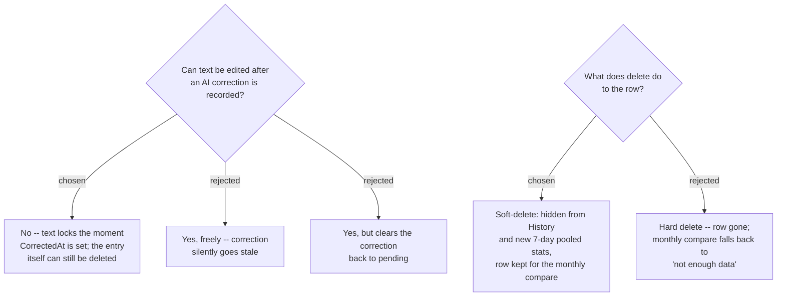

# ADR-169: A corrected entry's text locks; a deleted entry soft-deletes for the monthly comparison

**Date:** 2026-08-16
**Status:** Accepted
**Relates to:** issue #97; decision-map `writing-practice-build`, ticket `entry-mutability`
(docs/decision-map/writing-practice-build) — resolves the fog line "Editing or deleting a past
entry once submitted." Builds on `mcp-tool-contract` (the correction fields live on `WritingEntry`
itself, not a separate table) and `progress-signal` in the source learn-writing-english map (the
monthly progress screen needs "text from 4 weeks ago beside tonight's").

## Context

Phase 1 (issue #97) shipped create-only: the "เขียน" page submits tonight's entry and nothing
else. There is no screen anywhere that shows a past entry, let alone edits or deletes one. The
`entry-mutability` decision-map ticket asked whether entries are ever mutable after submission;
this ADR settles the two parts of that answer that carry a real trade-off. (A third part — that
reaching any of this needs a new "ประวัติ" list screen — is not recorded here: it has no
alternative worth naming, it is simply the surface CRUD requires.)

Two existing decisions constrain the answer. `mcp-tool-contract` put the AI-correction fields
(`CorrectedAt`, `HitCount`, `MissCount`, `ThaiWhyLine`, `SentenceCombiningItemsJson`,
`StuckWordsJson`) on the *same* `WritingEntry` row as the text, not a separate table — so there is
no independent correction record to invalidate apart from the entry it describes. And
`progress-signal` (learn-writing-english) requires the monthly progress screen to show "text from
4 weeks ago beside tonight's" — a past entry's raw text must still be resolvable a month later, or
that comparison has a hole for whichever night the rotation lands on.

## Decision

- **A correction locks the text.** The moment `CorrectedAt` is set on a `WritingEntry`, its `Text`
  becomes read-only in the History screen's editor. The entry can still be deleted outright — the
  lock is on partial edits, not on the writer's ability to remove the whole night.
- **Delete is soft.** A deleted entry gets a `DeletedAt` timestamp (reserved the same way Phase 1
  reserved the correction columns — added now, filtered everywhere, no second migration later) and
  is excluded from the History list and from every stats computation *from the moment of deletion
  forward*, including the current 7-day pooled window. The row itself is not removed, so the
  monthly old-vs-new comparison can still resolve a deleted night if the rotation lands on it.
  Restoring a deleted entry has no UI yet — left open, not decided by this ADR.

## Rejected

- **Free-form editing after correction.** Simplest to build, but the recorded
  `HitCount`/`MissCount`/`ThaiWhyLine` would silently describe text that no longer exists — the
  progress numbers built from it would be measuring a sentence the writer already rewrote.
- **Edit clears the correction back to pending.** Keeps the correction always truthful without
  banning edits outright, but re-opens re-correction on every small fix (a typo pass would need a
  full MCP round-trip again) and needs a "was this ever corrected" history the schema does not
  carry. Locking is simpler, and the writer already has an escape hatch: delete and rewrite fresh.
- **Hard delete.** No reserved column, no filtering to remember — but it breaks the specific night
  the monthly compare needed if the writer happens to delete it, with no way back. `progress-signal`
  already designed a "not enough data" fallback for a different starvation case, so hard delete was
  survivable, just strictly worse than keeping the row.

## Consequences

- Every future query against `WritingEntry` (History list, 7-day pooled stats, the monthly compare)
  must filter `DeletedAt IS NULL` — except the monthly-compare lookup itself, which is the one path
  allowed to read a soft-deleted row.
- The History screen's per-entry editor needs two states it does not have yet: locked-text (has
  `CorrectedAt`) and deleted (has `DeletedAt`, excluded from the list but not gone) — implementation
  detail for whichever plan builds the History screen, not further decisions.
- Restoring a soft-deleted entry is unresolved and stays out of this ADR's scope.
