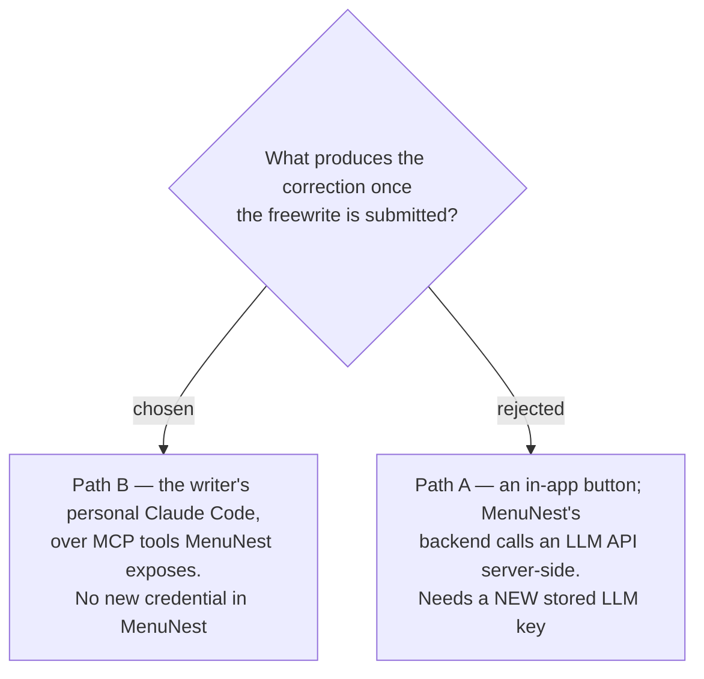

# ADR-170: The AI correction runs in the writer's own Claude Code over MCP, not in MenuNest's backend

**Date:** 2026-08-16 (decided); recorded 2026-08-18
**Status:** Accepted
**Relates to:** issue #97; decision-map `writing-practice-build`, ticket `ai-correction-invocation`
(docs/decision-map/writing-practice-build) — the root decision of that map. Constrains
`mcp-tool-contract` (ADR-175, which exists only because of this) and `done-day-redefinition`
(ADR-173, caused directly by the two-step flow this creates). Inherits the critique format from
`feedback-rubric` in the source `learn-writing-english` map.

## Context

The writing-practice feature is a nightly loop: a 7-minute Thai-English **Freewrite**, then an AI
pass that marks it against one **Target rule** and hands back evidence. Phase 1 built the writing
page. The open question was where the *marking* happens.

MenuNest already runs an MCP server (`MenuNest.McpServer`) behind its own OAuth proxy, built for the
Trip tools. That infrastructure exists, is deployed, and already authenticates the same **User**.
The alternative was to give MenuNest's own backend the ability to call an LLM.

This is the writer's private diary text. Keeping it off any infrastructure that does not need to
hold it was a standing concern on this feature — the same concern that later moved its UI mock off a
work account.

## Decision

**The correction runs in the writer's personal Claude Code, calling MCP tools MenuNest exposes.**
MenuNest stores the entry and does nothing else at submit time. Later — from a phone, in chat — the
writer asks their own Claude Code to correct a pending night. It reads the entry over MCP, marks it,
and writes the result back over MCP.

MenuNest holds **no LLM credential of its own**, and gains no server-side LLM integration. The
`WritingTools` MCP class this requires is specified in ADR-175.

## Rejected

- **Path A: an in-app button, corrected server-side.** Simpler for the writer — one screen, one tap,
  no second app. But it requires a new stored LLM credential inside MenuNest and a brand-new
  server-side integration to build and keep working, and it puts the diary text through a code path
  that has no other reason to touch it. The UX gain did not pay for a new secret to manage.

## Consequences

- **Two apps, two steps.** The writer writes in MenuNest, then asks Claude Code. This is the cost
  that was accepted, and it forced the next decision: if correcting can lag arbitrarily, what still
  counts as a finished night? Settled in ADR-173 — the timer alone.
- **A `WritingTools` MCP class becomes required**, mirroring `TripTools`. See ADR-175 for its
  contract, and note the boundary that decision draws: entry *creation* stays in-app and is never an
  MCP tool.
- **A correction can never be produced by MenuNest alone.** Any future surface that wants to trigger
  one — a button, a schedule, a backfill — reopens this ADR rather than extending it.
