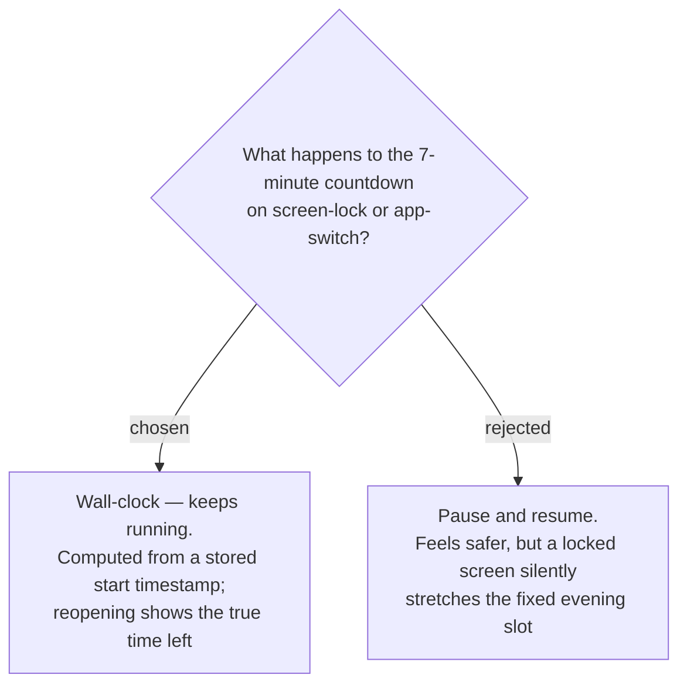

# ADR-171: The freewrite timer is wall-clock and never pauses

**Date:** 2026-08-16 (decided); recorded 2026-08-18
**Status:** Accepted
**Relates to:** issue #97; decision-map `writing-practice-build`, ticket `timer-resilience`
(docs/decision-map/writing-practice-build). Serves `habit-mechanics` in the source
`learn-writing-english` map, which built the whole habit around a **fixed evening slot**.

## Context

The **Freewrite** is 7 minutes, counting down from 7:00, and the writer does it on a phone. Phones
lock. Notifications arrive. The writer switches apps. So the timer had to have a defined answer for
losing the foreground, and the two candidate answers differ in what they protect.

`habit-mechanics` (source map) built this habit around a fixed evening slot — the trigger is *the
time of day*, not the duration. That is what makes the answer non-obvious: protecting the *duration*
can damage the *slot*.

## Decision

**Wall-clock. The countdown keeps running.** Remaining time is derived from a stored start timestamp,
never from the screen staying awake or the tab staying foregrounded. Locking the phone or switching
apps does not pause it, and reopening the page shows the correct remaining time — including 0, if the
7 minutes elapsed while the writer was away.

No server round-trip is needed mid-timer.

## Rejected

- **Pause on blur, resume on focus.** Feels protective: an interruption would not eat into writing
  time. But a phone locked for five minutes would silently turn a planned 7-minute session into a
  much longer wall-clock block, drifting out of the fixed evening slot the habit was designed
  around. It protects the wrong quantity — and a countdown that stops when you look away is not what
  "7 minutes" means to the person doing it.

## Consequences

- A reload mid-session must restore the true remaining time from the stored start, not restart at
  7:00. This is behaviour a rendering test cannot see and a unit test can, so it belongs in a pure
  timer module rather than in the page component.
- Time genuinely lost to an interruption is lost. Accepted: the writer can write again, and a night's
  value is the attempt, not the word count.
- `ElapsedSeconds` on the entry therefore measures wall-clock time from start to submit, which is
  what makes it a valid denominator for **Words-per-minute** (ADR-175's derived-numbers rule).
