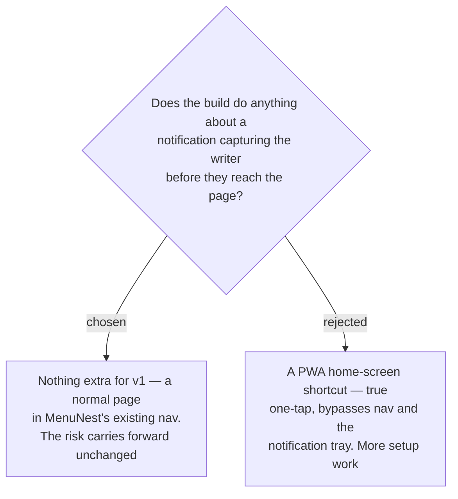

# ADR-172: v1 adds nothing for one-tap access, and carries the notification risk forward unsolved

**Date:** 2026-08-16 (decided); recorded 2026-08-18
**Status:** Accepted
**Relates to:** issue #97; decision-map `writing-practice-build`, ticket `one-tap-access`
(docs/decision-map/writing-practice-build). Leaves `habit-mechanics`' own accepted-and-unsolved risk
(source map `learn-writing-english`) exactly as that ticket left it.

## Context

`habit-mechanics` (source map) named a specific failure for this habit: the writer unlocks the phone
intending to write, a notification captures their attention on the way, and the night is lost. It
recorded that risk as **accepted and unsolved**.

This ticket asked whether the build should try to solve it — the obvious lever being a PWA
home-screen shortcut that lands directly on the writing page, bypassing both MenuNest's own
navigation and the notification tray.

## Decision

**Nothing extra for v1.** The writing page ships as an ordinary page inside MenuNest's existing
navigation, reached the way every other page is. `habit-mechanics`' risk stays accepted and unsolved,
unchanged and not re-argued.

## Rejected

- **A PWA home-screen shortcut for v1.** A genuine one-tap trigger, and the right shape of answer.
  Rejected for v1 on cost: it is extra setup work on a build whose single biggest named risk was
  *nights written = 0 while waiting for the build*. Spending v1 effort on the path to the page, rather
  than on the page, would have served that risk badly.

## Consequences

- The notification-capture failure remains live. If nights start getting lost this way, this is the
  ADR to reopen, and the shortcut is the answer already identified — no new decision needed, just the
  work.
- Adopting the shortcut later is additive: nothing in v1 depends on the page being reached through
  the nav.
- No glossary term was created for "one-tap access": the decision was to build nothing, and a term
  for an absent mechanism would be a term with no referent.
