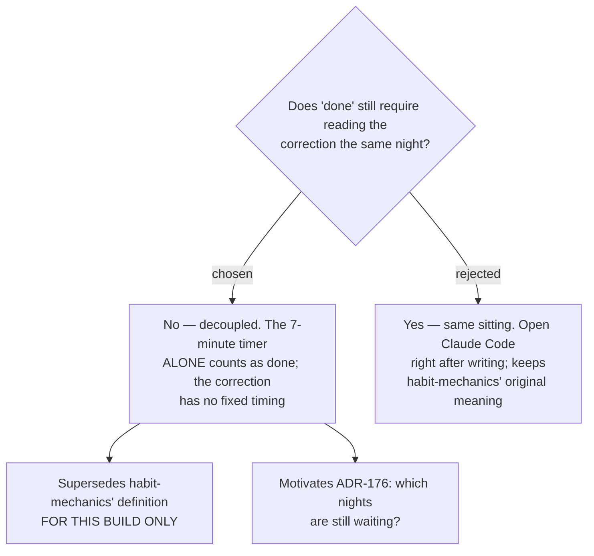

# ADR-173: The 7-minute timer alone makes a night done; the correction is decoupled

**Date:** 2026-08-16 (decided); recorded 2026-08-18
**Status:** Accepted
**Relates to:** issue #97; decision-map `writing-practice-build`, ticket `done-day-redefinition`
(docs/decision-map/writing-practice-build). Caused by ADR-170 (correction moved out of the app), and
directly motivates ADR-176 (the writer now needs to see which nights still await a pass).
**Supersedes `habit-mechanics`' done-day definition for this implementation only** — the source-map
ticket in `learn-writing-english` is deliberately not reopened or edited.

## Context

`habit-mechanics` (source map) defined the daily rep as a single ~12-minute block: 7 minutes writing,
5 minutes reading the correction, same sitting. That definition assumed the correction happened *in
the same place* as the writing.

ADR-170 broke that assumption. With the correction running in the writer's own Claude Code, writing
and correcting are two apps and, potentially, two different evenings. So "done" needed re-deciding —
not as a preference, but because the old definition described a flow that no longer exists.

## Decision

**The 7-minute timer alone counts as done.** A **Done day** is a date on which the writer completed
the Freewrite. The correction is a separate event with no fixed timing: right after, later that
night, or days later — or never.

This **supersedes `habit-mechanics`' definition for this build only.** The source-map ticket stays as
written; superseding it there would rewrite a decision made for a different context.

## Rejected

- **Same-sitting pairing — open Claude Code immediately after writing.** Preserves the original
  definition and keeps the rep a single block spanning two apps. Rejected because it makes the
  habit's success depend on a second app being available at that moment, and because the writer
  reported the plain reading of his own intent: doing the 7 minutes *is* the thing. Defining "done"
  as something he might not control turns a completed rep into a failed one.

## Consequences

- **A pending backlog now exists as a real state.** Nights can accumulate uncorrected, which is not a
  failure mode but an ordinary condition — and it is why ADR-176 had to decide how the writer sees it.
- **`CorrectedAt` becomes the only marker of the second step**, and its absence is the definition of a
  **Pending entry** — read-time only, never a stored flag.
- **Nothing in the app should show a streak or a score.** A streak counted over "done" would now count
  something the writer fully controls, but the critique contract from `feedback-rubric` forbids
  streaks outright; this decision does not create an exception to that.
- Any future progress screen must pool its numbers over corrected nights while counting done-ness over
  written nights. The two populations are deliberately different sizes.
