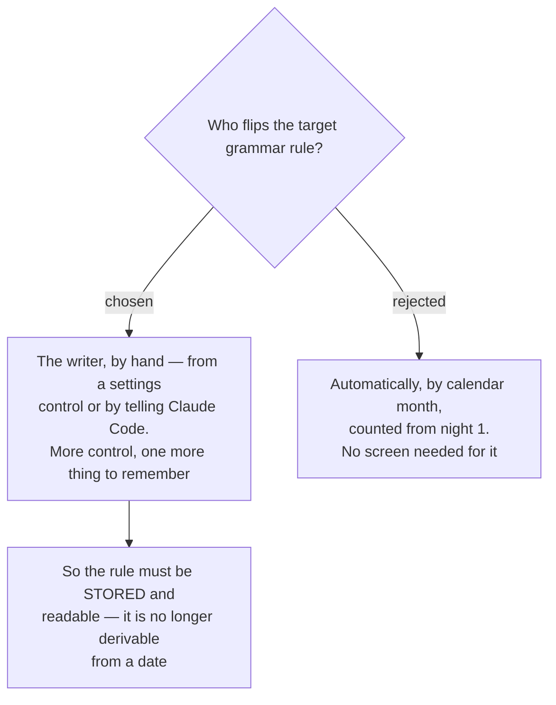

# ADR-174: The target rule rotates by hand, so the app must be able to read and set it

**Date:** 2026-08-16 (decided); recorded 2026-08-18
**Status:** Accepted
**Relates to:** issue #97; decision-map `writing-practice-build`, ticket `rule-rotation`
(docs/decision-map/writing-practice-build). Forced two tools in ADR-175's contract
(`get_active_target_rule` / `set_active_target_rule`) and the `UserSettings.ActiveTargetRule` column
that Phase 2 added.

## Context

The critique format from `feedback-rubric` (source map) marks **one** grammar rule per night — the
**Target rule** — and leaves every other error alone. That rule is meant to change over time as the
writer improves.

The question was who changes it. A calendar rotation needs no UI at all: month 1 is one rule, month 2
the next, counted from the first night. That is strictly less to build.

## Decision

**Manual.** The writer changes the **Active target rule** himself, and it is stored per-**User**
rather than derived. Two routes reach the same write, and the app remains primary — his words: *"1 but
can tell claude with mcp"*:

- the in-app `/settings` control (the everyday route), and
- telling Claude Code in chat, via `set_active_target_rule`.

## Rejected

- **Automatic calendar rotation, counted from night 1.** No screen, no decision to remember, nothing
  to build. Rejected because rule changes are not a function of elapsed time — they should happen when
  the writer judges a rule to be handled, which may be sooner or much later than a month. A calendar
  would move the target while he was still missing it, or hold a rule he had already mastered. The
  cost accepted in exchange is a real one: one more thing to remember.

## Consequences

- **The rule must be stored and readable.** It is not derivable from a date, so a persisted field is
  required — which is why Phase 2 had to add `UserSettings.ActiveTargetRule` before any correction
  tool could ask what to mark against.
- **Two write paths must not fight.** They share a value, so a change from one must be visible to the
  other. Notably, the MCP path must not clear the writer's other settings on its way through — the
  reason Phase 2 gave `set_active_target_rule` its own command instead of reusing the full-snapshot
  settings save.
- **A rule can be unset.** If the writer never sets one, the corrector has nothing to mark against and
  must ask rather than invent one.
- No rotation history is kept. The entry records the rule it was judged against at correction time,
  which is the only historical answer the numbers need.
