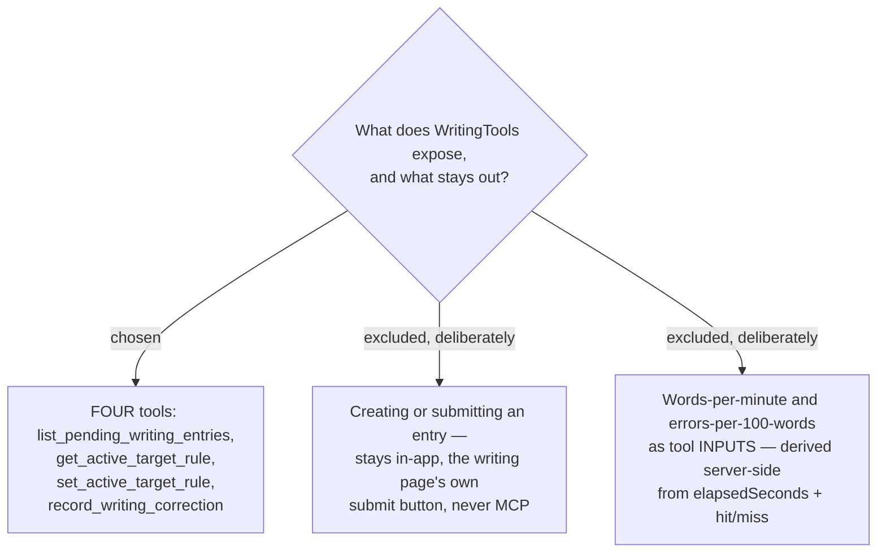

# ADR-175: WritingTools exposes four MCP tools, and entry creation is never one of them

**Date:** 2026-08-16 (decided); recorded 2026-08-18
**Status:** Accepted
**Relates to:** issue #97; decision-map `writing-practice-build`, ticket `mcp-tool-contract`
(docs/decision-map/writing-practice-build). Required by ADR-170 (the correction runs over MCP);
carries ADR-174's manual rotation into two of its four tools; supplies the `CorrectedAt` fact that
ADR-169 locks on and ADR-176 renders. Implemented by
`docs/superpowers/plans/2026-08-17-writing-mcp-phase-2.md`.

## Context

ADR-170 put the correction in the writer's own Claude Code, so MenuNest had to expose the loop as MCP
tools. `MenuNest.McpServer` already had the shape to copy: `TripTools`, a `[McpServerToolType]` class
of thin `[McpServerTool]` methods delegating to `IMediator`.

The open question was the surface: which operations become tools, and — more importantly — which do
not. An MCP tool is a capability handed to an assistant, so every tool added is a way for the loop to
be driven by something other than the writer.

## Decision

**Four tools, mirroring `TripTools`:**

| Tool | Kind | Carries |
|---|---|---|
| `list_pending_writing_entries` | read | every entry with no correction yet — `id`, `date`, `text`, `elapsedSeconds`, `wordsPerMinute` |
| `get_active_target_rule` | read | the rule to correct against |
| `set_active_target_rule` | write | changes it (ADR-174's second route) |
| `record_writing_correction` | write | the five correction blocks, and marks the entry corrected |

`record_writing_correction` carries the whole critique in one call: **Marked text**, `hitCount` /
`missCount` counted mechanically against the one rule, a one-line **Thai why-line**, 3–4
**Sentence-combining items** built from the writer's own sentences, and the bracketed **Stuck words**
with English translations. It sets `CorrectedAt`.

**Two deliberate exclusions, which are the substance of this ADR:**

- **Entry creation is not a tool.** Tonight's Freewrite is submitted through the writing page's own
  button. MCP carries only the correction step.
- **Words-per-minute and target-errors-per-100-words are not tool inputs.** MenuNest already holds
  `elapsedSeconds` and the text at submit time, and computes both from what the correction call
  supplies (hit/miss plus word count).

## Rejected

- **A submit/create tool.** It would let the assistant author entries. The Freewrite is the writer's
  own timed act (ADR-171 measures it by wall clock); an entry MenuNest did not time is not a
  Freewrite, and a diary the assistant can write into is not a diary.
- **Accepting the derived numbers as parameters.** Simpler for the caller, and the caller already knows
  them. Rejected because a writable derived number lets the corrector flatter the writer — it could
  report a speed or an error rate that the text does not support, and the progress screen would then
  be reporting the assistant's opinion as measurement. Deriving them server-side makes that
  impossible rather than merely discouraged.

## Consequences

- **`CorrectedAt` becomes writable for the first time**, which arms the mid-edit lock hazard: an entry
  can now become **Locked (writing)** while the writer has it open in an editor. ADR-169 defined the
  lock; making it reachable is this ADR's doing, and the detail page had to learn to lock live.
- **Cross-user isolation is the load-bearing property.** Every tool must scope to the calling User; a
  tool that reads or corrects another writer's night is the worst available defect here.
- The correction fields live on `WritingEntry` itself rather than a separate table — the constraint
  ADR-169 then built on.
- A refusal must reach the assistant as a clean tool error, not a raw crash, since the assistant is
  the only consumer.
