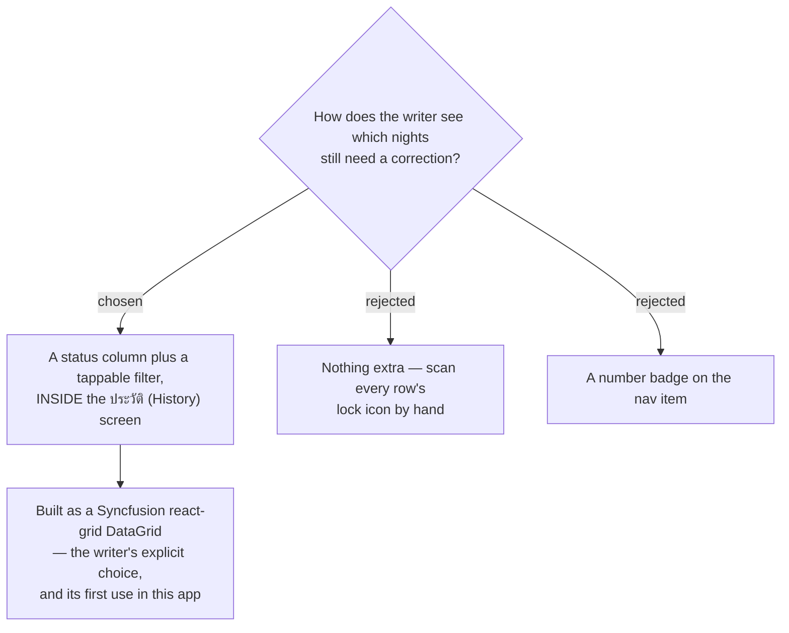

# ADR-176: Pending nights are shown by a per-row badge and a filter inside History, not a nav badge

**Date:** 2026-08-16 (decided); recorded 2026-08-18
**Status:** Accepted
**Relates to:** issue #97; decision-map `writing-practice-build`, ticket
`pending-correction-visibility` (docs/decision-map/writing-practice-build) — the last ticket on that
map. Motivated by ADR-173 (a correction may lag arbitrarily, so a backlog is an ordinary state) and
rendered on the History screen ADR-169 required; reads the `CorrectedAt` fact ADR-175 made writable.

## Context

ADR-173 decoupled the correction from the writing, which made an uncorrected backlog an ordinary
condition rather than a failure. That created a new need: some way to see which nights are still
waiting.

The History screen (ADR-169) already had to exist and already lists every **Writing entry**. So the
question was not whether to build a surface, but where the signal belongs — and specifically whether
it should reach outside that screen and onto the app's navigation.

## Decision

**A status badge per row plus a tappable filter, both inside the History screen.** Each row carries
**⏳ รอตรวจ** (a **Pending entry** — `CorrectedAt` is null) or **🔒 ตรวจแล้ว** (corrected — text
already **Locked**, per ADR-169). A filter narrows the list to ทั้งหมด / รอตรวจ / ตรวจแล้ว.

It renders as a Syncfusion `react-grid` DataGrid — the writer's explicit instruction (*"ใช้ datagrid
ของ syncfusion"*), and the first use of that already-installed dependency anywhere in the app. The
grid's own column templating and toolbar filtering cover both the badge and the filter without
hand-rolled list or filter code.

**No number lands on the nav.** The writer sees the backlog only by opening ประวัติ.

## Rejected

- **A count badge on the nav item.** The most visible option, and the one a habit app would reach for
  by reflex. Rejected deliberately: a permanent number counting unfinished work turns a decoupled
  second step back into a nagging obligation — which is exactly what ADR-173 decoupled it *from*. It
  would also sit adjacent to the streak the critique contract forbids, and read like one.
- **Nothing extra — let the writer scan the rows.** The information is technically already present in
  each row. Rejected because finding the pending nights would mean reading every row, which is a
  filter performed by hand.

## Consequences

- **The signal is pull, not push.** Nothing tells the writer they have a backlog; they find it when
  they look. Accepted as the point, not a gap.
- **Both badges must be visually distinguishable at a glance**, since the filter's value depends on
  the column being scannable — a rendering property no unit test in this repo can see, which is why
  this screen needed an e2e smoke test.
- Introducing `@syncfusion/react-grid` brings its own stylesheet requirements. This is the same class
  of asset gap that shipped a broken RTE toolbar to production on this feature; a new Syncfusion
  component is a rendering risk, not just a dependency.
- The map's frontier emptied with this ticket. Two fog lines were never graduated: freewrite draft
  autosave, and restoring a soft-deleted entry.
