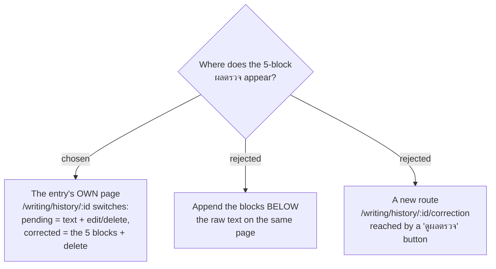

# ADR-177: A corrected night's own page becomes the ผลตรวจ screen — there is no separate correction route

**Date:** 2026-08-18
**Status:** Accepted
**Relates to:** issue #97; decision-map `writing-practice-build` (docs/decision-map/writing-practice-build),
tickets `one-tap-access` and `entry-mutability`. Builds on ADR-169 (a correction locks the text) and
ADR-176 (pending nights show by a badge and filter inside History). Renders what
`docs/superpowers/plans/2026-08-17-writing-mcp-phase-2.md` stored but deliberately left unrendered
("the ผลตรวจ screen … rendering it is the next plan").
**Mockup:** Claude Design project `MenuNest design system` → Screens → `issue-97-correction-result`
(frame 1 is this decision; frame 3 is the rejected option).

## Context

Phase 2 shipped the four `WritingTools` MCP tools and the seven correction columns, and the writer's
own Claude Code has now recorded a real **Correction** in production — verified in the prod database
(`CorrectedAt` set, `TargetRule`, `MarkedText`, `ThaiWhyLine`, `StuckWordsJson` all populated). Nothing
in the SPA displays any of it: `WritingEntryDto` carries no correction field, there is no
`GET /api/writing-entries/{id}`, and the three writing routes render only date, badge, text and the
edit/delete actions. The single visible consequence of a correction today is the 🔒 ตรวจแล้ว badge.

The approved mock (`screens/writing-practice-critique-loop.html`, frame 2) draws ผลตรวจ as a
standalone phone screen. That mock was drawn before the History screen existed (ADR-169 / ADR-176), so
it never had to answer where the blocks sit *relative to the entry's own detail page* — which now
exists and already owns that night.

Two facts decide it. **Marked text is the writer's original text**, marked in place, with every other
word untouched — so a page showing both the raw `Text` and the `MarkedText` shows the same sentences
twice, three lines apart, on a 360 px phone. And **ADR-169 already kills the edit affordance** the
moment `CorrectedAt` is set: a corrected page has no editor to keep.

## Decision

**`/writing/history/:id` is one route with two states, switched on `correctedAt`.**

- **Pending** (`correctedAt is null`) — unchanged from what ships today: the raw text, an **แก้ไข**
  button, a **ลบ** button, the ⏳ รอตรวจ badge.
- **Corrected** (`correctedAt` set) — the page header becomes `ผลตรวจ · <date>` and the body is the
  five correction blocks in their fixed order, followed by the "สิ่งที่ระบบจะไม่ทำเด็ดขาด" note and a
  **ลบ** button. The raw `Text` is **not** rendered separately — block 1's **Marked text** is that
  text. There is no **แก้ไข** button, because ADR-169 forbids the edit anyway.

No new route, no new nav entry: `one-tap-access` settled that the writer reaches this the ordinary
way, and the ordinary way is already the History row he taps.

The live-lock behaviour from Phase 2 is unchanged and now has a visible payoff: a correction landing
while the page is open flips the page from the pending state to the ผลตรวจ state in place.

## Rejected

- **Append the blocks below the raw text (same page, both).** Cheapest diff — no state machine, the
  existing render stays. But it prints the night's sentences twice within one screen height, and it
  keeps a dead "ตรวจแล้ว — แก้ข้อความไม่ได้" notice sitting above content that says the same thing
  better. Seen side by side in the mockup's frame 3, the duplication is the whole objection.
- **A new `/writing/history/:id/correction` route behind a "ดูผลตรวจ" button.** Matches the mock's
  literal framing (ผลตรวจ as its own screen) and keeps each page single-purpose. Rejected because it
  puts the most valuable artifact of the whole loop two taps away instead of one, and leaves two
  pages describing one night — a split the History grid would then also have to explain.

## Consequences

- The detail page grows a state switch; its pending half must stay byte-for-byte behaviourally the
  same, including the live lock and the server-truth save error (ADR-169 follow-ups).
- The API must return the correction for a single entry. The list endpoint is the wrong carrier —
  `MarkedText` is bounded at 50,000 characters, and the History grid needs none of it.
- Whatever "empty block" policy is chosen applies to this one screen, since there is no other place a
  correction can be seen.
