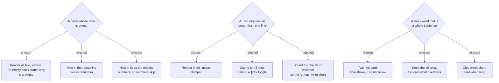

# ADR-178: The ผลตรวจ screen renders the correction as it actually arrives — all five blocks, at full length, whatever shape the data is

**Date:** 2026-08-18
**Status:** Accepted
**Relates to:** issue #97; ADR-177 (the corrected night's own page is this screen). Revises two
glossary definitions in `CONTEXT.md` (**Thai why-line**, **Stuck word**) against the first real
production correction. Constrained by the approved mock
(`screens/writing-practice-critique-loop.html`, frame 2: "exactly five blocks, in this order, and
nothing else").
**Mockup:** Claude Design project `MenuNest design system` → Screens → `issue-97-correction-result`.

## Context

The first real correction recorded in production (night of 2026-08-16, target rule
`articles (a/an/the)`) does not fit the idealised shape the mock and the glossary were written
against, and it is not an anomaly — it is what this writer's ordinary night produces:

| Block | What the design assumed | What actually arrived |
|---|---|---|
| 1 Marked text | English prose with the rule marked in place | Thai only, nothing markable; `HitCount = 0`, `MissCount = 0` |
| 2 Thai why-line | "One line by design… a reminder, not a lesson" | 389 characters — four to five lines on a phone |
| 3 Sentence combining | 3–4 items built from the writer's own sentences | `[]` — no English sentences existed to combine |
| 4 Stuck words | "one Thai word the writer could not say in English" | One item holding the *entire* entry as a sentence |

The cause is the same in every row: the writer brackets whatever he cannot produce in English, and on
a night he cannot produce any of it, the bracket swallows the night. The MCP contract already
anticipated part of this — `sentenceCombiningItems` enforces no minimum, precisely because a Thai-only
night has nothing to combine (Phase 2 plan, decision 6).

So the question this ADR answers is not "how do we handle a weird record" but **which side bends when
the data and the design disagree** — the screen, or the data.

## Decision

**The screen bends. Every rule below renders what was recorded, unaltered.**

- **All five blocks render, always, in their fixed order.** A block with no data shows a one-line
  statement of why — e.g. block 3: *"คืนนี้ไม่มีประโยคอังกฤษให้ต่อ"*. The block numbers are part of
  the ritual, not a list index: **ทำไม (ภาษาไทย)** is ② on every night the writer ever opens, so the
  page can be read by position instead of by heading. An empty block that says why it is empty also
  carries real information — that the night was written in Thai — which a missing block does not: a
  missing block cannot be told apart from an AI pass that silently skipped it.
- **The Thai why-line renders in full and is never clamped or truncated.** "One line" stays in the
  glossary as intent for the *prompt* the writer's Claude follows, not as a scissor on the screen.
  This block is the highest-value minute of the whole loop (written languaging — explaining a
  correction in L1); hiding the explanation behind a "ดูเพิ่ม" tap hides the one thing worth reading.
- **Each stuck word renders as a two-line card** — Thai on top, English below, separated by a rule —
  the same shape whether the fragment is `ข้าวต้ม` or a full sentence. One shape, no length branch.
  `CONTEXT.md`'s **Stuck word** entry is widened accordingly: the fragment has **no length rule**, and
  a whole-sentence entry is expected, not malformed.

## Rejected

- **Hide empty blocks (renumbering).** Shortest page, no empty boxes to scroll past. Rejected because
  the numbering then depends on the night: **ทำไม** is ① on a Thai-only night and ② on an English one,
  so nothing can be found by position, and "block 3 is missing" is indistinguishable from "the
  correction was incomplete."
- **Hide empty blocks, keeping the original numbers (numbers skip).** Preserves each block's identity
  and shortens the page — but a skipped ③ shows that something is absent while giving no way to learn
  what or why, which is strictly worse than a block that says it plainly.
- **Clamp the why-line behind a toggle.** Keeps the page compact and honours the mock's "one line"
  caption literally. Rejected as backwards: it costs a tap on the block the research says pays best.
- **Enforce the why-line's length in the `record_writing_correction` validator.** The only option that
  makes the glossary true rather than aspirational, and it fails at the source rather than on screen.
  Rejected for this round: the correction already in production would become data the validator no
  longer accepts, and it would refuse a Claude that explained *well* at 320 characters. Left open as a
  prompt-side concern, not a schema one.
- **Keep the chip and truncate.** Matches the mock exactly and looks best for short words. Rejected
  because on the real night the truncation would swallow the English translation entirely — the only
  part of that block the writer needs.
- **Chip for short, card for long.** Best-looking of the three, but it needs a length threshold that
  nothing in the domain justifies, and it makes one block render in two shapes.

## Consequences

- The empty-state sentence for each block is UI copy that must exist for blocks 1, 3 and 4; block 2
  and block 5 can never be empty (a correction cannot be recorded without a why-line, and the numbers
  are derived).
- Block 1 on a Thai-only night shows `ต้องเติม 0 ที่ · ถูก 0 · พลาด 0` above its own empty-state line;
  the zeros are truthful and must not be hidden.
- A future decision to bound the why-line at the MCP validator would not change this screen — it would
  only change what arrives.
