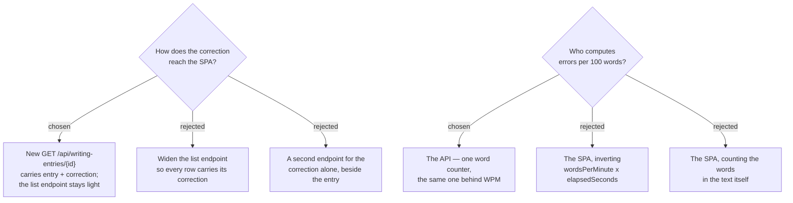

# ADR-179: A correction is fetched by id, and every number on it is derived server-side

**Date:** 2026-08-18
**Status:** Accepted
**Relates to:** issue #97; ADR-177 (the corrected night's own page renders the correction), ADR-178
(what that page renders). Honours the `CONTEXT.md` rule on **Words-per-minute**: "Derived, never an
input… The same rule governs target-errors-per-100-words." Touches the polling behaviour introduced
for the live lock (ADR-169 follow-ups, Phase 2).

## Context

The SPA has no by-id read for a writing entry. `WritingEntryDetailPage` loads the whole list
(`GET /api/writing-entries`) and `.find()`s the row, polling every 15 seconds so a correction landing
mid-edit locks the editor in place. That worked while an entry was date + text + two timestamps.

A correction is a different weight class. `MarkedText` alone is bounded at 50,000 characters, and
`ThaiWhyLine` at 2,000 — per night, on an endpoint the History screen polls. The History grid itself
needs none of it: it draws a date, a words-per-minute figure and a status badge.

Block 5 also needs a number nobody stores. `WordsPerMinute` is persisted; **errors per 100 words** is
not, and neither is the word count it divides by. `MissCount` is stored, so the arithmetic is
`missCount / wordCount * 100` — the open question is which word count, computed where.

The domain already fixes half the answer: these numbers are **derived, never inputs**, deliberately
kept out of the MCP tool signature so the assistant cannot hand the writer a flattering figure. That
rules out storing the number; it does not say who derives it.

## Decision

- **Add `GET /api/writing-entries/{id}`**, returning the entry together with its correction — the five
  blocks, the target rule the night was judged against, and the derived numbers. The detail page reads
  this instead of filtering the list. The list endpoint's shape is **unchanged**.
- **The detail page polls only while the entry is pending.** Once `correctedAt` is set the state is
  settled, and polling a payload of this size every 15 seconds buys nothing. The live lock keeps
  working: the poll runs exactly while there is a correction still to arrive.
- **The API computes `errorsPer100Words`** and returns it rounded to one decimal, using
  `WritingEntry`'s own word counter — the same code path that already produced `WordsPerMinute`.

## Rejected

- **Widen the list endpoint.** No new endpoint, no second query, and the detail page keeps working
  exactly as written. Rejected on what the writer would feel: every visit to ประวัติ would download
  every corrected night in full — and again on each 15-second poll — to render a table that shows a
  date and a badge.
- **A separate correction-only endpoint beside the entry.** Cleanly separates the two payloads and
  lets the page fetch the heavy half only when the badge says it exists. Rejected as a second
  round-trip for data that is always wanted together on this screen, and a second place for the
  entry's identity to be resolved.
- **Invert `wordsPerMinute × elapsedSeconds / 60` in the SPA.** No backend change at all. Rejected as
  fragile arithmetic: it recovers the word count from a stored float (5.853658536585366 × 41 / 60), so
  the divisor for a displayed statistic depends on floating-point rounding rather than on counting
  anything.
- **Count the words in the text in the SPA.** Straightforward and needs no API change, but it puts a
  second word counter in a second language beside the C# one — and the two tiles of block 5 would then
  be computed from different word counts the moment the tokenizers disagree about `&nbsp;`, ` ` or
  an empty tag. One counter, server-side, keeps the two numbers telling one story.

## Consequences

- `WritingEntryDto` is not widened; the by-id response is its own shape, carrying the correction and
  the derived numbers. The two JSON columns are deserialised on the way out.
- The detail page gains a second data source and loses its dependency on the entry being present in
  the list — which also fixes a live defect: an entry absent from the list currently renders
  "ไม่พบรายการนี้" even when it exists.
- Re-recording a correction on an already-corrected night will not appear on an open page, because
  polling has stopped by then. Accepted: re-correction is a repair the writer triggers himself and can
  reload for.
