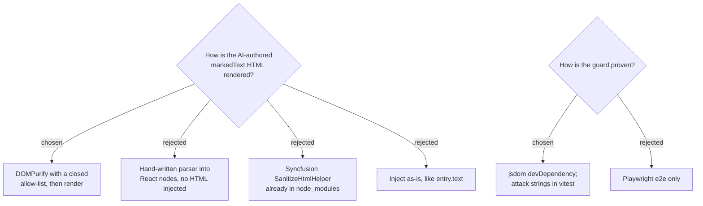

# ADR-180: Marked text is sanitized with DOMPurify behind a closed allow-list, and jsdom is added so that guard is testable

**Date:** 2026-08-18
**Status:** Accepted
**Relates to:** issue #97; ADR-177 / ADR-178 (the screen that renders `MarkedText`). Discharges the
note left by `docs/superpowers/plans/2026-08-17-writing-mcp-phase-2.md`: "Stored as-is (no
server-side sanitising)… **The ผลตรวจ screen must whitelist these tags on render** — note this for
that plan; it is not this plan's task."

## Context

`MarkedText` is HTML written by a language model — the writer's own Claude Code — and stored verbatim,
by design: the recording path performs no sanitising. Its intended vocabulary is tiny and fixed by the
mock's own CSS: `
`, and `` carrying one of `miss`, `fix`, `hit`, `th`.

Nothing enforces that vocabulary. Whatever the model emits is what the screen would receive, and the
screen renders it inside the writer's authenticated session. The threat is not a malicious writer — it
is an ordinary prompt-injection reaching a model that then writes markup into a field nobody checks.

Two constraints shaped the answer. Hand-writing HTML handling is a well-known way to ship a subtle
hole, and this repo's vitest runs in `environment: 'node'` with no DOM at all — so the natural
sanitizer (which needs a DOM) would land as the least testable code in the change, while being the
code that most deserves a test.

Facts checked against the live registry and the installed tree rather than recalled: `dompurify` is at
3.4.13, last published 2026-08-03, dual MPL-2.0 / Apache-2.0; it is **not** present in
`frontend/node_modules`, not even transitively. `@syncfusion/ej2-base` **does** already ship
`SanitizeHtmlHelper`.

## Decision

- **Sanitize with DOMPurify** in one module, `frontend/src/pages/writing/sanitizeMarkedText.ts`, with a
  closed allow-list: `ALLOWED_TAGS: ['p', 'span', 'br']`, `ALLOWED_ATTR: ['class']`.
- **Filter the class values too**, not only the tags: any class outside `miss | fix | hit | th` is
  stripped. Tag filtering alone would still let a correction carry `class="writing-detail-delete-btn"`
  and silently repaint the page with the app's own styles — a failure with no error and no clue.
- **Leave `entry.text` exactly as it is.** It is the writer's own Syncfusion-RTE output and legitimately
  contains `<b>`, `<ul>` and friends; applying this allow-list to it would delete his formatting. The
  new rule binds only where the new input is consumed.
- **Add `jsdom` as a devDependency** and mark the sanitizer's test file `@vitest-environment jsdom`, so
  the guard is exercised in vitest with real attack strings (`<script>`, ``,
  `javascript:` URLs, a smuggled app class) rather than trusted by inspection.

## Rejected

- **A hand-written parser producing React nodes** (no HTML injected anywhere). Attractive here: it is a
  pure function, so it would be fully testable in the existing node vitest with no new dependency, and
  it removes the injection surface rather than filtering it. Rejected on the writer's judgement that a
  security control should be a library the world maintains, not code we wrote once — bespoke HTML
  parsing is exactly where subtle holes live, and DOMPurify has a team tracking bypasses full-time.
- **Syncfusion's `SanitizeHtmlHelper`.** Already installed, zero new dependency, same vendor as the
  editor. Rejected because it exists to protect Syncfusion's own components from their own inputs, not
  as a general security boundary under adversarial review; "already in `node_modules`" is a convenience
  argument, not a safety one.
- **Inject as-is, like `entry.text` does today.** Consistent with the existing page and the simplest
  possible change. Rejected because the two strings have different authors: `entry.text` was typed by
  the writer into his own editor, `MarkedText` was generated by a model from text of unknown
  provenance.
- **Playwright e2e as the only proof.** No new dependency, and it does test the real browser. Rejected
  as too coarse for this: each payload costs a full scenario, so in practice one or two get tested and
  the rest are assumed. A side benefit of the chosen path is that this repo finally gains the ability
  to unit-test DOM behaviour at all — a gap CLAUDE.md documents at length.

## Consequences

- `dompurify` becomes a runtime dependency and `jsdom` a devDependency of `frontend`.
- The allow-list and the class filter are the security contract: changing either is a security change,
  not styling, and the test file is where that contract is stated.
- If a correction ever legitimately needs a new mark type, both the allow-list and the mock's CSS must
  change together, or the new mark renders as bare text.
