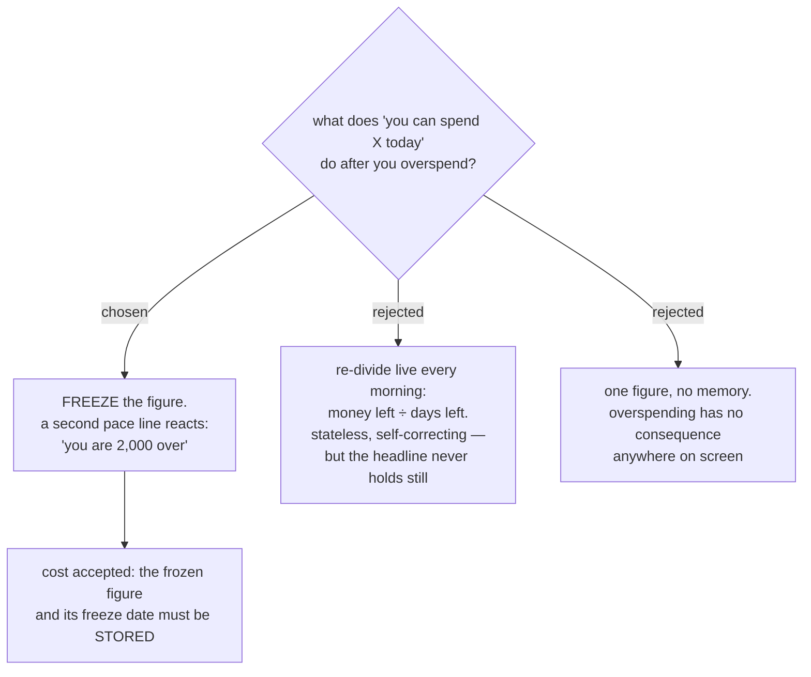

# The daily allowance freezes a figure, and a pace line carries the overspend

MenuNest's budget shows envelopes and Ready to Assign, and neither answers "what
can I spend today" (see `current-budget-audit` on decision map #99). YNAB has no
daily allowance to copy; the third-party apps that fill that gap divide *money
after bills* by *days until the next paycheck* (`ynab-parity-research`). #99 has
already fixed the budget month as the calendar month, so the divisor here is days
in the month, not a paycheck cycle.

We decided the number is a **frozen figure plus a pace line**, not a live
re-division. The figure is `everyday money remaining ÷ days remaining in the
calendar month`, computed at a **budgeting event** and then held still. Spending
never moves it. A second line compares what you should have spent by now against
what you did spend, and reads "you are 2,000 over" or "you are 2,000 under".

## What feeds it

Only envelopes marked **everyday**. Rent and savings are invisible to it. A daily
number computed over every envelope is not spendable money and would be wrong
every month.

`BudgetCategory` has no such flag today, and neither does `BudgetCategoryGroup` —
both were checked. The mark is a new **per-envelope** field, not a group field: an
envelope keeps its own mark when it moves between groups, whereas a group flag
would silently change the allowance whenever an envelope is dragged, and would
silently apply itself to every newly created envelope.

Envelopes are marked **incrementally**, not in an up-front setup pass. Until at
least one is marked, the card shows an empty state inviting you to pick — never a
number. A number built from unmarked envelopes would, on today's real data, be
built entirely from the *Bill* group and would tell the user they can spend their
phone bill.

## What re-freezes the figure

Three events, all of them deliberate acts of budgeting:

- marking or unmarking an envelope as everyday,
- assigning money to an everyday envelope (`SetAssignedAmount`, `MoveMoney`,
  `CoverOverspending` where an everyday envelope is involved),
- the month rolling over.

Spending is **not** one of them. A `BudgetTransaction` against an everyday
envelope leaves the figure untouched and moves only the pace line.

The divisor is **days remaining at the moment of the freeze**, not days in the
month. Both were put to the user with the real case: marking envelopes holding
6,000 on 21 August gives `6,000 ÷ 11 = 545`, where `6,000 ÷ 31 = 194` would
under-state by two thirds for the rest of the month. Because setup happens
mid-month by definition — nothing is marked today — the days-in-month divisor is
wrong on the very first day the feature is used.

## Consequences

- **The figure and its freeze date must be persisted.** The rejected live
  re-division stored nothing; this stores state and adds a rule about when to
  write it. That is the price of a headline that holds still, and it was accepted
  knowingly.
- **On the last day of the month the headline does not swell.** It stays frozen.
  If 5,000 is unspent, the pace line says "you are 5,000 under" — the headline
  does not become 5,000.
- **When the everyday envelopes are empty or negative the headline floors at 0**,
  and the pace line carries the overspend. This closes the "how should a
  category's overspend affect the daily allowance" question that #99 was carrying
  as fog.
- **Envelope `Available` already rolls negatives forward cumulatively** and there
  is no YNAB-style absorb-and-reset (`current-budget-audit`). A negative everyday
  envelope therefore drags the frozen figure down at the next freeze, not just in
  the month it was overspent. That interaction is real and is not revisited here.

## Recorded but not argued

Two points came back "no preference" from the user, and are recorded as the
recommendation rather than as their choice: the mark living on the **envelope**
rather than the group, and the **empty state** before anything is marked. A later
session may reopen either without treating it as overturning a decision.

Refs #99, decision ticket `daily-allowance-formula`.
