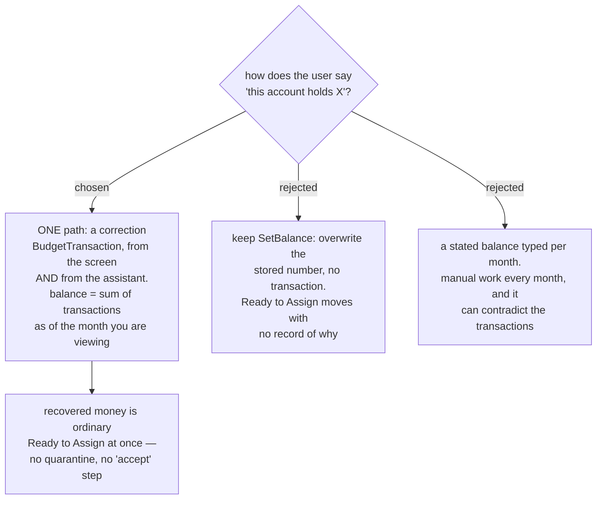

# An account balance is derived from transactions, and every correction writes one

Two contradictory paths for correcting an account balance already ship
(`current-budget-audit`, decision map #99). The budget screen's
`ReconcileBalanceDialog` posts a single uncategorized `BudgetTransaction` for the
difference, dated today, noted "Manual balance fix" — so the money lands in Ready
to Assign and the account history explains itself. The MCP/API path,
`update_budget_account` with `setBalance`, calls `BudgetAccount.SetBalance(...)`
and overwrites the stored number with no transaction at all, which contradicts
that entity's own XML doc ("reconciliation only; prefer `AdjustBalance` driven by
`BudgetTransaction`").

We decided the transaction-backed path is the only path. **Every change to an
account's money writes a `BudgetTransaction`**, whether the user acted on the
screen or through the assistant. `SetBalance`'s overwrite behaviour is deleted
from the `update_budget_account` surface; the tool posts a correction transaction
instead.

## What the correction recovers is ordinary money

The difference lands in Ready to Assign and is assignable immediately. There is no
quarantined "found money" state and no acknowledge step. The correction means the
user really does hold more than the app thought; making them tap twice to admit it
buys little and costs a state, a screen element and a step on every reconcile. The
accepted risk is that a mistyped balance silently inflates the budget — recoverable,
because the correction is now itself a transaction that can be edited or deleted.

## The balance is as-of-date

Viewing a month shows what the accounts held **at the end of that month**, derived
by summing transactions up to it — not today's number. The stored
`BudgetAccount.Balance` field survives, but only as a fast copy of today's total,
never as the source of truth for a past month.

This half-fixes the first defect the audit named. `readyToAssign` is
`sum(all account balances) − sum(envelope Available as of the selected month)`:
account money on today's clock, envelope money on the selected month's clock. Two
clocks, so every month except the current one reads wrong. Deriving the account
side puts both on the selected month's clock and fixes every **past** month. It
does **not** fix future months — a future month still shows money held today,
because forecast income does not exist yet. That half belongs to
`planned-income-model`, and is deliberately not decided here.

## Consequences

- **An opening balance must itself become a transaction.** Today it is typed at
  account creation and written straight onto `Balance`. A derived balance whose
  history starts with a non-transaction starts from nowhere. Existing prod data is
  test data and #99 already rules its migration out of scope, so this is a model
  change, not a migration.
- **It adds a second walk over history.** `ComputeEnvelopeAvailable` already loops
  every month from January 2000 for every category, twice per summary load;
  deriving account balances as-of-date adds another pass. Correct at current data
  sizes, and one more reason the summary's month-by-month walk needs replacing.
- **Two audit defects stay open and are not this decision's business**: closed
  accounts still count toward Ready to Assign, and `Loan` / `Credit` balances do
  too. Both remain fog on #99.

Refs #99, decision ticket `account-balance-input`.
