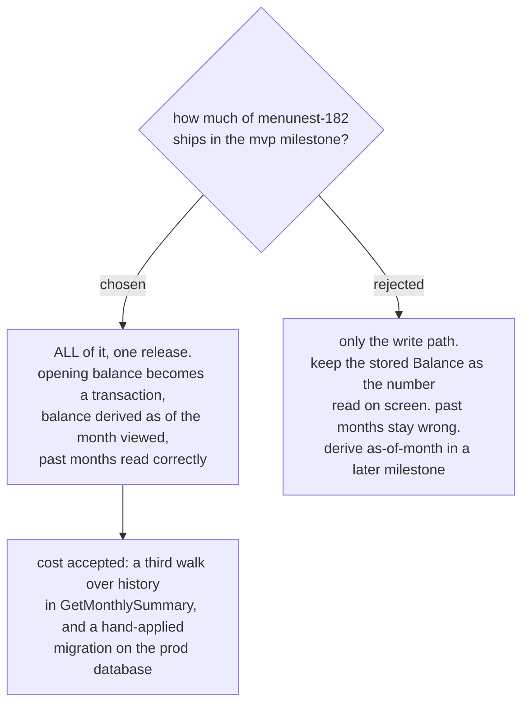

# The mvp milestone ships the derived account balance in one release

The `mvp` milestone on decision map #99 asks for one phone screen: set what each
**Account** holds, and see "today you can spend X". Both halves of that sentence
are about **today**. menunest-182 decided something wider — an **Account**'s
balance is derived from its **Budget transactions** *as of the month being
viewed* — and that half is a fix for **past** months, which the milestone
sentence does not name.

So the milestone had a real scope boundary to draw, and it is drawn at the wider
line: **the whole of menunest-182 ships here, in one release.**

## Why the smaller option is not actually smaller

menunest-182 deletes the silent `SetBalance` overwrite
(`UpdateAccountHandler.cs:27` today). Once it is gone, account **creation** is
the last remaining path that writes money without a **Budget transaction** — so
the opening balance must become a transaction regardless of which option is
chosen. That is the model change and the prod migration, and it is unavoidable
in both.

After every movement of money is a **Budget transaction**, deriving the as-of
balance is a date filter and a sum. The expensive part has already been paid.

## Why not split it across two releases

Splitting leaves the prod database half-migrated between the two deploys: the
opening balance is a transaction, but `readyToAssign` still sums the stored
`Balance` field. Both numbers exist, they disagree, and nothing on screen says
which one is being read. Prod deploys on every push to `main`, so that state
would be live rather than a local intermediate.

## What the user was actually asked

Not the engineering shape — the habit. "At the top of `/budget` there is a month
strip with a `‹` button. Do you use it?" The answer was that old months are looked
at and their numbers must be correct, which settles it: today those numbers are
wrong, because **Accounts** are summed on today's clock while **Envelopes** are
summed on the selected month's clock.

## Consequences

- **`GetMonthlySummary` gains a third full walk over history.**
  `ComputeEnvelopeAvailable` already loops every month from January 2000 for
  every **Envelope**, twice per load. Deriving each **Account**'s balance
  as-of-month adds another pass. Accepted at current data sizes; the fog line
  about replacing that walk stays open and is not resolved here.
- **A migration must be applied to prod by hand.** Per CLAUDE.md neither the app
  nor the CD pipeline runs `dotnet ef database update`. Existing prod budget data
  is test data, and #99 already rules its migration out of scope, so the opening
  balances of existing **Accounts** may be recreated destructively rather than
  back-filled.
- **The stored `BudgetAccount.Balance` field survives as a cache only**, per
  menunest-182. It is never the source of truth for a month other than today.
- **Future months are still not fixed.** A future month keeps showing money held
  today, because forecast income does not exist yet. That half belongs to
  `planned-income-model` and stays open.

Refs #99, milestone `mvp`.
