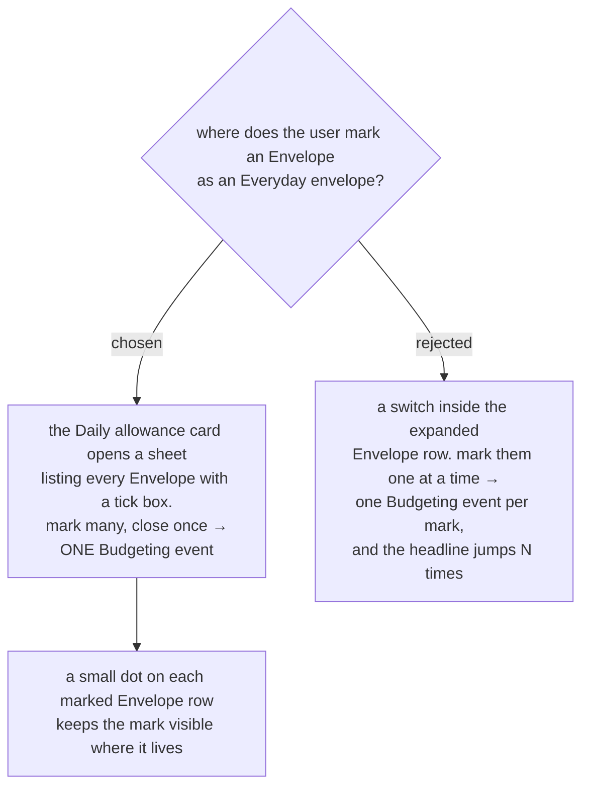

# Everyday envelopes are marked from the allowance card, not the envelope row

menunest-181 decided the mark lives on the **Envelope** itself and that
**Envelopes** are marked incrementally rather than in an up-front setup pass. It
also decided that before anything is marked, the **Daily allowance** card shows an
empty state that invites the user to pick. It did **not** decide where the picking
happens, and the `budget-shell-ux` mock does not draw a marking affordance
anywhere. Without one the **Daily allowance** can never be switched on at all.

We decided the mark is made from the **Daily allowance** card: tapping it opens a
sheet listing every **Envelope** with a tick box, several are ticked at once, and
closing the sheet commits them.

## Why not the envelope row

Marking is a **Budgeting event**, and a **Budgeting event** re-freezes the
**Daily allowance**. Marking six **Envelopes** one at a time is therefore six
freezes, and the headline figure visibly jumps six times during what the user
experiences as a single act of setup. The sheet makes that one freeze.

The collapsed **Envelope** row is also already full — emoji, name, the `⇄` move
icon, and the money pill — and `budget-shell-ux` is adding a `＋` log-spend icon
to it. There is no room for a mark there, and the expanded panel's spare slot is
`✎ Edit (soon)`, reserved for Phase-2 category editing.

## The empty state now leads somewhere

This is the decision's real work. menunest-181 required an empty state but gave it
no destination, which would have shipped an invitation with nothing behind it.
The same sheet serves both jobs: the first-run invitation, and every later change
of mind. Nothing separate has to exist for setup, which is what keeps the marking
incremental as menunest-181 required.

## Consequences

- **A marked **Envelope** carries a small dot on its collapsed row.** The mark
  lives on the **Envelope** per menunest-181, so it must be visible there even
  though it is not *set* there. Without it the user cannot tell which
  **Envelopes** feed the number without reopening the sheet.
- **Closing the sheet is the commit point**, not each tick. The tick boxes are
  local until the sheet closes; one write, one **Budgeting event**, one re-freeze.
- **The sheet lists every **Envelope**, including ones in Bill and savings
  groups.** The mark is per-**Envelope** and group-independent by menunest-181, so
  the sheet must not filter by group.

Refs #99, milestone `mvp`.
