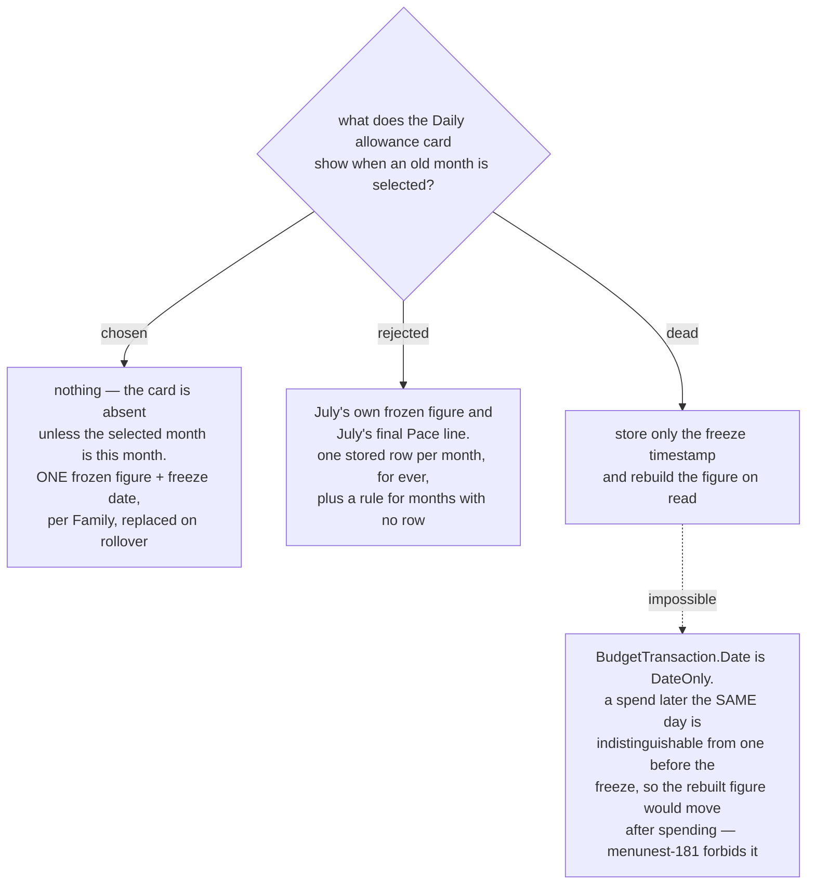

# The allowance card is current-month only, and one frozen figure is stored

menunest-181 decided the **Daily allowance** is frozen and that the figure and its
freeze date must be persisted. It did not decide the *shape* of that persistence,
which decision map #99 has been carrying as an explicit fog line: "a new column, a
new entity, or a recompute from a stored freeze timestamp".

menunest-183 then made this urgent by deciding that old months must read
correctly, which puts the **Daily allowance** card on screen for July as well as
for today — unless it is deliberately taken off.

We decided the card appears **only when the selected month is the current
month**, and that exactly **one** frozen figure plus its freeze date is stored per
**Family**, replaced whenever a **Budgeting event** re-freezes it.

## The rebuild option is not available

The fog line offered "recompute from a stored freeze timestamp" as a third shape,
and it is the only one that would store no figure at all. It cannot work here:
`BudgetTransaction.Date` is a `DateOnly` (`BudgetTransaction.cs:17`). A spend made
after the freeze on the *same day* carries the same `Date` as the state the freeze
was taken from, so a rebuilt figure would silently absorb it and move — which is
exactly the behaviour menunest-181 rejected. The figure is therefore genuinely
stored, not derived. That closes the fog line.

## Why the card is current-month only

The **Daily allowance** answers "what can I spend **today**". A past month has no
today, so a frozen July figure names an amount that can no longer be spent. July's
**Pace line** likewise reports an outcome that July's **Envelopes** already carry
in their **Available** numbers.

The storage follows from that, rather than the other way round: with no past-month
card there is nothing to look up per month, so a per-month history has no reader.
A history would also need a rule for every month that predates the feature, all of
which would have no row.

## Consequences

- **The stored figure lives at **Family** scope**, matching the rest of the budget,
  which is family-gated. Two members therefore see the same figure. How two members
  budgeting the same month at once should behave stays fog on #99 and is not
  decided here.
- **Month rollover overwrites the stored figure** rather than appending. The
  previous month's figure is not recoverable, by design.
- **A month with no stored figure shows the empty state**, which is also the state
  before any **Everyday envelope** exists. The two cases collapse into one screen,
  and menunest-184 already gave that screen its destination.
- **The card must read the selected month, not the clock.** It is rendered inside a
  page whose month is user-selected, so "is this the current month" is a real check
  against today's date, not an assumption.

Refs #99, milestone `mvp`.
