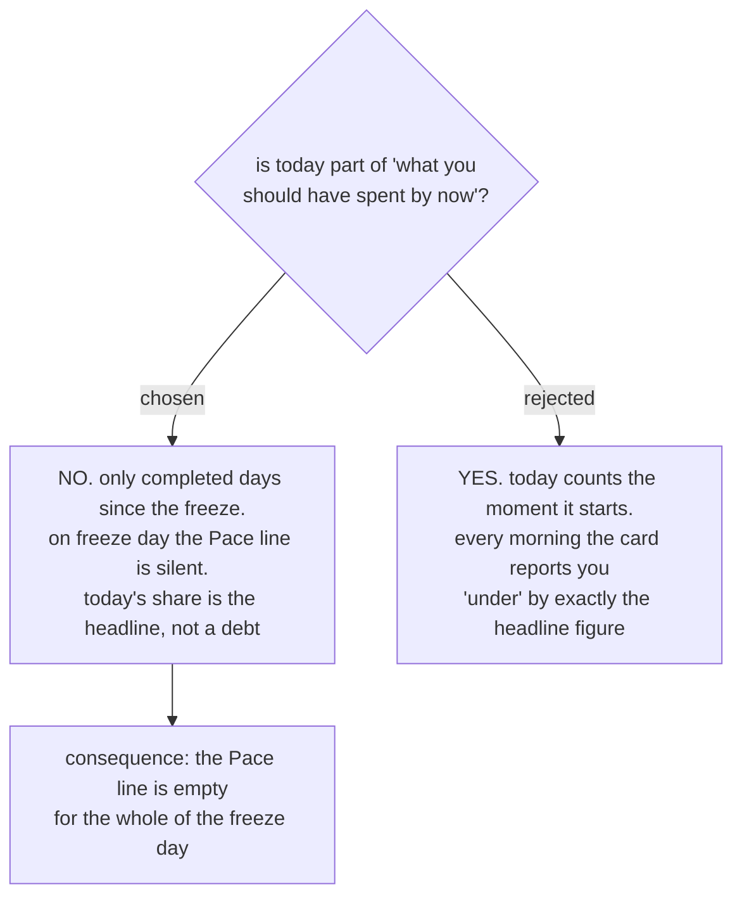

# The pace line counts only completed days

menunest-181 decided the **Pace line** compares what should have been spent by now
against what was spent, and reads "you are 2,000 over" or "you are 2,000 under".
It left the arithmetic unstated, and one term of it is a real choice: whether
*today* belongs to "by now".

We decided it does not. **Should-have-spent = the frozen figure × the number of
completed days since the freeze.** The freeze day itself contributes nothing until
it ends.

## Why

The two lines sit together on one card. The headline says "spend ฿545 today". If
today counted, the **Pace line** directly beneath would say "you are ฿545 under"
from the moment of the freeze — the same ฿545 stated twice, once as money the user
may spend and once as money they have failed to spend. The card would contradict
itself every morning before the user did anything.

Falling behind on a day that has not finished is not a thing that can happen.

## The rejected consistency argument

menunest-181 fixes the divisor as *days remaining at the freeze*, and its worked
example — `6,000 ÷ 11` on 21 August — counts 21 August as one of the eleven. So
today does receive a share of the money, and counting it in the **Pace line** is
the consistent reading.

It was rejected anyway. Receiving a share is not the same as owing it. The divisor
answers "how many days must this money cover"; the **Pace line** answers "how many
days have I already used". Those are different counts and they are allowed to
differ by one.

## Worked example

Freeze on 21 August: **Everyday envelopes** hold ฿6,000, 11 days remain, the figure
is ฿545.

| Date | Completed days | Should have spent | Actually spent | **Pace line** |
|---|---|---|---|---|
| 21 Aug | 0 | ฿0 | ฿0 | silent |
| 25 Aug | 4 | ฿2,180 | ฿1,800 | "you are ฿380 under" |

## Consequences

- **The **Pace line** is silent for the whole of the freeze day.** This is the
  visible cost, and it is accepted: it is also correct, because no day has yet been
  used.
- **Actually-spent is measured from the freeze date, not from the start of the
  month.** The frozen figure was computed from the pot as it stood at the freeze,
  so comparing it against spending that predates the freeze would double-count
  money the figure has already excluded.
- **Only spending on an **Everyday envelope** counts.** A **Budget transaction**
  against Rent or savings moves neither line, matching what feeds the figure.
- **An assignment never appears in the **Pace line**.** Assigning to an
  **Everyday envelope** is a **Budgeting event**, so it re-freezes the figure and
  resets the count of completed days to zero.

Refs #99, milestone `mvp`.
