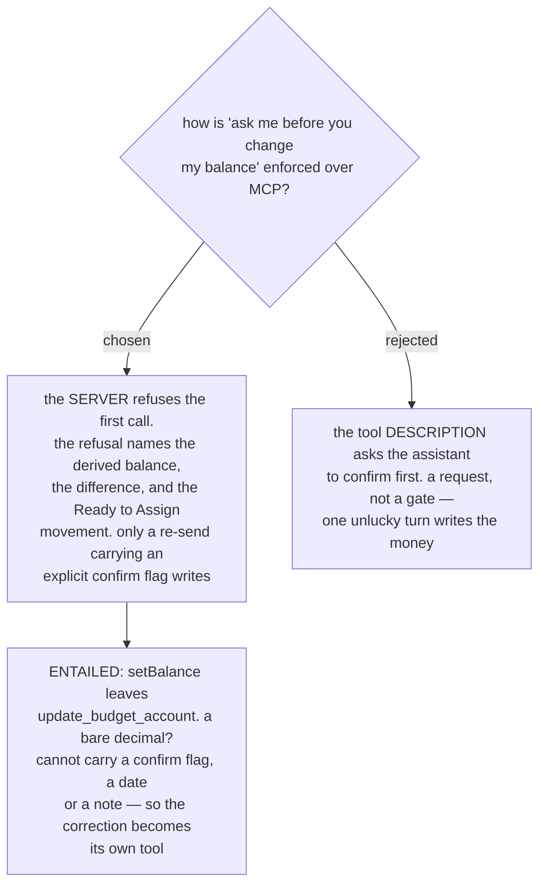

# A balance correction over MCP is its own tool, and the server refuses it once

menunest-182 deleted the silent `SetBalance` overwrite and said the assistant
"posts a correction transaction instead". It did not say through which tool, nor
what protects the user from a correction they did not ask for — and it had already
removed the quarantine step that used to sit between a **Balance correction** and
**Ready to Assign**. The user then stated the requirement directly: *ask me before
you call it.*

We decided the enforcement is **server-side refusal**, following ADR-140's
**Shrink** precedent, and that the correction therefore becomes **its own MCP
tool**.

## The gate

The first call is refused. The refusal states the **Account**'s derived balance,
the difference the correction would write, and the amount that would move into
**Ready to Assign**. Only a second call carrying an explicit confirmation flag
writes anything.

This is the same shape `update_trip` already uses for a **Shrink** (ADR-140): the
server refuses, the refusal names what would be lost in numbers, and the caller
must re-send with `allowStopLoss: true`. There are no MCP tool annotations anywhere
in this codebase, so refuse-then-confirm is the house route, and the assistant now
meets one consistent shape across MenuNest rather than two.

## Why a description was not enough

A description is a request to the model. It usually works. When it does not, the
money is already in **Ready to Assign** and the user learns about it afterwards —
and menunest-182 deliberately removed the acknowledge step that would otherwise
have caught it. A refusal cannot be skipped by an unlucky turn.

## The tool split is entailed, not preferred

`update_budget_account`'s `setBalance` is a bare `decimal?`
(`BudgetTools.cs:59`). It has nowhere to carry a confirmation flag, and nowhere to
carry the date and note a **Balance correction** needs. The gate cannot be built on
it. So `setBalance` leaves `update_budget_account` — which keeps only name, sort
order and closed state — and a dedicated correction tool takes the true balance,
the confirmation flag, and an optional date and note.

The tool's own description had also become false: it advertises "manually set its
balance", which is the exact claim menunest-182 exists to delete.

## Consequences

- **Every balance correction over MCP costs two round trips**, including when the
  user is certain. There is no remembered consent and no "always allow".
- **The refusal text is the user-facing message.** It is what the assistant reads
  back, so it must name real numbers, not a generic rejection.
- **The correction carries a date.** Once balances are derived per month
  (menunest-183), a correction dated today and one dated 31 July land in different
  months, so the date cannot be implicit.
- **`create_budget_account`'s `openingBalance` is not gated.** Creating an
  **Account** with a stated balance is not a correction of an existing number, and
  the user is already stating it deliberately. It must still write a **Budget
  transaction** rather than a stored value.
- **The web screen is unaffected.** `ReconcileBalanceDialog` already shows the
  numbers and already requires a press to submit, which is the same gate expressed
  as a screen.

Refs #99, milestone `mvp`.
