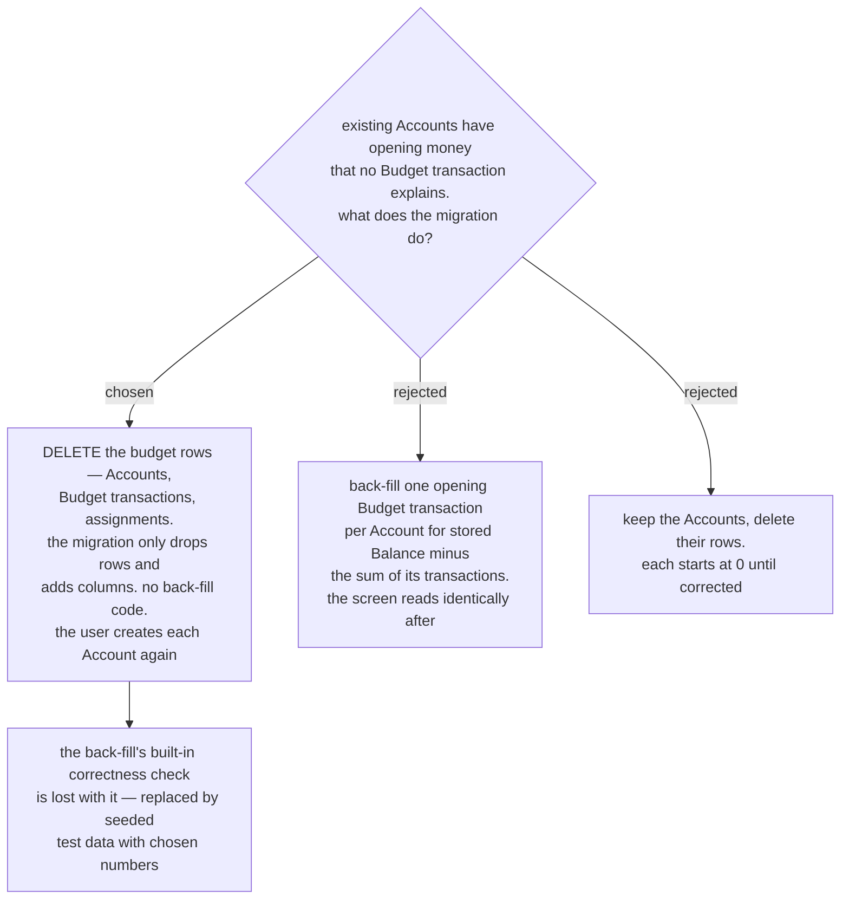

# Existing budget data is deleted rather than back-filled

menunest-183 makes an **Account**'s opening balance a **Budget transaction**.
Existing prod **Accounts** have no such row: their opening money was typed at
creation and written straight onto the stored `Balance` field. Once the balance is
derived, that money is simply absent — a Cash **Account** reading ฿52,480 whose
transactions total ฿12,480 would show ฿12,480.

Decision map #99 already rules migrating prod budget data out of scope because it
is test data. That *permits* a destructive answer without requiring one, so it was
put to the user. Their answer was that the old **Account** data is no longer valid
at all.

We decided the migration **deletes the budget rows entirely** — **Accounts**,
**Budget transactions**, **MonthlyAssignments**, **Envelopes** and their groups —
and writes no back-fill. The budget starts empty. The user creates each
**Account** again afterwards, and the new code writes its opening balance as a
**Budget transaction**.

The delete is total rather than account-only because a surviving **Envelope**
holding **Available** money that no **Budget transaction** explains reproduces the
same defect one level down: **Ready to Assign** is accounts minus envelopes, so
envelope money orphaned from the ledger corrupts it exactly as orphaned account
money would.

## What this buys

The migration carries no back-fill logic: it drops rows and adds the new columns.
Every peso in the database afterwards was written by the new code through the new
path, so there is no half-migrated state where a derived number and a stored number
disagree and nothing on screen says which is being read.

Keeping the **Accounts** but deleting their rows was also rejected. It leaves each
**Account** reading ฿0 until it is corrected, which is a window in which the screen
shows numbers nobody intended.

## What this costs, and what replaces it

The back-fill option carried a free correctness test: if it were right, the newly
derived balance for the current month would equal the stored `Balance` exactly, for
every **Account** — the only evidence available that the derivation itself is
correct. Deleting the data destroys that comparison.

It is replaced by **seeded test data**: known **Budget transactions** in, a known
as-of-month balance out, asserted in the test suite. This is stronger than the
back-fill check, because the numbers are chosen to exercise month boundaries and
sign rather than being whatever prod happened to hold.

## Consequences

- **The stored `Balance` field is not read by the migration**, so a balance that is
  already wrong today — `current-budget-audit` found a Cash **Account** at −6,000,
  which a Cash account cannot hold — is not carried forward. This defect disappears
  on its own.
- **Setup is manual and must be done once**, by hand, after the migration is
  applied. Per CLAUDE.md the migration is applied by hand anyway; neither the app
  nor CD runs `dotnet ef database update`.
- **The **Envelopes** and their groups must be recreated too**, not only the
  **Accounts**, and marked as **Everyday envelopes** again. The mark is new in this
  milestone, so no existing marks are lost — but the envelope structure is.
- **The Playwright specs must still pass.** `/budget` has four (`budget.smoke`,
  `budget.interactions`, `budget.account-tx-crud`, `budget.add-entry-points`) and
  they build their own state, so an empty starting database does not break them.

Refs #99, milestone `mvp`.
