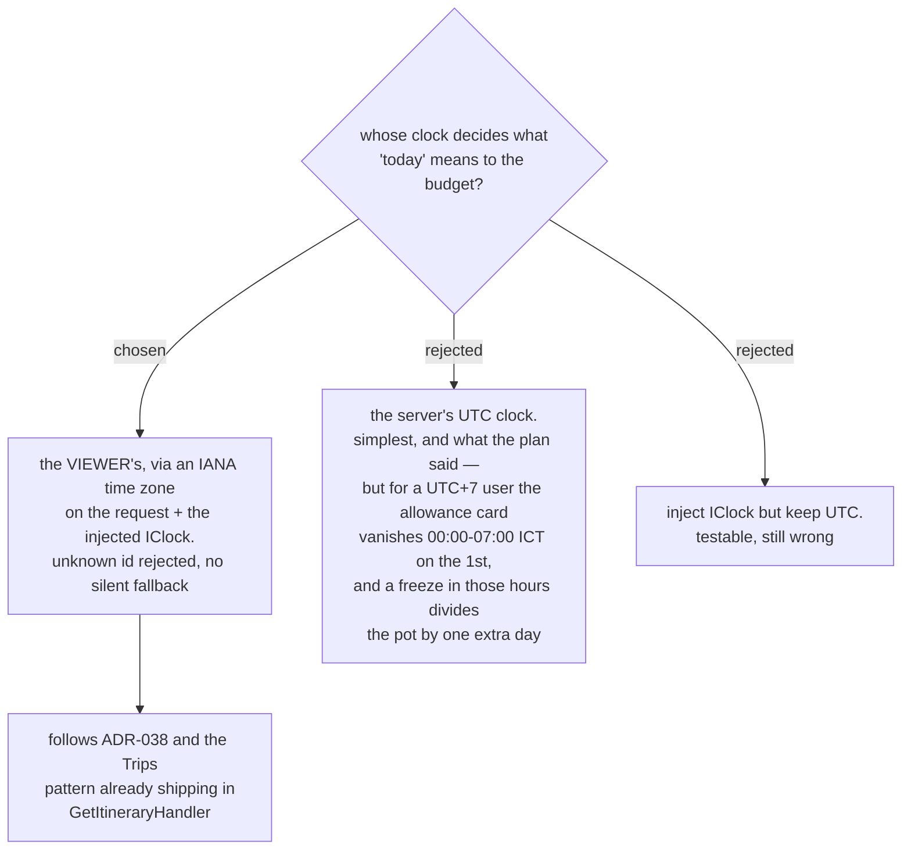

# The budget's "today" is the viewer's local day, not UTC

The `mvp` milestone's plan prescribed `DateTime.UtcNow` in the five handlers that
need to know what day it is: `GetMonthlySummary` (which decides whether the
**Daily allowance** card is shown at all), `SetEverydayMarks`, `SetAssignedAmount`,
`MoveMoney` and `CoverOverspending` (the three **Budgeting events**).

A review of Task 4 established two concrete consequences for a user in Thailand
(UTC+7), which is this app's only user base — #99 already fixes the currency at
THB:

- **The card disappears for seven hours a month.** It renders only when the
  selected month is the current month. On the 1st between 00:00 and 07:00 ICT the
  phone has rolled over and the server has not, the months disagree, and the card
  is simply absent.
- **A freeze in those hours uses yesterday's date.** The divisor is *days
  remaining in the month*, so the figure is divided by one extra day and comes out
  low for the rest of the month — silently, since nothing on screen says which day
  the freeze thinks it is.

We decided the budget's "today" is the **viewer's local day**, resolved from an
IANA time-zone id supplied on the request and the injected `IClock`.

## This is the pattern MenuNest already has

ADR-038 settled the same question for the **Smart Schedule**: the caller supplies
an IANA time-zone id, the server resolves it against its own **UTC** clock, and
never uses the server's local time. `GetItineraryHandler` implements it —
`TimeZoneInfo.FindSystemTimeZoneById`, a `DomainException` on an unknown id, then
`TimeZoneInfo.ConvertTimeFromUtc(_clock.UtcNow, tz)` — and the SPA already
resolves its zone with `Intl.DateTimeFormat().resolvedOptions().timeZone`
(`frontend/src/pages/trips/utils/time.ts:41`). The MCP `get_itinerary` tool
carries the parameter too.

So this is not a new mechanism. It is applying an existing, shipped one to a
second module that needs the same guarantee.

## No silent UTC fallback

ADR-038's rule holds here: where the time zone is actually needed, a missing or
unknown id is **rejected**, never quietly replaced with UTC. A silent fallback
reproduces exactly the bug this decision exists to remove, while making it look
handled.

The budget differs from the itinerary in one respect — the itinerary needs a zone
only for a Day flagged **Current-time start**, whereas the budget needs one on
every read that could show the card. That makes the parameter effectively
required rather than conditionally required, which is why the MCP
`get_budget_summary` tool must carry it as well.

## Consequences

- **`IClock` replaces `DateTime.UtcNow` in all five handlers.** This also closes
  the testability gap the review raised: `HandlerTestFixture` already exposes a
  `FixedClock`, so the freeze, the rollover and the completed-day count become
  deterministically testable instead of depending on the wall clock.
- **`GetMonthlySummaryQuery` and the Budgeting-event commands gain a time-zone
  id**, and `BudgetController` passes through what the SPA sends.
- **The MCP `get_budget_summary` tool gains a `timeZoneId` parameter.** That file
  belongs to a later task in this plan, so the change lands there rather than
  being back-fitted here.
- **The stored `FrozenOn` stays a plain `DateOnly` with no zone.** It records the
  viewer's local day at the moment of the freeze; the budget is family-scoped and
  single-region, so a per-row zone would be storing a fact nobody reads.
- **Cost: one extra fix round on Task 4**, and a required parameter on an
  endpoint that previously had none. Accepted deliberately in preference to
  shipping a bug that is invisible until the 1st of a month.

Refs #99, milestone `mvp`. Applies ADR-038 to the budget module; amends the
implementation plan `docs/superpowers/plans/2026-08-22-budget-mvp-milestone.md`,
which prescribed `DateTime.UtcNow`.
