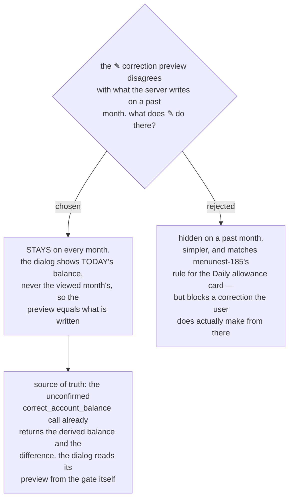

# Reconcile stays on every month and always states today's balance

menunest-183 made an **Account**'s balance derive *as of the month being viewed*.
That silently broke the ✎ **Balance correction** dialog, which had always compared
against a single live number.

`ReconcileBalanceDialog.tsx:34` computes `diff = actual − trackedBalance`, and
`trackedBalance` is fed from the monthly summary — now the *viewed month's*
figure. The server corrects against **today's** derived balance. So on a past
month the two disagree:

| | |
|---|---|
| **Account** holds today | ฿52,480 |
| **Account** held in July | ฿30,000 |
| You press `‹` to July, tap ✎, type | ฿32,000 |
| The dialog previews | **+฿2,000** |
| The server writes | **−฿20,480** |

This regression did not exist before this milestone, because balances were always
today's.

We decided the ✎ affordance **stays available on every month**, and the dialog
**always states today's balance** rather than the viewed month's.

## Why not hide it

Hiding it on a past month was the recommendation, and it would have been
consistent with menunest-185, which takes the **Daily allowance** card off a past
month on the grounds that a past month has no "today". The user rejected it: they
do reach for the correction while looking back, and losing the affordance costs
more than the oddity of the number.

The accepted oddity is real and should be stated plainly: on the July screen the
**Accounts** row reads ฿30,000 while the ✎ dialog reads ฿52,480, at the same
time. That is the price of keeping the action always reachable, and it is
tolerable only because the dialog explicitly labels its figure as today's.

## Where the preview comes from

The dialog must not read the summary's as-of-month balance. The obvious fix — add
a second `balanceToday` field to the account DTO — duplicates a number the server
already computes.

Prefer instead the gate that menunest-187 already built: an **unconfirmed**
`correct_account_balance` call returns the derived balance, the difference, and
the **Ready to Assign** movement, and writes nothing. The dialog can use that as
its preview and then re-send with the confirmation flag. The preview then comes
from *the same computation that performs the write*, so the two cannot drift
again — which is the actual defect being fixed, not merely the wrong number.

This also makes the web screen use the same refuse-then-confirm path as the
assistant, where menunest-187 had it short-circuit with `confirmed: true`.

## Consequences

- **The dialog gains a load step.** It cannot render its comparison until the
  unconfirmed call returns. That is a visible change to a dialog menunest-187 said
  would be unaffected, and it supersedes that expectation.
- **The figure must be labelled.** Showing ฿52,480 on a July screen is only
  defensible if the dialog says it is today's balance.
- **A correction made while viewing July still lands today**, not in July. The
  correction states what the **Account** holds now; it is not a way to rewrite
  history. Dating a correction into a past month remains possible over MCP via the
  tool's optional `date`, and is deliberately not offered on the screen.

Refs #99, milestone `mvp`. Supersedes menunest-187's claim that
`ReconcileBalanceDialog` is unaffected.
