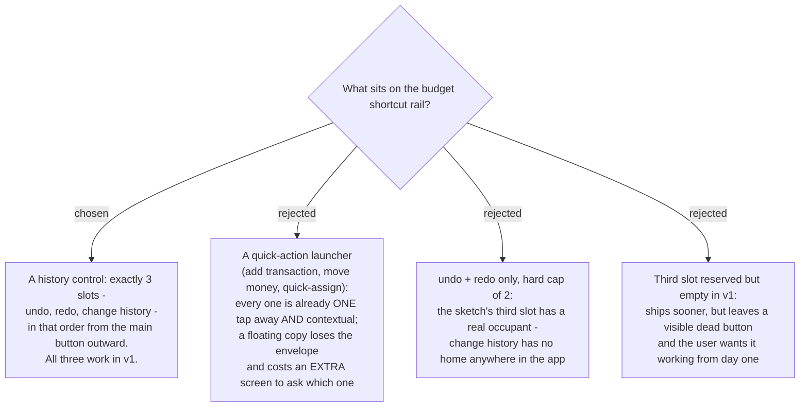

# The shortcut rail is a history control, not a launcher

Issue #106 asked for shortcut buttons "such as undo redo" on the budget screen, sketched
as three stacked buttons down the right edge. The question underneath was whether the
rail is a **history control** or a general **launcher**.

It is a history control. The budget screen already puts every launcher candidate one tap
away, and every one of those taps is **contextual**: the `＋` on the "groceries" envelope
row already knows you mean groceries. A floating `＋` does not, so it would have to ask -
making the "shortcut" slower than the control it duplicates.

| action | where it already lives | taps |
|---|---|---|
| add transaction | `＋` on every envelope row (`EnvelopeCard.tsx`) | 1 |
| move money | `⇄` on every envelope row | 1 |
| cover overspending | `⚠` on an overspent envelope row | 1 |
| quick-assign | the two chips under the RTA hero (`QuickAssignChips.tsx`) | 1 |
| all transactions | `☰` on the month strip (`MonthStrip.tsx`) | 1 |
| correct account balance | `✎` on every account card (`AccountsStrip.tsx`) | 1 |
| **undo / redo / change history** | **nowhere** | **-** |

Undo, redo and change history are the inverse case: they act on *"the last thing you
did"*, which belongs to no envelope, so a floating control is their correct home rather
than a duplicate of one.

## The slot rule

**Exactly three slots. A new button earns one only by being about the user's own recent
acts.** Anything else goes where its context already lives. The rule matters more than
the count: without it the rail slowly becomes a second menu, and the context problem
rejected above comes back through the side door.

Order, from the main button outward: **undo → redo → change history** - frequency order,
and it matches the `Ctrl+Z` / `Ctrl+Shift+Z` bindings on desktop.

## Consequences

- **Change history is a new screen, not a rename of an existing one.** `/budget/transactions`
  lists **Budget transactions** only; assigning, moving money and covering overspending are
  not transactions and appear nowhere today. This is also NOT the **Budgeting event** of
  menunest-181/185 - that term names the three acts that re-freeze the **Daily allowance**
  and nothing else.
- **Shipping change history in v1 pulls `build-ship` behind `history-storage`**, because the
  view reads the same record the undo stack does. What it lists and how far back it reaches
  is a decision this ADR does NOT make.
- Two buttons would not have justified a tap-to-expand rail; three might. That remains the
  `rail-interaction` ticket's call, not this one's.
