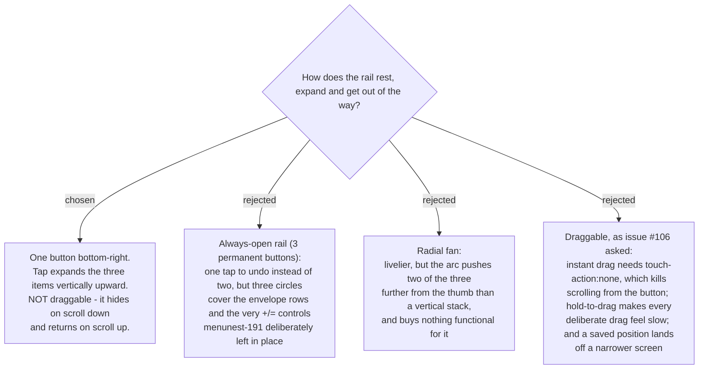

# The shortcut rail hides on scroll rather than being dragged

Issue #106 asked for a draggable floating button. A throwaway prototype on the real
budget layout was built and used on a phone, which is the only place the question could
be settled. Three rails and three drag modes were put under the thumb.

**Drag lost on evidence, not on taste.** The prototype made both halves of the trade-off
felt: with instant drag the button sets `touch-action: none`, so a thumb landing on it
can no longer scroll the page at all; with a 250 ms hold the page still scrolls, but
every intentional drag becomes a wait. Shrinking the frame then showed a position saved
on a wide screen sitting outside a narrow one, which a real build would have to clamp,
reset, or lose the button to.

**What drag was actually for was occlusion** - "the button is covering something I want".
Hide-on-scroll solves exactly that: flick down and the rail drops away, flick up (or
simply stop for about a second) and it returns. No drag-versus-scroll conflict, no
remembered position, nothing to land off-screen.

Two guards are part of the decision, not implementation detail: the rail **never hides
while the dial is open**, and it returns on idle so it can never be lost by stopping
mid-flick.

## Consequences

- **Undo costs two taps** (open, then press) rather than one. Accepted knowingly: the
  always-open alternative buys that tap back by covering the envelope rows permanently.
  If two taps proves wrong in use, the escape is variant A, already prototyped.
- **Syncfusion SpeedDial has no hide-on-scroll**, so that behaviour is roughly twenty
  lines MenuNest owns and maintains on top of the component chosen in the
  `library-choice` research. It does not overturn that choice.
- `position=BottomRight` and `mode=Linear direction=Up` map straight onto the component's
  own properties, so the resting corner and expansion need no custom positioning.
- The bottom-right corner is free on `/budget` but occupied by `.bdg-fab` on
  `AccountDetailPage`. Reconciling that belongs to `rail-architecture`, not here.

## Prototype

https://claude.ai/code/artifact/21ac73e6-a87a-4dbb-a3a5-70555a8e0202 - built with the
app's own tokens from `frontend/src/pages/budget/BudgetPage.css` and the issue
screenshot's own figures. It is a throwaway grilling aid, not the mock: `mock-signoff`
still owes a `docs/mocks/` file that the build is diffed against.
