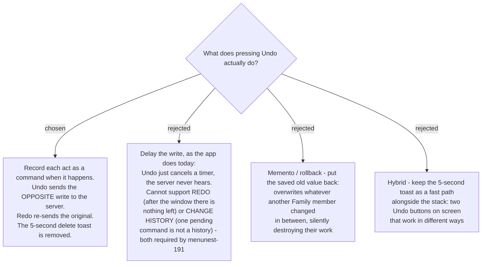

# Undo sends a compensating transaction, not a rollback

Issue #106 wants Undo, Redo and a Change history screen. menunest-191 put all three in the
rail and all three in v1. This ADR decides the mechanism underneath them.

## What the app does today is not undo

`AccountDetailPage.tsx` shows an Undo toast for five seconds after a **Budget transaction**
is deleted. It reverses nothing. The app removes the row from the screen and then **waits**
before telling the server; pressing Undo cancels the timer, and the server never learns of
the delete at all.

That mechanism cannot grow into what #106 asks for:

- **Redo needs something to redo.** After five seconds the delete is complete and gone.
- **Change history needs a history.** One waiting command is not a list.

So the choice was already made by menunest-191, and was presented as such rather than
re-opened.

## Why not simply restore the old value

A **Family** has more than one member, and both can budget the same month. Restoring a saved
copy is a rollback, and a rollback overwrites everything that happened in between.

Worked through with the user on a walkthrough built for the purpose
(`docs/problem-description/2026-08-29-undo-redo-walkthrough.html`):

| | Ready to Assign | Envelope "ค่ากิน" |
|---|---|---|
| start | ฿500 | ฿0 |
| ทศพล assigns ฿300 | ฿200 | ฿300 |
| มาลี assigns ฿100 | ฿100 | ฿400 |
| **rollback** — "set it to ฿0" | ฿500 | **฿0 — มาลี's ฿100 destroyed** |
| **compensating** — "subtract ฿300" | ฿400 | **฿100 — มาลี's ฿100 survives** |

The compensating write talks about **what this user did**, not about what the total ought to
be, which is exactly why it leaves other people's work alone. This is Microsoft's
Compensating Transaction pattern; the recorded line is the Command pattern. Redo comes free:
re-apply the same record forward.

## The old toast is removed

Asked explicitly. Keeping it would put two Undo buttons on screen that work in different
ways, and nothing would define what pressing one does to the other. One Undo, one mechanism.

## Consequences

- **Every reversible act needs a defined inverse.** Adding a use case and forgetting its
  inverse breaks Undo silently. Which acts qualify is `reversible-actions`, not this ADR.
- **Deleting a Budget transaction has no natural inverse today.**
  `DeleteTransactionHandler` calls `_db.BudgetTransactions.Remove(tx)` — a hard delete, with
  no soft-delete flag, unlike `Trip`, `Drug`, `Photo` and `WritingEntry` which all have one.
  Undoing a delete would therefore create a **new** record with a **new** id. Whether to
  cover transactions at all, and at what cost, belongs to `reversible-actions`.
- **A record can go stale** — the month rolled over, the Envelope was deleted, someone edited
  it first. That is `stale-undo`.
- **The records need a home** — memory, the device, or the server. That is `history-storage`.
- **Trap for the SPA:** RTK Query's `api.util.updateQueryData(...).undo()` is **not** this. It
  rolls the cache back when a *request fails*. Same word, different job. Do not build user
  Undo on it.
- `BudgetAccount` already carries a rowversion concurrency token, so lost-update protection
  exists at the account level. It does not solve staleness at the Envelope level.
