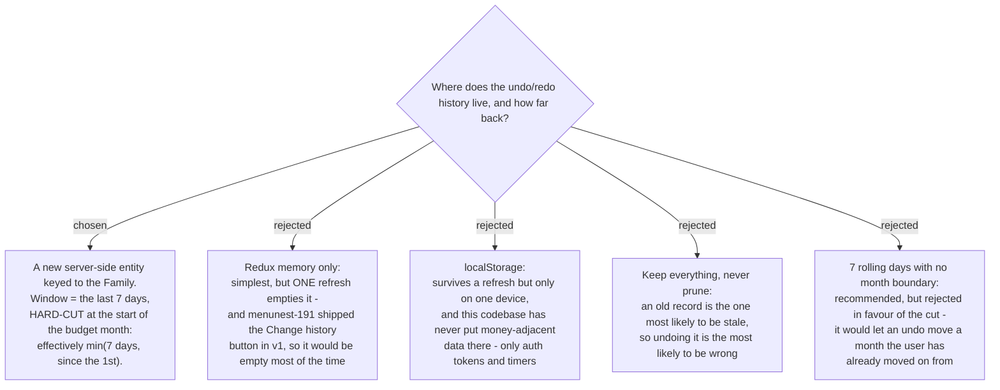

# The undo history lives on the server and never crosses a month

menunest-193 decided that undo sends a compensating write built from a recorded command.
This ADR decides where those records live and how long they last.

## Server-side, because the history button already shipped

menunest-191 put **Change history** in the rail in v1. That single earlier decision rules
out both client-side stores: in memory the list is emptied by any refresh, and in
localStorage it is empty on every other device. A history screen that is usually empty is
not a feature.

Two supporting facts:

- **This codebase already draws the line.** `localStorage` appears only in auth, the
  pomodoro timer, the writing timer and a health prompt — per-device ephemera. No
  money-adjacent data has ever been kept there, and there is no `redux-persist`.
- **A client-side store would silently decide `whose-acts`.** That ticket asks whether one
  Family member may undo another's change. A record that never leaves your device cannot
  know what anyone else did, so choosing client-side would answer that question by
  accident, without asking it.

## Seven days, cut at the month

The reason to prune is not disk. A record costs a few bytes; what makes an old record
expensive is that it is the one most likely to be **stale** — its Envelope deleted, its
month closed, its figure already edited by someone else. So the window is time, not a count:
a count-based cap behaves unpredictably, because one heavy budgeting session buries
yesterday's mistake.

Seven days was the recommendation. The user added the month cut, and it earns its place: a
budget month is a closed period in this app, so an undo reaching back into a month the user
has already left would move numbers they consider settled. The cut removes that entire class
of problem from `stale-undo` rather than asking it to handle it.

## The cost, stated plainly

**On the first day of each month the history is empty.** A mistake made on 31 August cannot
be undone on 1 September — not by switching the MonthStrip back, not at all. This was named
before the choice was made and accepted knowingly. It is the price of never letting an undo
cross a month.

## Consequences

- **A new entity, and it must land whole.** Per CLAUDE.md a new `DbSet<>` must be added to
  **all three** `IApplicationDbContext` implementers (`AppDbContext`, `SqliteAppDbContext`,
  `InMemoryAppDbContext`) or the build fails `CS0535`, and the entity plus its EF
  configuration must be in the **same commit** or pre-commit can never pass.
- **The migration is applied to prod by hand.** Neither the app nor CD runs
  `db.Database.Migrate()`; see the CLAUDE.md runbook, including the temporary SQL firewall
  rule.
- **Pruning can be real deletion, not just a read filter.** `MenuNest.Infrastructure/BackgroundServices/FollowUpDispatcher.cs`
  shows the project already runs hosted background services, so a job that deletes expired
  rows is available. Whether v1 filters at read time or deletes on a schedule is an
  implementation choice, not a decision this ADR makes.
- **The ticket's navigation question dissolves.** Because the store is server-side and keyed
  to the Family, the list does not reset when the user switches month on the MonthStrip or
  leaves `/budget`. The month only *scopes* what is visible and undoable.
- `whose-acts` stays genuinely open, which was the point.
