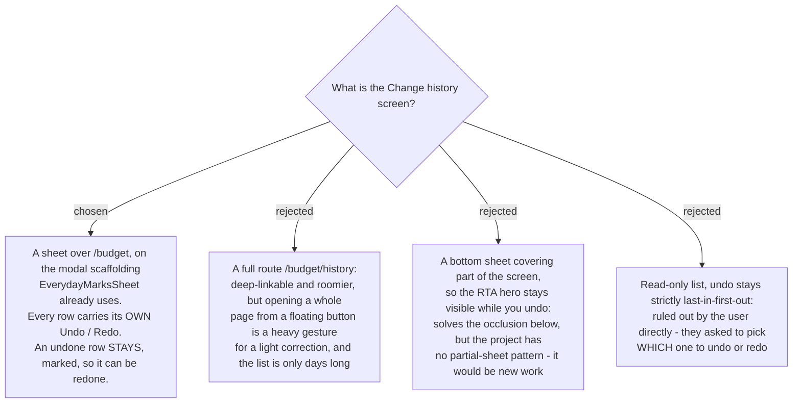

# Change history is a sheet with per-row undo and redo

menunest-191 put Change history in the rail in v1. menunest-194 decided where its records
live and how far back they reach. This ADR decides what the screen itself is.

## Rows are individually actionable, both ways

Asked for directly:

> "ควรมีให้กดเลือกได้ว่าจะรีดูหรืออันดูอันไหนเฉพาะในหน้า history"

So undo is **not** strictly last-in-first-out, and the row is the unit. This matches YNAB,
which MenuNest copies deliberately: its Recent Moves page lets you swipe left to undo any
recent move, not only the most recent.

**An undone row therefore stays on the list**, marked as undone, carrying a Redo. This is an
inference rather than a separate answer — per-row *redo* has nowhere to live if undone rows
vanish — and it is a cheap one to revise if it is wrong.

## An out-of-order undo may leave an Envelope negative, and that is allowed

Picking a row out of order can produce a state a strict stack never could: assign ฿300 to an
Envelope, move ฿200 out of it, then undo only the assign, and the Envelope lands at −฿200.

Put to the user against refusing the row and against cascading the undo forward. Answer:
allow it. MenuNest already treats an overspent **Envelope** as an ordinary first-class state
— the budget page carries an "Overspent" filter chip — so a negative figure the user can see
and fix beats a button that refuses to work, or an undo that silently reverses acts they did
not select.

## A sheet, not a page

The rail exists for fast correction without losing your place. Jumping to a separate route
from a floating button is a heavy gesture for a light action, and menunest-194 bounds the
list to at most a few days, so it does not need a page.

The project already has both patterns in this feature — `/budget/transactions` is a route,
`EverydayMarksSheet` is a sheet on the `budget-modal-overlay` / `budget-modal` scaffolding —
so this reuses what exists rather than inventing a shape.

## The cost, stated plainly

**The sheet covers the numbers.** Press Undo and you will not see Ready to Assign or the
Envelope move until you close it. Named before the choice and accepted. The partial bottom
sheet that would have fixed it was rejected only because the project has no such pattern; if
the occlusion turns out to matter in use, that is the escape.

## Deliberately not decided here

- **Which acts appear on the list** — `reversible-actions`.
- **Whether a row names who performed the act**, and whether other Family members' acts appear
  at all — `whose-acts`.
