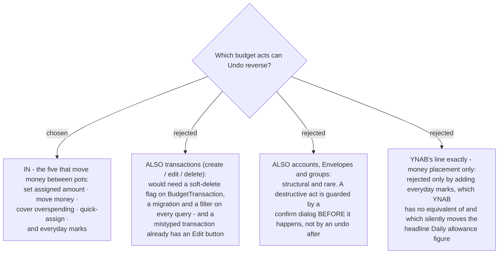

# Undo covers money placement, not transactions or structure

menunest-193 decided undo sends a compensating write. This ADR decides which acts get one.

## The line

**In** — set assigned amount · move money · cover overspending · quick-assign (both chips) ·
everyday marks.

**Out** — Budget transaction create / edit / delete · balance correction · account, Envelope
and group create / edit / delete.

Three reasons, in order of weight:

1. **Transactions already have their own correction path.** A mistyped **Budget transaction**
   is fixed by editing that row, which is one tap away on the account page. Undo would be a
   second way to do a thing the app already does — and the expensive one, because
   `DeleteTransactionHandler` does a **hard** delete (`Remove(tx)`) with no soft-delete flag,
   unlike `Trip`, `Drug`, `Photo` and `WritingEntry`. Undoing a delete would mint a new id,
   so it would need a migration and a filter on every transaction query, all to duplicate an
   Edit button.
2. **Structural acts want a confirm, not an undo.** Deleting an account or an **Envelope** is
   rare and destructive. The right guard runs *before* the act; an undo that arrives after is
   both weaker and more work.
3. **A balance correction IS a Budget transaction** (CONTEXT.md defines it that way), so
   excluding transactions excludes it too. That falls out of the rule rather than being a
   separate call, which is a sign the line is drawn in the right place.

## Where this departs from YNAB, and why

The map records YNAB's precedent: it undoes money movements and assignments, not
transactions. This ADR follows that, **plus everyday marks**.

The reason is specific to MenuNest: marking an **Everyday envelope** is a **Budgeting event**
(menunest-181), so an accidental toggle silently re-freezes the **Daily allowance** — the
"you can spend this much today" figure at the top of the screen changes with no warning and
no obvious way back. Its inverse is a single boolean toggle, the cheapest on the whole list.
YNAB has no equivalent concept, so there is nothing to copy.

## Quick-assign is one entry, not many

One press of "Fill targets first" is **one** row in Change history, and undoing it reverses
every envelope it touched. Splitting it into twelve rows would be more honest about what
happened, and would make undoing the press require twelve taps — worse than having no undo.

**A pre-existing defect surfaced while deciding this, and it is NOT caused by undo.**
`QuickAssignDialog.tsx` commits the plan as a sequential loop of one `setAssigned` request
per envelope, with no batch endpoint and no transaction around them. So **today**, if request
7 of 12 fails, the user is left half-assigned with nothing telling them. Undo inherits
exactly this exposure and adds none: its reversal loop is no less atomic than the forward
loop already is. Making both atomic means a new batch endpoint, which is worth its own issue
rather than a ticket on this map.

## Consequences

- `stale-undo` now has a bounded list to reason about: five act types, all of them money
  moving between pots, none of them creating or destroying a row.
- `build-ship` does not need a schema change for undo. That was the single most expensive
  fact on the map and this decision retires it.
- The Change history sheet (menunest-195) will only ever list these five kinds, which keeps
  its rows short and its wording uniform.
