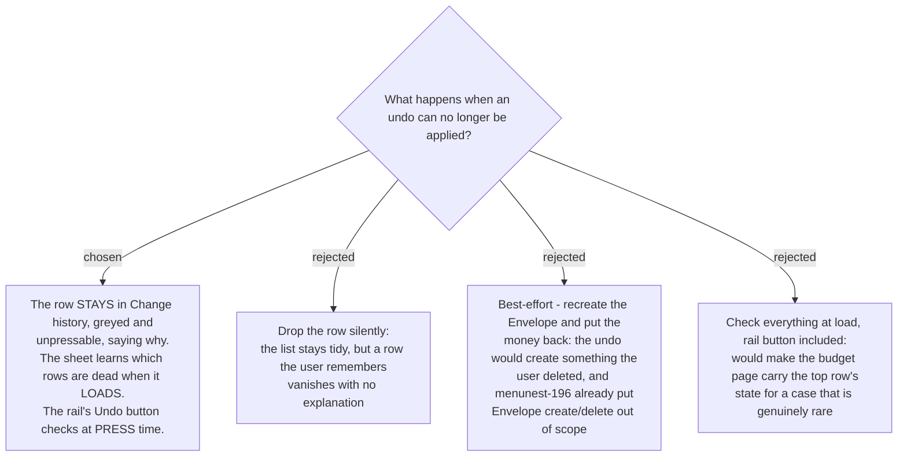

# A stale undo row stays visible and disabled

## The ticket feared five cases. Four were already gone

This ticket was written before menunest-194 and menunest-196. Both narrowed it sharply:

| the case | still possible? |
|---|---|
| the budget month rolled over | **No** — menunest-194 hard-cuts the window at the month start |
| the Budget transaction was already edited or deleted | **No** — menunest-196 put transactions out of undo's scope |
| the Account was deleted | **Not relevant** — none of the five undoable acts references an Account |
| another Family member changed the same number | **Not a failure** — this is precisely what a compensating write handles (menunest-193). "Subtract ฿300" is correct whatever the figure is now |
| **the Envelope was deleted** | **Yes — the only one left** |

Recording that explicitly matters as much as the decision: a later reader should not
re-litigate four cases that other ADRs already closed.

## The one real case, and why a naive undo would be wrong

`DeleteCategoryHandler` refuses to delete an **Envelope** that has any **Budget
transaction** — *"Cannot delete category with transactions — hide it instead."* If it has
none, the delete removes the Envelope **and every one of its `MonthlyAssignments`**.

So the money is **already back in Ready to Assign** by the time the Envelope is gone.
Applying the recorded "subtract ฿300" afterwards would take it out a second time. The undo
is not merely untargeted; it would be double-counting.

That is why the row is disabled rather than best-effort. It is also why this is rare: it
needs create-Envelope, assign, delete-Envelope all inside seven days and one month.

## Visible and disabled, not deleted

menunest-195 already keeps an *undone* row on the list so it can be redone. Keeping a *dead*
row on the list, greyed and captioned with its reason, is the same rule. A row the user
remembers should not vanish; "that Envelope was deleted" is information, and an empty gap is
not.

## The check is deliberately asymmetric

- **The Change history sheet** loads its rows from the server anyway, so the server marks
  each row undoable or not at read time. This costs almost nothing and means the user never
  presses a control that then fails.
- **The rail's Undo button** checks at press time instead. It sits on the budget page,
  outside the sheet, so making it *look* dead would mean the page carrying the top row's
  state — real work for a case this rare. A clear message on press is the proportionate
  answer.

Accepted knowingly: the rail's Undo can therefore look pressable and then refuse. That is the
price of not wiring history state into the budget page.
