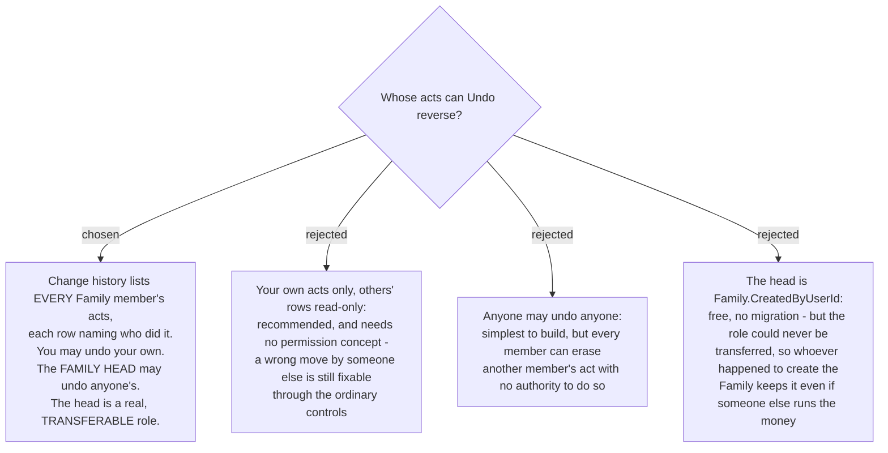

# Everyone sees the history, and the family head may undo anyone

## This is MenuNest's first permission distinction

Recorded plainly because it is the largest consequence and it is not about undo.

**The app has no roles today, by explicit design.** `UserRelationship` carries a doc comment
saying it is *"stored as metadata only — it has no effect on permissions"*, and
`Family.CreatedByUserId` exists but is never consulted for authorization anywhere: it appears
only in EF configuration and entity construction. Every Family member is equal in every
feature.

This ADR ends that. It was put to the user that it does, and the answer stood.

## What was decided

- **Change history lists every member's acts**, each row naming who performed it. Attribution
  is not new work: `BudgetTransaction` already carries `CreatedByUserId` and the transaction
  DTO already projects `CreatedByDisplayName`.
- **A member may undo their own acts.**
- **The family head may undo anyone's.**
- **The head is a real role that can be transferred**, not `Family.CreatedByUserId`. That
  field was offered as the free option and rejected: it records who happened to create the
  Family, so if a different member ends up running the money the authority sits with the
  wrong person forever.

## Why seeing everything, separately from undoing it

The most valuable thing a shared history offers is the answer to *"who moved my ฿500?"*, and
that needs only visibility. Undo is the separate, stronger act. Splitting the two means a
member who disagrees with another member's move can still fix it through the ordinary
controls — moving the money back, which lands in the history under **their own** name — while
undoing someone else's act, which removes it from the current state, needs authority.

## Consequences

- **The family-head role is its own piece of work**, not a detail of the rail: who may
  transfer it, what happens when the head leaves or is removed from the Family, whether the
  head gains any other power or only this one, and whether the role is visible to other
  members. It is charted as its own ticket on the map and blocks the build.
- **Whether the person is told their act was undone is deliberately not decided here.** It
  only becomes a question because the head can act on others, so it belongs with the role.
  For costing: the push channel is real and registered — `WebPushSender` over VAPID, not the
  `NullWebPushSender` placeholder — but `IWebPushSender` exposes only
  `SendFollowUpAsync(FollowUpPing)`, typed to the health domain. A notification here means a
  new method on a working sender, not new infrastructure.
- Every future feature now has a question it did not have before: *may the head do this too?*
  That is the real cost of the first role, and it is paid once.
