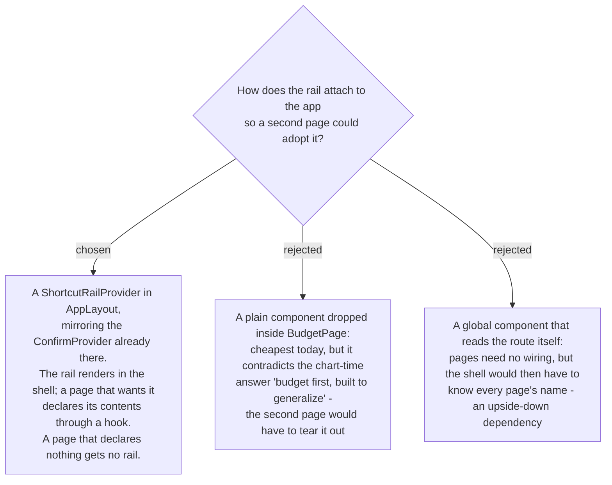

# The shortcut rail is a provider in AppLayout that pages opt into

## The pattern already exists three lines away

`AppLayout` wraps every Family-gated route, including all three budget routes, and it already
holds **`ConfirmProvider`** — a `createContext` provider supplying a cross-cutting UI
capability to any page that asks. The rail is the same shape of thing.

So this is not a new architecture. It is the same pattern, a second time, in the same file.

## The collision problem dissolves rather than being solved

`.bdg-fab` occupies the bottom-right corner of `AccountDetailPage`, and menunest-192 puts the
rail in that same corner. Under opt-in, `/budget` declares a rail and `AccountDetailPage` does
not, so **there is no collision to resolve** — the rail simply never renders there. `.bdg-fab`
is untouched.

If AccountDetailPage later wants a rail, that is when the corner has to be negotiated, and by
then there will be a real reason to. Deciding it now would be deciding it blind.

## The stack question was already answered

The ticket asked whether the undo stack is global or per page. menunest-194 made it a
server-side store keyed to the **Family**, so it is one store by construction. What a page
chooses is not *which stack* but *which acts it shows*.

## Deliberately NOT generalized

Stated so this does not become a framework before a second page exists. Each of these follows
from an earlier decision rather than being a fresh choice here:

- **The rail's contents.** Undo / Redo / Change history is the budget's answer under
  menunest-191's slot rule. Another page adopting the rail makes its own slot decision.
- **The history store.** menunest-194's entity records budget acts. It is not a general
  activity log, and menunest-196 fixed its scope at five money-placement acts.
- **The `.bdg-fab` corner.** Untouched, as above.

What *is* shared from day one: the rail's shell, its expand behaviour, its hide-on-scroll with
the two guards from menunest-192, and the opt-in hook.

## Consequences

- `build-ship` adds one provider to `AppLayout` beside `ConfirmProvider`, one hook, and one
  call from `BudgetPage`. The generalization costs roughly that much more than hardcoding,
  which is what the chart-time answer "budget first, built to generalize" bought.
- A page that forgets to declare gets no rail rather than a broken one, which is the right
  failure direction.
