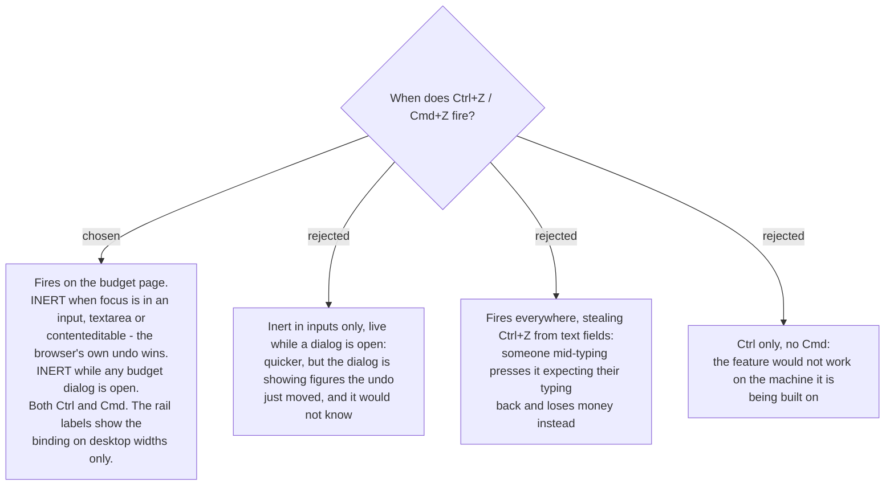

# Ctrl+Z is inert in inputs and while a dialog is open

## Two facts worth recording

- **This is the app's first global keyboard shortcut.** Everything today is local: Enter to
  send in the AI chat, Enter to add a checklist item, Escape to leave the map's add-place
  mode, Enter/Escape on the envelope's inline amount input. Nothing listens at the app level.
  Smaller than the role precedent in menunest-198, but it is a precedent.
- **`EnvelopeCard.tsx:92` already binds Escape to revert** the inline assigned-amount input.
  That is a different thing and both should exist: **Escape** discards an edit **not yet
  sent**; **Undo** reverses one **already committed** (menunest-193). Keeping Ctrl+Z out of
  inputs means the two never argue.

## What was decided

- **Ctrl+Z and Cmd+Z both**, on desktop. Not a real choice — the developer's own machine is a
  Mac, so Ctrl-only would ship a feature that does not work where it is written.
- **Inert while focus is in an input, textarea or contenteditable.** The browser's native undo
  is what a person pressing it there expects, and the cost of being wrong is high: they wanted
  their typing back and would instead move money.
- **Inert while any budget dialog is open** — MoveMoney, QuickAssign, CoverOverspending,
  Transaction, AddAccount. A dialog is showing figures the undo would move underneath it, and
  it has no way to know.
- **The rail's labels show the binding, on desktop widths only.** menunest-192 already puts a
  label beside each expanded item; on desktop it reads "Undo ⌘Z" rather than "Undo". On a
  phone there is no keyboard, so the hint would be noise. It must be platform-aware: ⌘ on
  macOS, Ctrl elsewhere.

Without the label the button and the shortcut are two features that happen to agree. With it
they are one.

## Consequence for the build

**"Is a dialog open?" is not centrally known today.** The five budget dialogs are local
`useState` inside their own components; nothing tracks them. Two ways out, and this ADR does
not pick one:

- the handler checks the DOM for an open `.budget-modal-overlay` — ugly, honest, and works
  now;
- the dialogs register with the `ShortcutRailProvider` from menunest-199 — cleaner, and the
  provider is being added anyway.

The second is likely right precisely because that provider already has to exist, but it is an
implementation call for `build-ship`.
