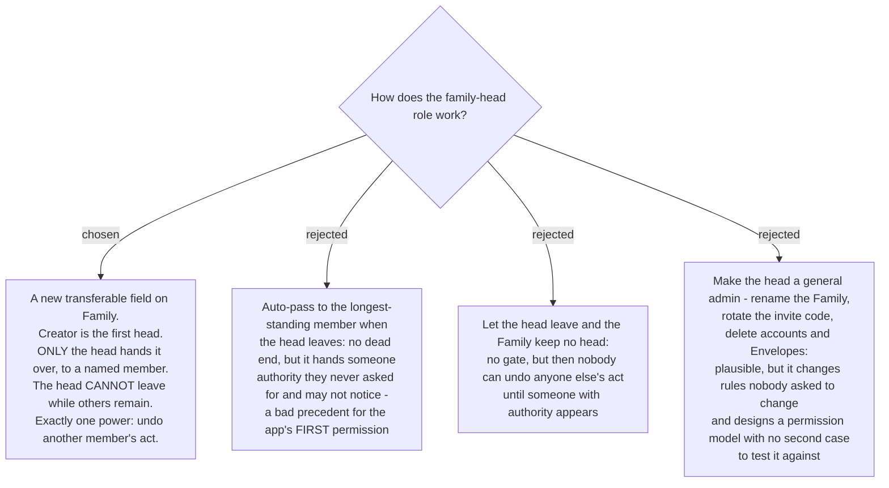

# The family head is a transferable role with exactly one power

menunest-198 gave the family head the power to undo any member's act and chose a real
transferable role over `Family.CreatedByUserId`. This ADR builds that role.

## Two facts that shaped it

- **Nobody can be removed from a Family by anyone else.** The use cases are `CreateFamily`,
  `JoinFamily` (invite code) and `LeaveFamily` — self-service only. So "the head is removed"
  is not a case that exists; only "the head leaves".
- **`LeaveFamilyHandler` does not touch `Family.CreatedByUserId`.** It clears the user's
  relationships and their `FamilyId`, and the Family row survives even when empty. So that
  field can *already* point at somebody who left, which is the concrete evidence for
  menunest-198's refusal to use it as the head.

## The rules

1. **The creator is the first head.**
2. **Only the head hands the role over**, to a member they name.
3. **The head cannot leave the Family while other members remain.** `LeaveFamily` refuses with
   *"hand over the family head first"*.
4. **A head who is the last member may leave.** The Family then has no head, and **the next
   person to join becomes head.**
5. **Existing Families are backfilled**: `CreatedByUserId` if that person is still a member,
   otherwise the earliest-joined current member.

Rule 3 is the one that was chosen against an alternative. Auto-passing on leave has no dead
end, but it hands someone authority they never asked for and may not notice. For the app's
**first** permission concept, "authority is always taken deliberately" is the better precedent,
and the escape is never blocked — hand over, then leave.

## Exactly one power

The head may **undo another member's act**, and **hand over the role**. Nothing else.

Renaming the Family, rotating the invite code and deleting accounts, Envelopes or groups stay
open to every member exactly as they are today. Sweeping them under the head would be a
different feature that nobody asked for, and it would design a permission model with no second
case to test it against.

Each later feature now has to answer *"may the head do this too?"* on its own evidence. That
is the cost menunest-198 accepted, and keeping the role at one power is what keeps the cost
small.

## Being told

When the head undoes a member's act, **the Change history row always names who undid it** —
free, because menunest-195 already keeps an undone row visible and only the attribution is
new. **A push notification is sent on a best-effort basis**: the real `WebPushSender` over
VAPID is registered and working, but it needs a new method on `IWebPushSender` (which today
exposes only `SendFollowUpAsync(FollowUpPing)`) and it only reaches members who granted
permission.

Best-effort was chosen over requiring push: making the undo conditional on a permission the
member may never have granted would block a legitimate correction. Passive notice always
lands; active notice lands when it can.

**Where the role is shown was not asked** and follows from the rest: `/family` already lists
members, so the badge belongs there. Cheap to change.

## Consequences

- A new field on `Family` plus a migration, applied to prod **by hand** per CLAUDE.md.
- **`LeaveFamilyHandler` gains a guard** — the first behavioural change this map makes to an
  existing, unrelated use case. It needs its own test.
- `IWebPushSender` gains a method, so the health domain's interface stops being single-purpose.
