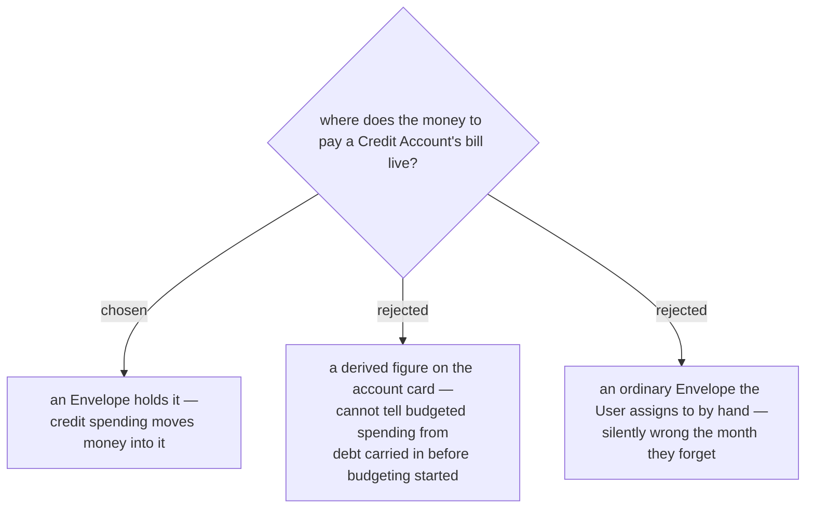

# Credit spending moves money into a payment envelope, it is not merely displayed

A **Credit** **Account** already exists in the app (`BudgetAccountType.Credit`) but carries no
behaviour of its own: it is summed into **Ready to Assign** exactly like a Cash **Account**, so
the money owed on the card is held back from assignment by the account's negative balance and is
therefore *correct but invisible* — no surface answers "can I pay this bill in full?" (issue #112).

We hold that money in an **Envelope** rather than computing it for display. A displayed figure is
cheap but conflates two different debts: this month's budgeted card spending (fully funded, safe)
and a balance carried in from before the budget existed (not funded at all), which are the same
negative number. An **Envelope** separates them, because only funded spending puts money in it.
A hand-assigned ordinary Envelope was rejected for the same reason it is cheap — it is right only
while the User remembers, and the month they forget it reads as fully funded when it is not.

The cost is accepted and real: every credit **Budget transaction** must now move money between two
**Envelopes**, and that movement has to hold up against Undo/Redo (menunest-193…197), the
**Daily allowance** freeze (menunest-181) and **Cover overspending**.
