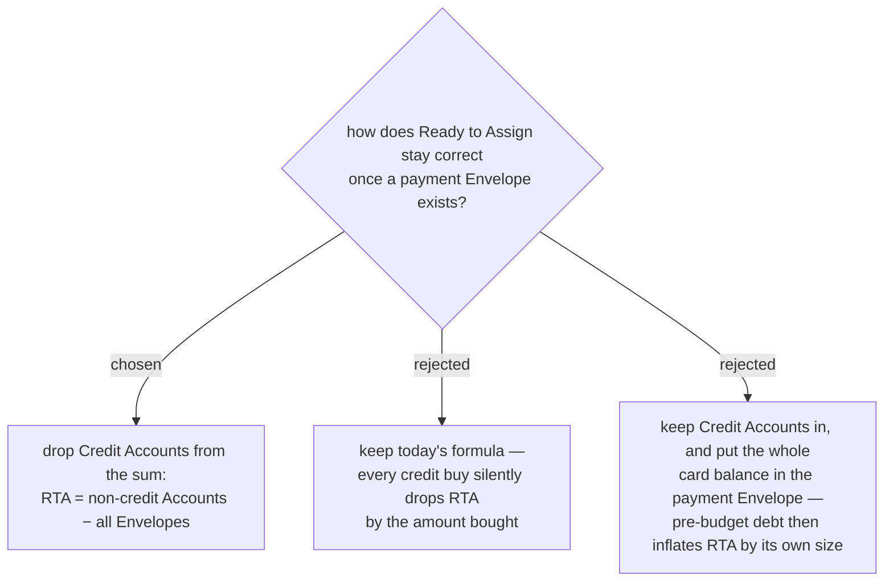

# Ready to Assign stops counting Credit accounts

**Ready to Assign** is `sum(all Accounts) − sum(all Envelopes)` today, and Credit **Accounts** are
in that sum. That is self-consistent *only* while nothing holds the money owed on a card: the
card's negative balance is what holds it back. menunest-202 puts that money in an **Envelope**, so
it is now held back twice. Buying 500 of food on a card moves Accounts to 9,500 and Envelopes to
3,000, and **Ready to Assign** falls from 7,000 to 6,500 — for a purchase that was fully budgeted.

Dropping Credit **Accounts** from the sum restores the invariant. Buy 500 on the card: Cash 10,000,
Card −500, อาหาร 2,500, จ่ายบัตร 500, **Ready to Assign** 7,000. Pay the bill: Cash 9,500, Card 0,
อาหาร 2,500, จ่ายบัตร 0, **Ready to Assign** 7,000. Unchanged throughout, which is correct — paying
a card moves money you had already set aside.

Option C was the earlier proposal and is arithmetically wrong: with 30,000 cash and 20,000 of
pre-budget card debt it reports 30,000 − (−20,000) = **50,000** assignable.

## Consequences

- The payment **Envelope** holds **only funded spending** — money that a **Budget transaction** on
  the card moved out of some other **Envelope**. It never holds the opening balance.
- **Debt carried in before the budget existed sits outside the budget entirely.** It is visible as
  the *gap* between the Credit **Account** balance and its payment **Envelope**: card −20,000 against
  จ่ายบัตร 0 means 20,000 not yet found. Nothing needs to decide where that number "goes".
- Overspending still lands where it happened. Buying 500 against an อาหาร holding 300 leaves
  อาหาร at −200 and จ่ายบัตร at the full 500; the card is still payable and **Cover overspending**
  handles อาหาร unchanged.
