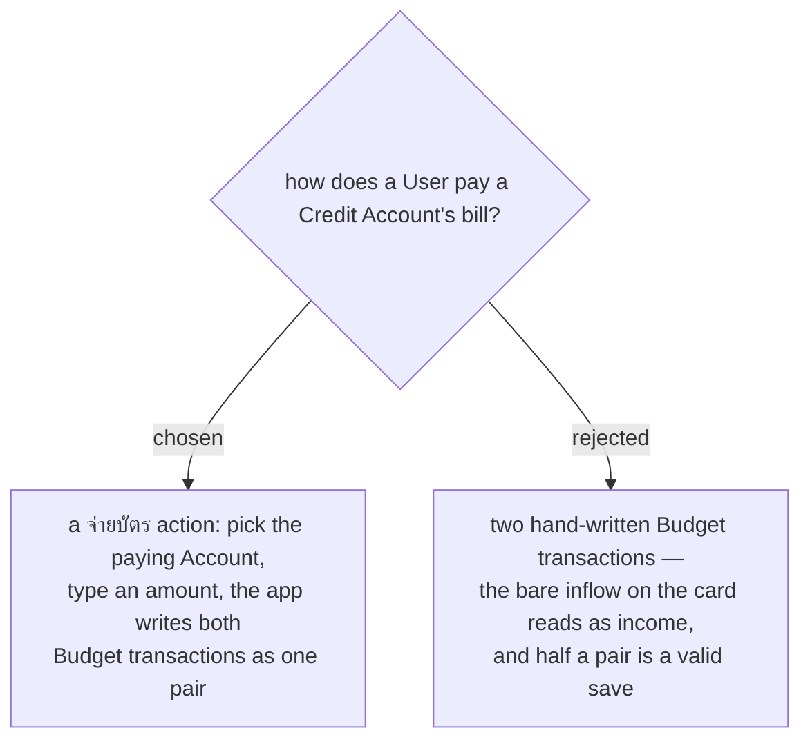

# Paying a card is one paired action, not two hand-written transactions

MenuNest has no transfer: a **Budget transaction** carries exactly one `AccountId`. Paying a card
by hand therefore means two of them — an outflow on the paying **Account** and an inflow on the
Credit **Account** — and the app cannot tell that they belong together.

Two things break if we leave it there. The bare positive on the Credit **Account** carries no
**Envelope**, and `GetMonthlySummaryHandler` counts every uncategorised positive row in the month
as **Income**, so paying your own card reports as money arriving. And nothing binds the halves:
saving one and abandoning the other leaves the budget wrong with no error, which is exactly the
failure menunest-202 exists to prevent.

A single จ่ายบัตร action writes both rows together, spends down the payment **Envelope**, and is
the one place that knows the pair is a payment rather than income.
