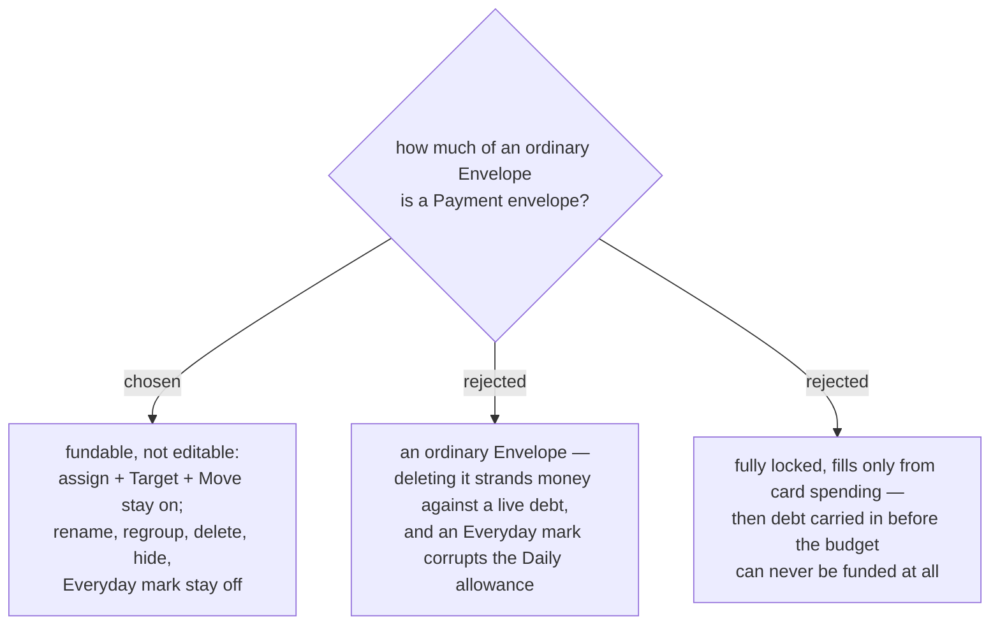

# The payment envelope is fundable, but not renamable, movable or deletable

Confirmed against a rendered mock of `/budget` in the app's own tokens, not in prose — the
question was where things sit on a screen, and text agreement on that is false agreement.

A **Payment envelope** is created with its Credit **Account** and lives in its own
**บัตรเครดิต** group, so the **User**'s own groups stay theirs.

**On:** assigning into it, a **Target**, and **Move money** in. These are load-bearing, not
conveniences — menunest-203 leaves pre-budget debt outside the budget, and funding the
**Payment envelope** by hand is the *only* road that pays it down. Option C closes that road.

**Off:** rename (the name follows the **Account**), move to another group, delete, hide, and the
**Everyday envelope** mark. The **Everyday** exclusion is the sharp one: the **Daily allowance**
divides **Everyday envelope** money by the days left in the month, so a **Payment envelope** in
that pot would raise "spend this much today" every time the card is used — the exact inverse of
the truth. Delete is off because the **Envelope** can hold money while the debt it answers to is
still live.

**+ Transaction is replaced by จ่ายบัตร** (menunest-204). A **Payment envelope** is never spent
from directly; the only way money leaves it is a card payment.
